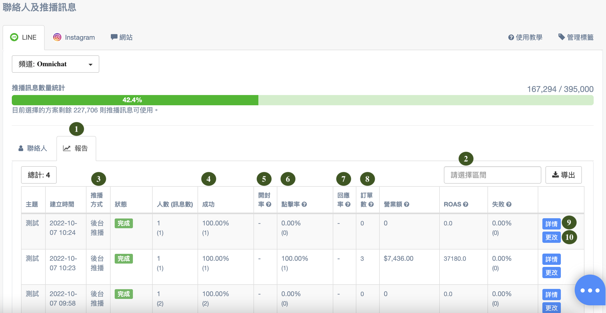
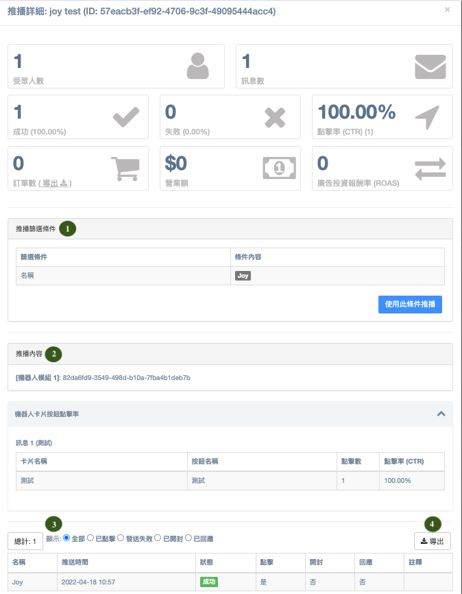

# 報告與詳情

## 報告

<figure><figcaption>
報告分頁樣式
</figcaption></figure>

1. 發送推播訊息之後，可以點擊「**報告**」分頁查看推播紀錄。推播紀錄會顯示推送成功人數、開封率、點擊率（CTR）、回應率、因推播訊息帶來的訂單數、營業額及廣告投資報酬率（ROAS）。
2. 可自行**選擇時間區間**，導出 **30 天內**的報告列表資料。
3. **推播方式**：將分為「手動」和「API」，透過 Open API 推播的訊息會顯示為 **「API推播」**，其餘的推播會顯示為**「後台推播」。**
4. **成功**：該則推播訊息總數的成功率及(推播成功的人數)。
5. **開封率**：計算方式為 (不重複的開封數÷推播人數)。
6. **點擊率（CTR）**：計算方式為（不重複的按鈕連結點擊數量÷成功發送的推播訊息數量）。\
   需推播訊息內為使用機器人按鈕含 URL，帶入才能進行計算，並且只計算發出的第一則訊息，文字訊息中帶入的連結亦不會列入計算。
7. **回應率**：計算方式為 (收到推播訊息的 24 小時內有回應的人數÷推播人數)，包含文字訊息、按鈕點擊。
8. **訂單數**、**營業額**及**廣告投資報酬率（ROAS）**需完成「網站用戶行為追蹤（Pixel）」埋放才會顯示。
   * 因為 LINE、WhatsApp 有訊息費用，因此可以計算得出 ROAS。而 Facebook 則沒有
9. **詳情**：點擊右側的「詳情」按鈕，可檢視更多細節（例如：該則推播發送的全部人員名單、已點擊的人員名單、發送失敗的人員名單及原因、已開封的人員名單、已回應的人員名單）。\
   請見下方[詳情](http://localhost:5000/o/-L\_qBouk\_wijumBR7PT3/s/3u2I1osIy6mEi07X1z46/)介紹。
10. **更改**：如果該則推播還在排程中，尚未完成推播則可以點擊右側的「更改」按鈕，來調整推播內容及時間排程。


關於各訊息卡片種類，分別哪些有計算「開封數/率」、「點擊數/率」、「回應率」、「訂單金額」，請參考 [**LINE 訊息卡片-可計算的數據維度**](../line-xun-xi-ka-pian-ke-ji-suan-de-shu-ju-wei-du.md)


## 詳情

<figure><figcaption></figcaption></figure>

1. **推播篩選條件**：顯示該則推播所使用的篩選條件及篩選的條件內容為何；\
   也可以點選右側「**使用此條件推播**」按鈕，即使用相同條件再進行一次推播。
2. **推播內容**：顯示該則推播內所設置的內容
   * **文字訊息**：依照當時所設置的文字訊息則數，分別顯示其內容資訊
   * **圖片訊息**：將顯示該圖片的連結網址
   * **機器人模組**：將顯示該機器人模組的模組名稱並附帶超連結，可點擊後來到該機器人的設置頁面進行查看。若如上圖顯示一串編碼，則表示該機器人後續已遭刪除，則無法查看該機器人的內容
3. **顯示**：可選擇並檢視該則推播發送的**全部人員**、**已點擊**、**發送失敗**、**已開封**、**已回應**的人員名單。
4. **導出**：可依據所選擇的顯示項目，其所列的人員名單導出為 CSV 檔案。

