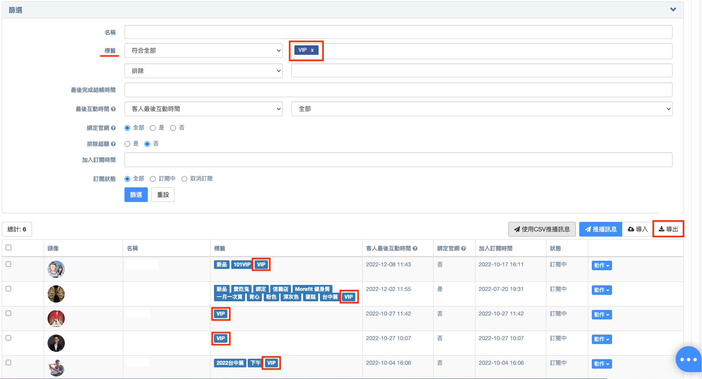

# 導入、導出聯絡人資料

## 導入聯絡人

如用戶取得 LINE - **UID** 或 Facebook - **PSID**，可以在 Omnichat 後台導入聯絡人及標籤。\
(Instagram 及官網暫時無支援導入功能）


**注意：**\
LINE-UID 或 Facebook-PSID 資料在 LINE 官方帳號以及 Facebook 原生後台無法取得，需曾將 LINE 官方帳號或 Facebook Messenger 串接至第三方平台，且第三方平台有支援匯出 CSV檔案，才可以將聯絡人導入至 Omnichat 後台


#### 以 LINE 官方帳號為例，導入聯絡人及標籤：

步驟一：點選「導入」，下載CSV檔案範本

<figure><figcaption></figcaption></figure>


**注意：**\
CSV 檔案如非為 UTF-8 encoding 版本會呈現亂碼。

為避免版本問題，用戶可使用 [**Google Sheet**](https://docs.google.com/spreadsheets/) 進行操作


步驟二：依照下載的範例檔案建立導入名單。在欄位填上 LINE UID 以及 標籤文字

<figure><figcaption></figcaption></figure>

步驟三：將 CSV 檔案上傳導入


**注意：**\
如選擇『覆蓋標籤』會將導入的標籤覆蓋消費者已經被貼上的所有標籤。\
如只是想利用導入的方式新增標籤，請勿選取『覆蓋標籤』選項


<figure><figcaption></figcaption></figure>

步驟四：導入成功的聯絡人可以看到導入標籤

<figure><figcaption></figcaption></figure>

## 導出聯絡人

可利用不同條件（例如標籤）篩選列表中聯絡人，點選「導出」，可以將 LINE - **UID** 或 Facebook - **PSID** 導出為 CSV 檔案


_導出標籤_ 功能目前僅支援**旗艦方案**用戶唷！


<figure><figcaption></figcaption></figure>


導出資料後續運用可以至 LINE 或 Facebook 成為自訂受眾下廣告。關於 Facebook 後續應用請參考此篇部落格-[【Facebook 廣告受眾設定】鎖定 Messenger 互動粉絲的簡單2方法](https://blog.omnichat.ai/2021/03/fb-ads-messenger-audience/)

