# 推播訊息

## 發送推播（ Facebook Messenger ）

選擇您想推播訊息的第三方通訊渠道（ Facebook Messenger ）後，選擇已串接的 Facebook 專頁

<figure>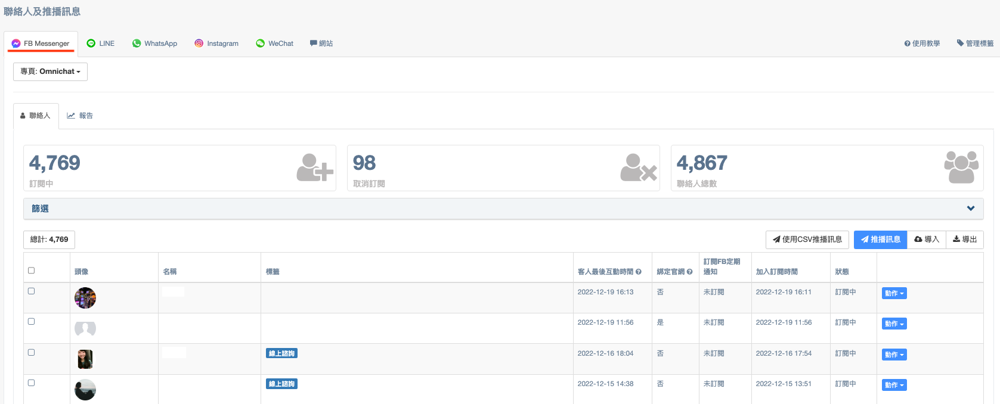<figcaption></figcaption></figure>

打開篩選頁面進行篩選條件設定

<figure>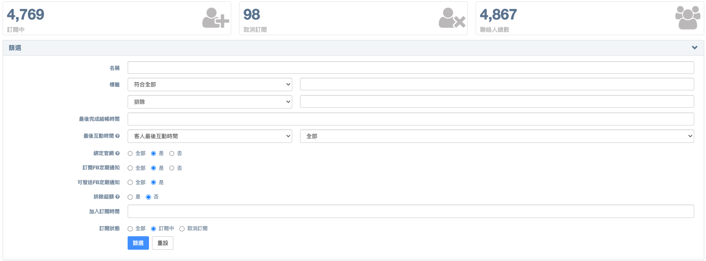<figcaption></figcaption></figure>

根據篩選出來的結果，選取要推播的聯絡人，並點擊右側的 **推播訊息**，進入推播訊息頁面

<figure>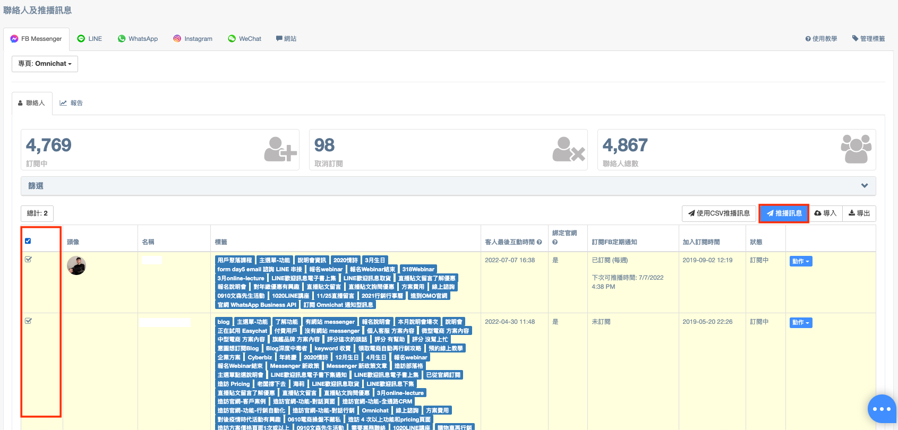<figcaption></figcaption></figure>

**推播訊息** 頁面

<figure>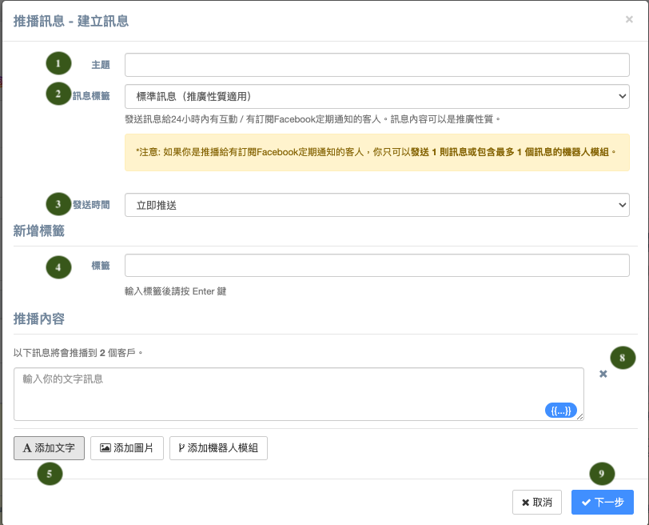<figcaption></figcaption></figure>

 

<figure>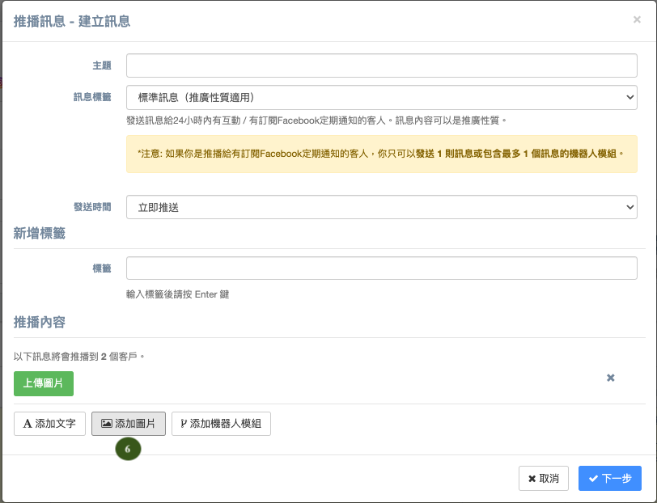<figcaption></figcaption></figure>

 

<figure>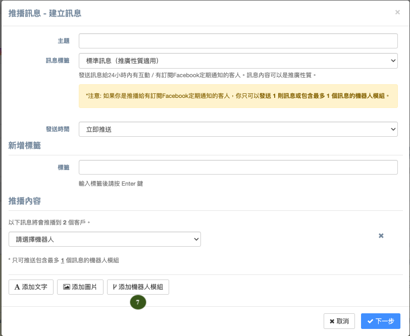<figcaption></figcaption></figure>

1. 輸入推播的**主題**
2. **\[限 Facebook Messenger ]** 選擇**訊息標籤**
   *

       <figure>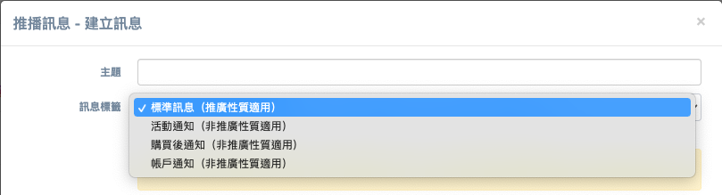<figcaption></figcaption></figure>
   * 可用標籤：
     * **標準訊息**：受 Facebook Messenger 24 小時政策限制，只可發送給 24 小時內有互動的客人，可以推送推廣性內容。
     * **活動通知**：發送活動通知給已登記或購買門票的客人。例如：上課/活動時間提醒、活動確認。(不受 24 小時對話限制，但只可推送**非推廣性質內容**)
     * **購買後通知**：發送與客人最近購買有關的通知。例如：出貨狀態變更提醒、訂單狀態變更提醒。(不受 24 小時對話限制，但只可推送**非推廣性質內容**)
     * **帳戶通知**：發送與客人帳號有關的通知。例如：帳號申請狀態變更提醒、帳號有異常變更提醒。(不受 24 小時對話限制，但只可推送**非推廣性質內容**)
   * **限制**
     * **除「標準訊息」外，其他「訊息標籤」不可以用於發送推廣內容，包括但不限於推廣優惠，優惠券和折扣。我們系統會自動偵測推播內容是否符合 Facebook Messenger 的規定，如有違規，系統會自動把使用訊息標籤推播的功能封鎖。以保障你的專頁不會被 Facebook 判定為不當使用，導致你的專頁無法傳送訊息。**
3. 選擇推播**發送時間**
   * **即時**：即時送出
   * **排程推送**：自定推送時間
     * 在自訂推播送出時間前，你可以在「報告」分頁內修改內容及時間


針對排程推送的訊息，若有需要在推播前修改推播內容，建議在<mark style="color:red;">**實際推播時間1小時前進行修改**</mark>，在實際發送時會以修改後的推播訊息內容進行推播。


1. **標籤**：可在這次推播時同步貼標在這一批聯絡人上。
2. 點擊下方「**添加文字**」：可添加文字訊息，並於輸入筐右下方藍色按鈕可添加**聯絡人名稱參數。**
3. 點擊下方「**添加圖片**」：可上傳圖片。
4.  點擊下方「**添加機器人卡片**」：

    機器人卡片模組（按鈕卡片、輪播訊息卡片、快速回覆卡片）。

    * 需要預先在 **進階自動化功能 >自助設計機器人** 頁面中建立模組
    * 機器人卡片**不能**和其他訊息同時發送
5. 點擊「 **X** 」圖示可刪除已添加的訊息。
6. 點擊「**下一步**」會再次確認是否發送推播。


1. 當系統更新不到客人最新名稱時，會先以 Omnichat 後台留存的名稱代入
2. **Facebook Messenger** 最多可以推播 **5** 個訊息。



**Facebook Messenger 政策**

客人發送訊息到你的 Facebook 專頁後**：**

* **24小時內**：你可以**無限制地**發送推播訊息給客人。
* **24小時後 （任何時間）：**你只可以使用「**訊息標籤**」發送**非推廣性**訊息給客人。**不當使用可能導致你的專頁無法傳送訊息。**

**詳情可查看**：[https://developers.facebook.com/docs/messenger-platform/policy/policy-overview/](https://developers.facebook.com/docs/messenger-platform/policy/policy-overview/)



Instagram 目前暫不支援推播，但仍可手動貼上標籤。


## 發送推播（ LINE）

選擇您想推播訊息的第三方通訊渠道（LINE）後，選擇已串接的 LINE 頻道

<figure>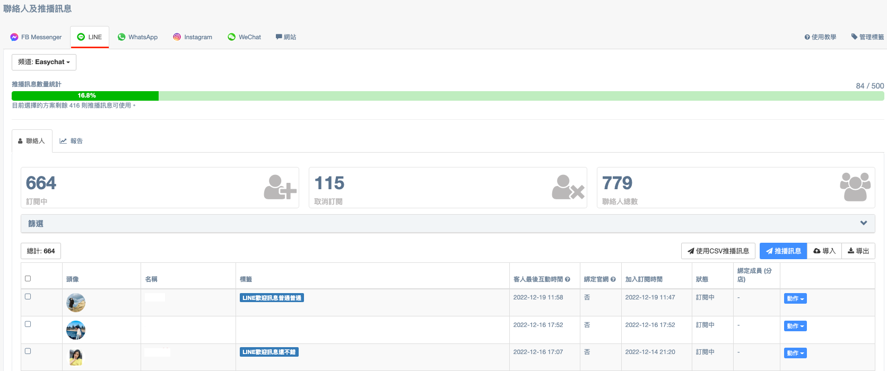<figcaption></figcaption></figure>

打開篩選頁面進行篩選條件設定

<figure><figcaption></figcaption></figure>

根據篩選出來的結果，選取要推播的聯絡人，並點擊右側的 **推播訊息**，進入推播訊息頁面

<figure><figcaption></figcaption></figure>

**推播訊息** 頁面

<figure>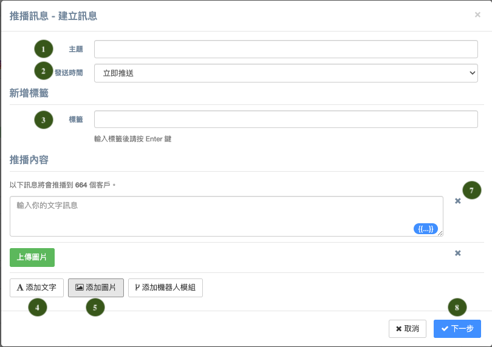<figcaption></figcaption></figure>

 

<figure>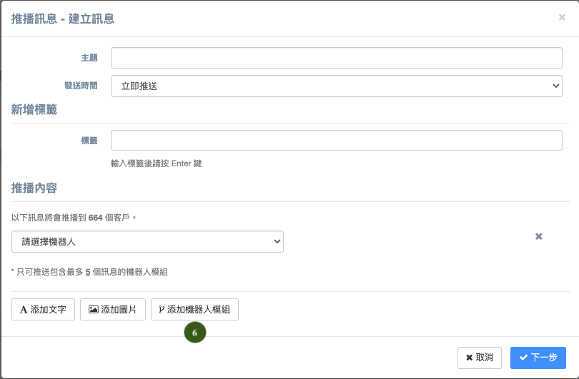<figcaption></figcaption></figure>

1. 輸入推播的**主題**
2. 選擇推播**發送時間**
   * **即時**：即時送出
   * **排程推送**：自定推送時間
     * 在自訂推播送出時間前，你可以在「報告」分頁內修改內容及時間
3. **標籤**：可在這次推播時同步貼標在這一批聯絡人上。
4. 點擊下方「**添加文字**」：可添加文字訊息，並於輸入筐右下方藍色按鈕可添加**聯絡人名稱參數。**
5. 點擊下方「**添加圖片**」：可上傳圖片。
6.  點擊下方「**添加機器人卡片**」：

    機器人卡片模組（按鈕卡片、輪播訊息卡片、快速回覆卡片）。

    * 需要預先在 **進階自動化功能 >自助設計機器人** 頁面中建立模組
    * 機器人卡片**不能**和其他訊息同時發送
7. 點擊「 **X** 」圖示可刪除已添加的訊息。
8. 點擊「**下一步**」會再次確認是否發送推播。


**LINE** 最多可以推播 **5** 個訊息。


### LINE 訊息種類 API 類型及收費表


LINE 官方針對使用任何第三方平台串接 LINE 對話時，將會依據使用者的對話行為判定其 API 類型為何。並針對 Push API 類型的動作收取訊息費用，Reply API 類型動作則為免費。 \
（[LINE 訊息種類 API 類型及收費表](../tong-xun-qu-dao/integrations/line-2.0/line-2.0-message-fee.md)）


## 發送推播（ WhatsApp ）

選擇您想推播訊息的第三方通訊渠道（ WhatsApp ）後，選擇已串接的 WhatsApp 號碼

<figure>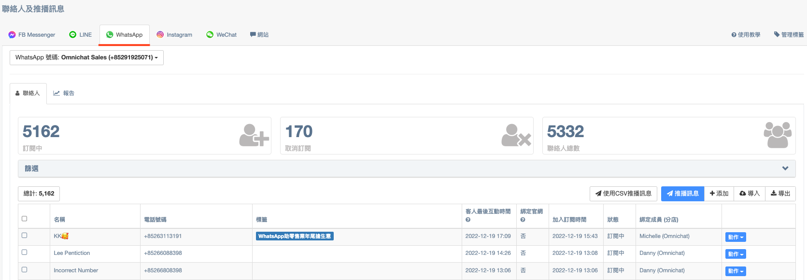<figcaption></figcaption></figure>

打開篩選頁面進行篩選條件設定

<figure>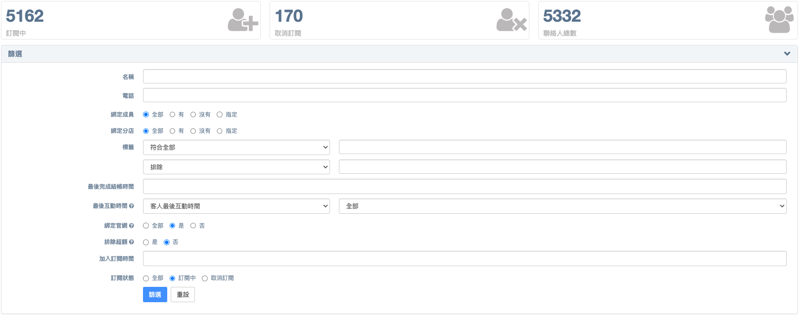<figcaption></figcaption></figure>

根據篩選出來的結果，選取要推播的聯絡人，並點擊右側的 **推播訊息**，進入推播訊息頁面

<figure>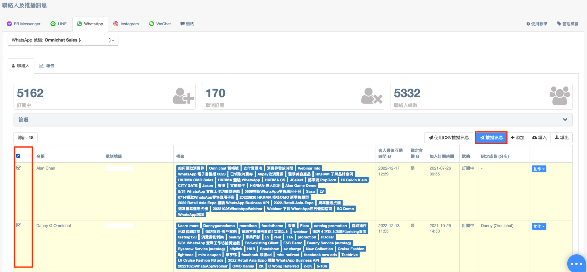<figcaption></figcaption></figure>

**推播訊息** 頁面

<figure><figcaption></figcaption></figure>

 

<figure><figcaption></figcaption></figure>

 

<figure><figcaption></figcaption></figure>

1. 輸入推播的**主題**
2. 選擇推播**發送時間**
   * **即時**：即時送出
   * **排程推送**：自定推送時間
     * 在自訂推播送出時間前，你可以在「報告」分頁內修改內容及時間
3. 從已建立好的訊息範本列表，選擇推播要使用的**訊息範本。**
4. **訊息標頭**：
   * 訊息內文的第一行字即為標頭，此處會顯示該訊息範本所設定的訊息標頭
   * 如有設計**標頭參數** **\{{1\}}** 的話，可於「**參數1**」輸入自訂的文字或編號
5. **內容**：
   * 此處會顯示該訊息範本所設定的訊息內容
   * 如有設計**參數** **\{{1\}}** 的話，可於「**參數1**」輸入自訂的文字或編號\
     **EX：** **\{{1\}}** 對應「**參數1**」、 **\{{2\}}** 對應「**參數2**」、 **\{{3\}}** 對應「**參數3**」以此類推...
6. **按鈕**：
   * 如不設置任何按鈕動作可選擇「**沒有動作」**
   * **「機器人」**可選擇以建立好的機器人模組帶入
   * 選擇「**訂閱通知**」，讓已取消訂閱的客人再次成為 Omnichat 訂閱中狀態的聯絡人
   * 選擇「**取消訂閱通知**」，讓訂閱中狀態的客人取消訂閱狀態，不再接收 Omnichat 後續訊息
7. **標籤**：可在這次推播時同步貼標在這一批聯絡人上。
8. **訊息預覽**：可完整預覽此次推播要使用的訊息範本。
9. 點擊「**下一步**」會再次確認是否發送推播。

