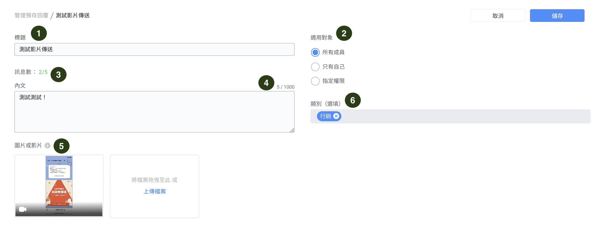

# 管理預存回覆

### 預存回覆列表

1. 預存回覆標題：建立之後可方便搜尋，前台消費者看不到該標題
2. 適用對象：可看到適用該預存回覆之團隊成員，管理員可以看到所有的預存回覆 （除了其他成員設定的『只有自己 』的預存回覆看不到）
3. 類別：可以針對預存回覆建立類別，之後根據分類篩選特定的預存回覆
4. 編輯：修改已儲存的預存回覆
5. 刪除：刪除已儲存的預存回覆
6. 建立新的預存回覆


預存回覆以「最後更新時間」為主，也就是最後更新的預存回覆會排在最上方。


### 新增預存回覆教學


預存回覆可支援 1,000 個字元，如內容超過建議拆分為兩個預存回覆。


<figure><figcaption></figcaption></figure>

<figure><figcaption></figcaption></figure>

1. 標題：可以設定好標題，讓之後在對話頁面搜尋時可以用關鍵字進行
2. 可設定 特定分店 / 特定角色 才能使用的預存回覆（分店為使用 OMO 功能客戶才會看到）
3. 訊息數：（已經使用的訊息類型數/可以使用的訊息類型數），圖片和文字各算一則，圖片加上文字至多五則
4. 預存回覆可支援 1,000 個字元，如內容超過建議拆分為兩個預存回覆，中文字元算多個字元。


當點擊輸入文字的框框時，在文字輸入框的右下方，點擊 {...} 後點選【聯絡人名稱】可以將聯絡人姓名參數帶入內容中。


<figure><figcaption></figcaption></figure>

&#x20; 5\.   圖片&影片：可直接拖曳檔案上傳，或是點擊「上傳檔案」。**需要將檔案實際拖曳至窗格內**


1. 目前含有影片的預存回覆不適用於 Instagram 對話事件 和 網站對話事件。
2. MOV 影片檔類型無法上傳


&#x20; 6\.   標籤可以用在區分預存回覆的種類

* &#x20;範例 1：退貨 / 換貨 / 一般客服問題
* 範例 2：可用在有多個 LINE 官方帳號時，要區分不同官方帳號的預存回覆

