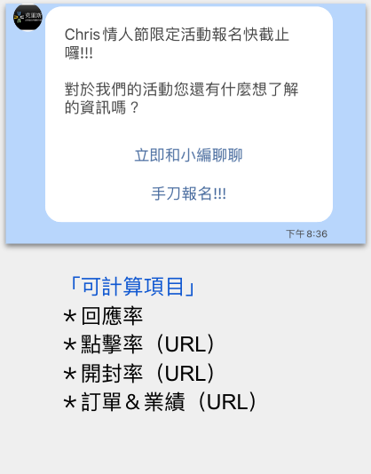
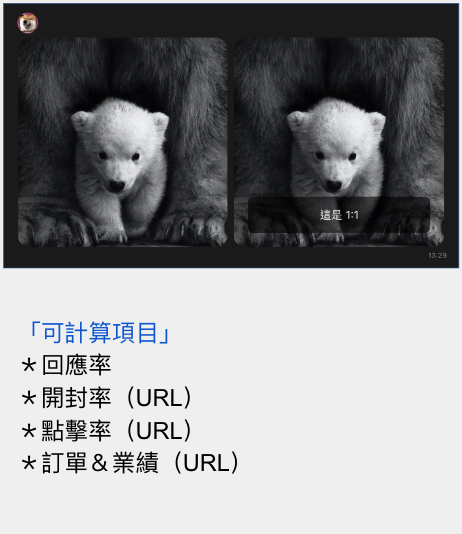
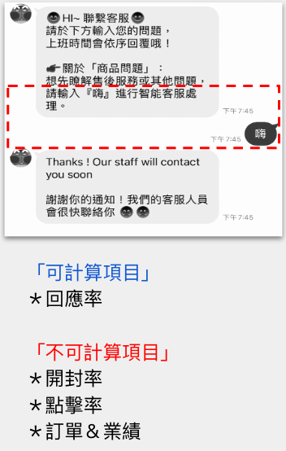
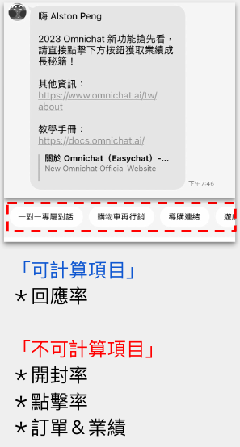
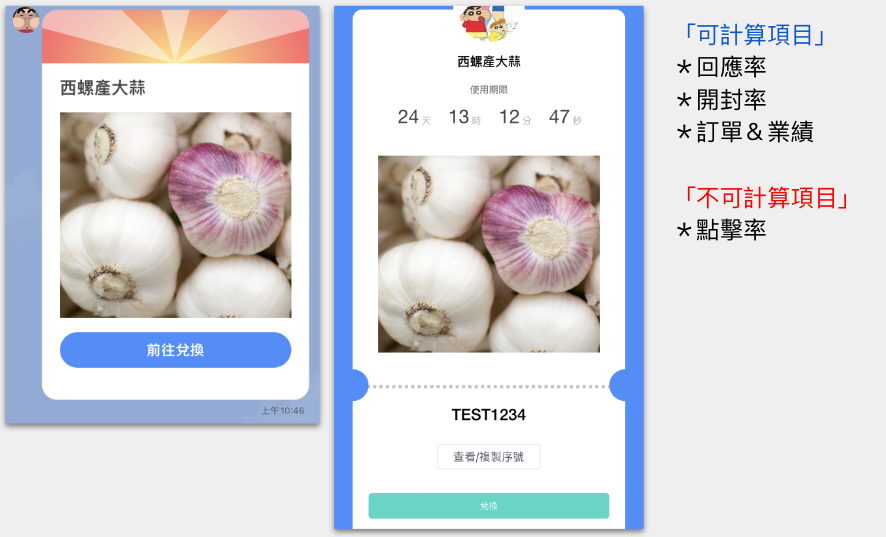

# LINE 訊息卡片-可計算的數據維度

<figure><figcaption>
LINE 機器人模組中，可使用的訊息卡片種類
</figcaption></figure>

不同種類的訊息卡片，有不同的「可計算數據」，請參考下表

| 訊息卡片類別 | 使用設計     | 開封數/率 | 點擊數/率 | 回應率   | 訂單金額  |
| ------ | -------- | ----- | ----- | ----- | ----- |
| 文字訊息   | 無按鈕      |       |       | ✅ 可計算 |       |
|        | 有按鈕（URL） | ✅ 可計算 | ✅ 可計算 | ✅ 可計算 | ✅ 可計算 |
| 圖像訊息   |          |       |       | ✅ 可計算 |       |
| 輪播訊息   | 圖片（URL）  | ✅ 可計算 | ✅ 可計算 | ✅ 可計算 | ✅ 可計算 |
|        | 有按鈕（URL） | ✅ 可計算 | ✅ 可計算 | ✅ 可計算 | ✅ 可計算 |
| 圖片輪播訊息 | 無按鈕      | ✅ 可計算 |       | ✅ 可計算 |       |
|        | 圖片（URL）  | ✅ 可計算 | ✅ 可計算 | ✅ 可計算 | ✅ 可計算 |
|        | 有按鈕（URL） | ✅ 可計算 | ✅ 可計算 | ✅ 可計算 | ✅ 可計算 |
| 快速回覆   |          |       |       | ✅ 可計算 |       |
| 圖文訊息   | 無 URL    | ✅ 可計算 |       | ✅ 可計算 |       |
|        | 有 URL    | ✅ 可計算 | ✅ 可計算 | ✅ 可計算 | ✅ 可計算 |
| 用戶輸入   |          |       |       | ✅ 可計算 |       |
| 優惠券    |          | ✅ 可計算 |       | ✅ 可計算 | ✅ 可計算 |
| 影片     |          |       |       | ✅ 可計算 |       |

### 文字訊息卡片

<figure><figcaption>
有按鈕
</figcaption></figure>

 

<figure><figcaption>
無按鈕
</figcaption></figure>

### 圖像訊息卡片、影片卡片

<figure><figcaption>
圖像訊息
</figcaption></figure>

 

<figure><figcaption>
影片卡片
</figcaption></figure>

### 輪播訊息卡片、圖片輪播訊息卡片

<figure><figcaption>
輪播訊息
</figcaption></figure>

 

<figure><figcaption>
圖片輪播訊息
</figcaption></figure>

### 快速回覆卡片、用戶輸入卡片

<figure><figcaption>
快速回覆卡片
</figcaption></figure>

 

<figure><figcaption>
用戶輸入卡片
</figcaption></figure>

### 圖文訊息卡片

<figure><figcaption>
圖片訊息
</figcaption></figure>

### 優惠券卡片

<figure><figcaption>
優惠券卡片
</figcaption></figure>

