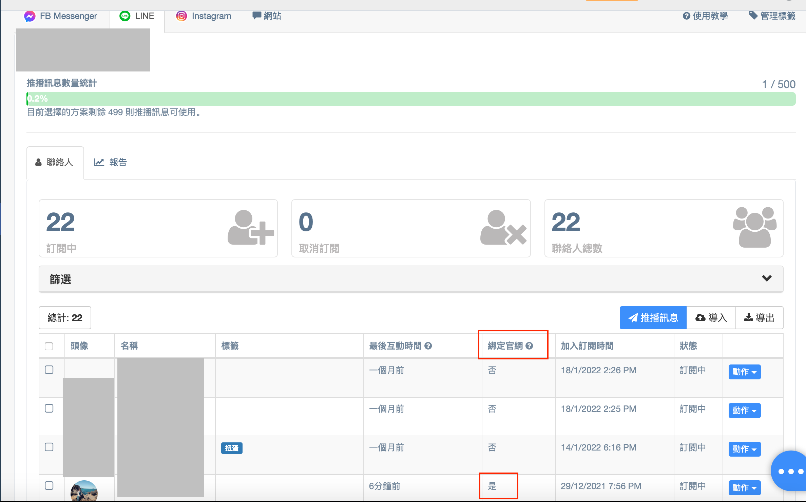

# 機器人綁定（站外綁定）

## 如何完成機器人按鈕綁定？

客人只要點擊機器人按鈕，該按鈕設定為開啟官網的 URL，當客人點擊按鈕開啟官網網址時，就可以成功將客人與開啟的瀏覽器完成綁定。

舉例來說，如果客人點擊 LINE 官方帳號中的機器人按鈕，並且使用 LINE 內建瀏覽器開啟官網，那就是將『LINE 社群身份』及『LINE 內建瀏覽器』完成綁定。


注意：&#x20;

* 機器人按鈕設定的 URL『**不可轉址**』、『**不可為縮網址**』和『**不可為短網址**』，否則綁定無法成功
* 機器人按鈕設定的 URL 需為含有 Omnichat 插件代碼的網址，如為其他外部網址（例如google 表單）將無法完成機器人按鈕綁定
* 機器人卡片中的機器人按鈕皆適用此功能（包含：文字訊息、輪播訊息和 LINE 圖文訊息等）
* 只要能連結到 Omnichat 的機器人模組都可以做到機器人按鈕綁定功能。例如：關鍵字自動回覆、歡迎模組等


### LINE 官方帳號範例（以關鍵字自動回覆為例）

步驟 一 ：先在 Omnichat 完成機器人模組設定。

機器人模組需設定機器人按鈕且選擇『開啟 URL』，並務必貼上完整網址（請參考：[自助機器人設定](https://docs.omnichat.ai/features/marketing/chatbot-builder)）

路徑：『進階自動化功能』→『自助機器人』

步驟二：設定 LINE 官方帳號的關鍵字自動回覆條件，並且連結到步驟一設定好的機器人模組（請參考：[關鍵字自動回覆教學](https://docs.omnichat.ai/features/marketing/keyword-autoreply)設定）

路徑：『進階自動化功能』→『關鍵字自動回覆』

步驟 三 ：客人輸入關鍵字（如圖中『新品』字詞）觸發關鍵字自動回覆，並且『點擊機器人按鈕』（如圖中『點我看人氣商品』）開啟官網

步驟 四：客人成功完成LINE社群身份綁定（可至連絡人及推播訊息中查看，如客人 LINE 社群身份有在『綁定官網』欄位顯示『是』，就表示綁定成功）


注意：

* 此功能僅適用『機器人按鈕』，如設定在LINE圖文選單的URL中，將無法社群身份綁定功能。如想在圖文選單進行綁定，需在定義行動時選擇機器人模組，才可以讓消費者點擊機器人按鈕完成綁定。(LINE圖文選單綁定請參考此篇[活用教學](https://docs.omnichat.ai/features/marketing/line-tu-wen-xuan-chan/huo-yong-tu-wen-xuan-chan#mi-ji-yi-cong-line-guan-fang-zhang-hao-jiang-ke-ren-dai-hui-wang-zhan-wan-cheng-bang-ding)）
* 透過『機器人按鈕』完成綁定時，客人將不會收到『綁定成功訊息』，也就是說客人不會知道自己按下機器人按鈕的行為已經完成社群身份綁定


### FB Ｍessenger（以關鍵字自動回覆為例）

步驟 一 ：先在 Omnichat『進階自動化功能』『自助機器人』中完成機器人模組設定。機器人模組需設定機器人按鈕選擇『開啟 URL』，並務必貼上完整網址（請參考：[自助機器人設定](https://docs.omnichat.ai/features/marketing/chatbot-builder)）

步驟二：設定 FB Messenger 關鍵字自動回覆條件，並且連結到步驟一設定好的機器人模組（請參考：[關鍵字自動回覆教學](https://docs.omnichat.ai/features/marketing/keyword-autoreply)設定）

步驟 三 ：客人輸入關鍵字（如圖中『新品』字詞）觸發關鍵字自動回覆，並且『點擊機器人按鈕』（如圖中『點我看人氣商品』）開啟官網

步驟 四：客人成功完成社群身份綁定（可至連絡人及推播訊息中查看，如客人FB社群身份有在『綁定官網』欄位顯示『是』，就表示綁定成功）

.png>)


注意：

* 透過『機器人按鈕』完成綁定時，客人將不會收到『綁定成功訊息』，也就是說客人不會知道自己按下 FB Messenger 機器人按鈕的行為已經完成 FB Messenger 社群身份綁定


