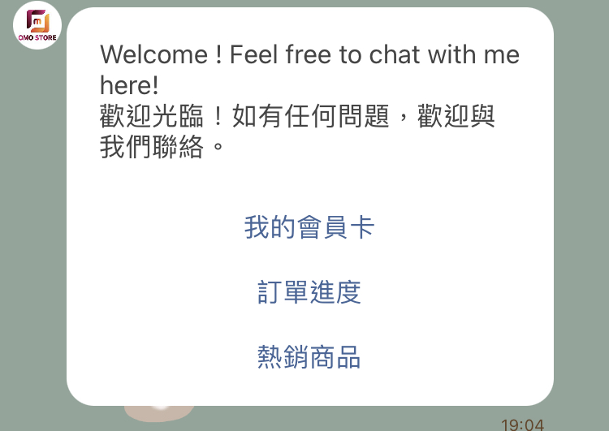

# 機器人模組（91APP 用戶限定）

## 如何在 LINE 官方帳號中叫出機器人模組

### 步驟一：先至 91APP 後台將 LINE 相關設定完成

1. 請至 91APP 後台的 Marketing Cloud -> LINE 模組設定。請選擇合作廠商 Omnichat，因為 91APP 與 Omnichat 之間需要拋轉 Webhook URL 並且讓商店在 Omnichat 上面進行聊天機器人的操作。 \
   所以，會有兩個提醒視窗提示，商店必須填入 Omnichat 的 Webhook URL 並且聊天機器人的設定在此頁面會關閉，請至 Omnichat 後台操作。

<figure><figcaption></figcaption></figure>

2\. 因選擇 Omnichat 為合作廠商，因此會多新增一個欄位為『Webhook URL』。此時請將 Omnichat 的 Webhook URL 複製貼上到此處，確保 91APP 與 Omnichat 之間資料拋轉正常。

可先至 Omnichat 後台的 通訊渠道>> 串接社群通訊渠道 >> LINE 官方帳號整合，複製 Omnichat Webhook URL。

<figure><figcaption></figcaption></figure>

<figure><figcaption></figcaption></figure>

3\. 當商店選擇已有合作廠商 Omnichat 的時候，91APP 的聊天機器人功能將關閉，商店需在 Omnichat 後台進行聊天機器人的操作及設定。

<figure><figcaption></figcaption></figure>

### 步驟二：先至 Omnichat 後台進階自動化功能中的『自助設計機器人』 來新增機器人

提醒：您也可以使用在 LINE 平台的機器人內做『新增模組』的方式來進行製作

### 步驟三：建立機器人模組

<figure><figcaption></figcaption></figure>

1. 點擊『新增模組』
2. 新增兩個機器人模組命名『我的會員卡』、『訂單查詢（出貨進度）』和『熱銷商品』（可任意命名）
3. 新增『我的會員卡』模組後，在模組內找到『新增卡片』的地方，點選『文字訊息』卡片，並在文字卡片下方，設定機器人按鈕
4. 讓『我的會員卡』模組中的機器人按鈕，連結到『對話模組』中『＠我的會員卡(只支援 LINE )』系統預設模組
5. &#x20;點擊『91APP 訂單查詢』模組，照以上方法再設定後連結『對話模組』中『＠出貨進度(只支援 LINE )』
6. 點擊『91APP 熱銷模組』模組，照以上方法再設定後連結『對話模組』中『＠熱銷商品(只支援 LINE )』

### 步驟四：91APP 機器人常見應用

除了從官網來進行 91APP 會員綁定，可以參考以下常見應用方式來讓消費者進行 91APP 會員綁定、查看 91APP 會員和訂單資訊唷！

1. 關鍵字自動回覆
2. LINE 的歡迎訊息（如您有將該隻機器人模組設定在 Omnichat 後台的通訊渠道 -> 社群通訊渠道 -> LINE 的歡迎訊息）
3. LINE 圖文選單

#### 一、關鍵字自動回覆

完成機器人模組的設定後，可以運用「關鍵字自動回覆」，讓客人在 LINE 官方帳號留言時，有打中關鍵字，就先觸發「我的會員卡」模組和「出貨進度」模組給客人做查看。

首先可至『進階自動化功能』>『關鍵字自動回覆』設定完成機器人模組。詳細關鍵字自動回覆內容請參考[這裡](../../keyword-autoreply.md)

1. 先點擊『添加回覆分組』，設定『目標通訊渠道』為『LINE 官方帳號』。
2. 再點擊『添加條件』，設定關鍵字自動回覆條件與內容

 

1. 點擊添加條件後，設定關鍵字條件為『完全符合』
2. 關鍵字為『我的會員卡』
3. 需將『及事件狀態為』設定為『處理中』，才能讓真人客服接手處理後依然可以觸發關鍵字自動回覆
4. 自動回覆內容勾選『機器人模組』，選擇設定好的機器人『關鍵字自動回覆- 91 APPLINE 綁定』中『我的會員卡』模組，並按下『儲存』

#### 二、LINE 的歡迎訊息

除了使用關鍵字自動回覆功能來進行觸發外，您還可以使用 LINE 歡迎訊息設定為機器人模組來進行設定

可在機器人模組內設定文字訊息卡片，透過卡片底下的機器人按鈕分別設定導至『＠我的會員卡(只支援 LINE )』 『＠出貨進度(只支援 LINE )』和『＠熱銷商品(只支援 LINE )』

<figure><figcaption>
Omnichat 後台機器人
</figcaption></figure>

 

<figure><figcaption>
LINE 
</figcaption></figure>

#### 三、LINE 圖文選單

透過 Omnichat 後台設定好機器人後，在進階自動化功能 -> LINE 圖文選單內將定義行動導至機器人模組

關於 LINE 圖文選單您可以參考[這裡](../../line-tu-wen-xuan-dan/)

<figure><figcaption></figcaption></figure>
