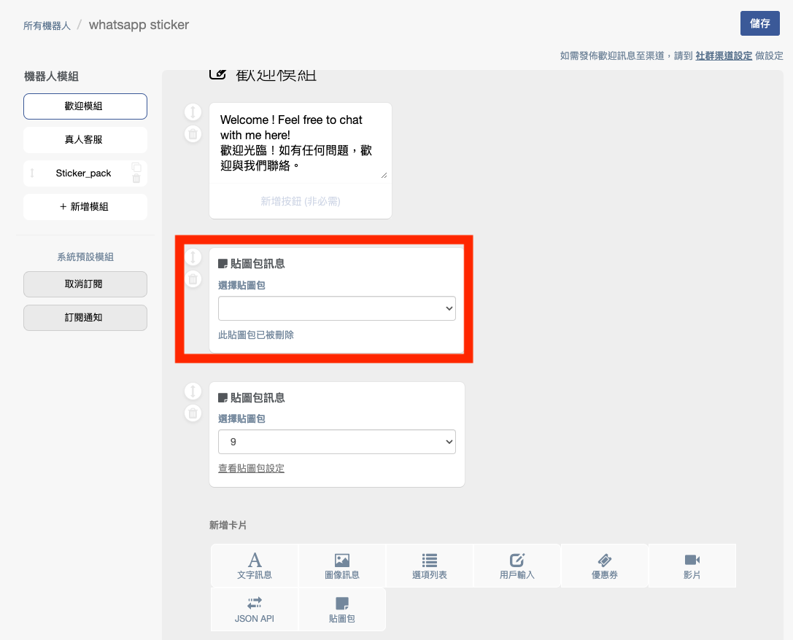

# WhatsApp 限定機器人


WhatsApp 目前暫時不支援 URL 功能，因此按鈕內導向功能為『對話模組』和『標籤』


若需使用限定機器人，請先重新新增一隻機器人，並選擇「**只限 Whatsapp**」！

### ㄧ、圖像訊息卡片

WhatsApp 支援 caption 功能，您可以在圖片下方放上說明

### 二、選項列表卡片

『選項列表』與『快速回覆』卡片作用相同，輸入標題文字，再輸入按鈕名稱。

底下可增加對於選項按鈕的說明內容。當消費者按其中按鈕時，前往您指定的對話模組，可增加 10 個按鈕。

.png>)

.jpeg>)

### 三、貼圖包卡片


1. 該功能須先完成加購 WhatsApp 表情包功能才能使用。
2. 請留意，該機器人模組請選擇 WhatsApp 限定渠道，若選擇發布於其他平台的機器人模組，則不會出現該選項。


新增卡片後，選擇需要的貼圖包並點選儲存，於 WhatsApp 中使用。

若該貼圖包被刪除時，會於卡片內顯示提醒文字「該貼圖包已被刪除」。

