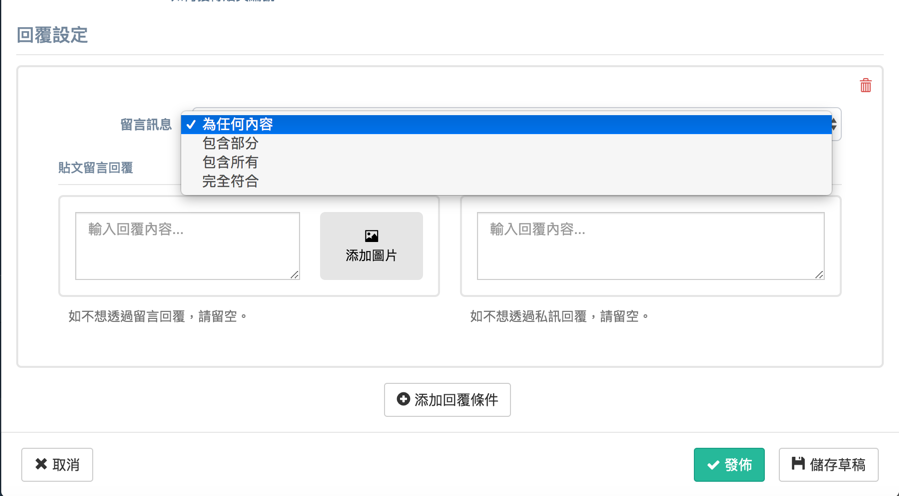
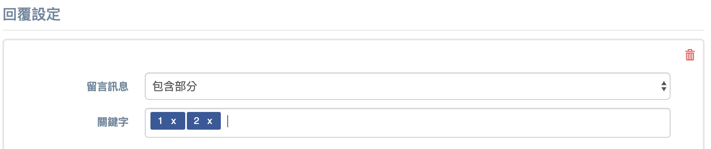
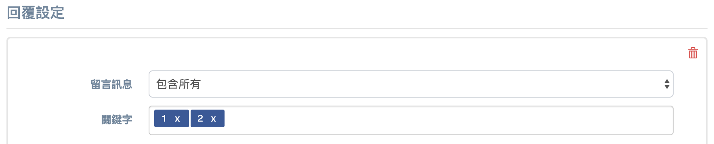
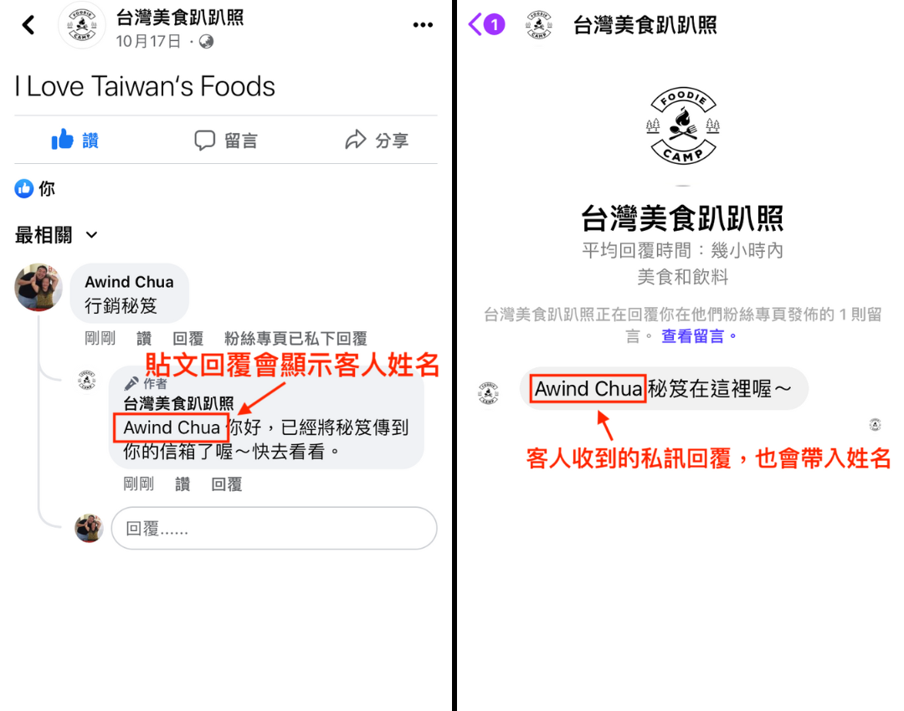
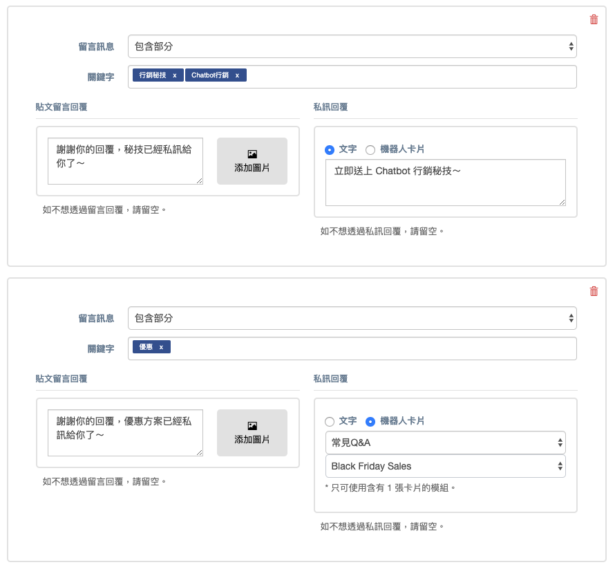

# Facebook / Instagram 貼文回覆


請留意，如欲使用「Facebook 貼文回覆」功能，必須是以 Facebook 粉專管理員身份登入Facebook 粉絲專頁的狀態下才能使用，若非登入狀態則不能使用。


## **如何設定** Facebook / Instagram 貼文回覆活動

### 步驟 **1 - 新增活動**

點選右上角的「**新活動**」按鈕

### 步驟 2 - 設定活動名稱及目標 Facebook / Instagram 專頁

* 輸入活動名稱
* 設定 Facebook / Instagram 專頁

<figure><figcaption></figcaption></figure>

### 步驟 3 - 選擇 Facebook / Instagram 貼文 / 手動輸入貼文編號

在「**貼文**」清單中，選擇你需要發佈「**自動回覆**」的「**貼文**」


**貼文清單** 只會顯示 Facebook 粉專最近 **50** 篇「**已發佈**」的貼文

Instagram 顯示近期 **25** 篇「**已發佈**」的貼文


如想設定 Facebook「 **排程中貼文**」、『**廣告貼文**」或**舊貼文**你可以手動輸入貼文編號。


詳細可參考「[**如何獲得 Facebook 貼文編號?**](how-to-get-facebook-post-id.md)」



[how-to-get-facebook-post-id.md](how-to-get-facebook-post-id.md)



新增全部貼文選項，可以當作所有貼文預設的自動回覆，若有單獨貼文的回覆，則以單獨貼文的自動回覆為優先



如選擇全部貼文，可以支援『已發佈』、排程中以及『廣告貼文』的所有貼文。另外，活動前所發佈的所有貼文也會支援


### 步驟 4 - 設定貼文回覆的有效時間

設定的有效期間過後就不再派送，若沒有要設定時限則選取永久啟用

#### Facebook 貼文

#### Instagram 貼文

Instagram 的 IG 直播支援**「IG限時動態」**&**「IG直播」**等兩個功能，原本有效時間即為 24 小時，因此無法設定永久啟用。

### 步驟 5 - 設定貼文回覆的觸發條件

目前支援兩種觸發條件：留言訊息關鍵字、標記朋友，可以兩者同時設定。

#### 留言訊息關鍵字

1. **為任何內容**：不用設定關鍵字，在貼文下方留言任何內容（圖片 / FB 貼圖除外），即會觸發自動回覆
2. **包含部分**：若有設定多個關鍵字時，符合到其中一個關鍵字，就可以觸發自動回覆
3. **包含所有**：若有設定多個關鍵字時，需要符合所有關鍵字，才可以觸發自動回覆
4. **完全符合**：貼文下方的回覆內容需要跟後台設定的一模一樣，所以選擇此選項時，建議只設定一個關鍵字或句子即可，若設定多個關鍵字，也只會在留言「第一個」的關鍵字時才會觸發自動回覆，留言第二個之後的關鍵字不會觸發自動回覆

舉例來說：

選擇「**包含部分**」時，當客人留言 1、31、24 這種有包含到「1」或「2」的字詞就可以觸發

選擇「**包含所有**」，客人則必須要留言 12、21 這樣有包含到「1」和「2」的字詞，才可以觸發

選擇「**完全符合**」，客人只有在留言「Omnichat」時（Omnichat 是第一個關鍵字），才可以觸發自動回覆，留言「ABC」、「Hi」時不會觸發自動回覆

#### 標記朋友

<figure><figcaption></figcaption></figure>

1. 不需標記：若不限制需要標記朋友，請選擇此項
2. 大於或等於：設定數量後，系統會偵測客人符合標記朋友的數量後，自動觸發回覆內容


目前 Instagram 平台不支援偵測標記朋友，因此無法使用此條件。


### 步驟 6 - 設定貼文留言回覆及私訊回覆內容

設定**最少一組**的「貼文留言回覆」或「私訊回覆」。

「**私訊回覆**」內容支援2種類型：

1. 「**文字**」：以純文字私訊回覆，可以添加姓名參數自動顯示聯絡人名稱。
2. 「**機器人卡片**」：以機器人卡片模組回覆（注意：因為 Facebook 的限制，只可以回覆**包含 1 張卡片**的模組，建議使用有按鈕的卡片，可提高用戶跟粉專的互動率）


設定多個回覆訊息，系統會隨機選擇其中一個訊息回覆給使用者。如此可以避免每次自動回覆的訊息都相同，可以降低帳號被 Facebook 封鎖的機會



選擇以「**文字**」回覆時，可以點選輸入框右下的藍色框框選取【聯絡人名稱】，系統會在內容中帶入 \{{system:cutomer\_name\}} 的姓名參數，會自動抓取聯絡人社群名稱。


<figure><figcaption></figcaption></figure>

<figure><figcaption>
以上畫面為客人收到貼文回覆與私訊的畫面
</figcaption></figure>

### 步驟 7 - 添加多組貼文留言回覆及私訊回覆內容

你亦可以設定**多組**貼文留言回覆及私訊回覆

### 支援消費者在限時動態標註 Instagram 官方帳號可收到私訊回覆


消費者 Instagram 帳號需為「公開」，否則若在「private」狀態無法觸發私訊給消費者內容。


#### 步驟一：先選擇貼文內容為「IG 限動標註」

#### 步驟二：可依照行銷活動設計期限：永久啟用或是時間排程

#### 步驟三：到「回覆設定」中進行私訊內容設定，可選擇文字或機器人模組


選擇以「**文字**」回覆時，可以點選輸入框右下的藍色框框選取【聯絡人名稱】，系統會在內容中帶入 \{{system:cutomer\_name\}} 的姓名參數，會自動抓取聯絡人社群名稱。


<figure><figcaption></figcaption></figure>

#### 當客人標註帳號時即會自動發訊息

## 列表功能

1. 草稿：草稿狀態下的貼文可以進去編輯修改貼文，一但發布之後只能暫停
2. 已暫停：只要啟用狀態按下暫停就會顯示，即便符合自動回覆條件也不會觸發
3. 列表頁帳號欄位後方會依據設定的貼文選項顯示：**單則貼文、全部貼文、IG直播**
4. 編輯：如需要進行修改，點擊編輯進去修改該設定
5. 啟動：可對「草稿」及「已暫停」的貼文活動進行設定
6. 暫停：按下該按鈕就會讓貼文活動呈現「已暫停」
