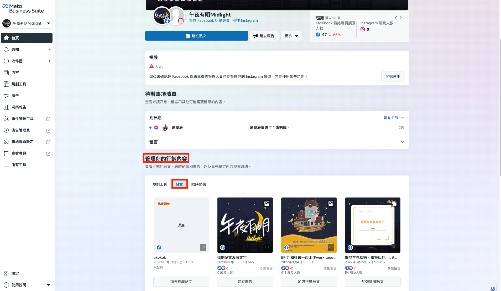
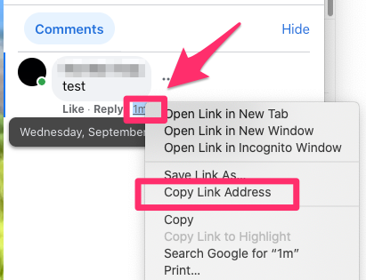

# 如何獲得 Facebook 貼文編號?

## 一般貼文

### 「已發佈貼文」

1. 前往[**Meta Business Suite**](https://business.facebook.com/latest/home?nav\_ref=bm\_flyout\_menu\&entry\_exp=jorxqhodyt\&nav\_source=flyout\_menu\&nav\_id=3101504572)

<figure><figcaption></figcaption></figure>

2. 點擊**管理你的行銷內容 > 貼文，**取得貼文 ID

<figure><figcaption></figcaption></figure>

### 「排程貼文」

1. 前往 **「Facebook 企業管理平台」**的 [**粉絲專頁貼文**](https://business.facebook.com/content\_management/)
2. 左側請選擇**「商業帳號」**的角色

<figure><figcaption></figcaption></figure>

3. 在右上方選擇你的 Facebook 粉絲專頁

<figure><figcaption></figcaption></figure>

4. 左側貼文類型選擇<mark style="color:blue;">**「廣告貼文」**</mark>

<figure><figcaption></figcaption></figure>

5. 點擊建立貼文，建立排程貼文

<figure><figcaption></figcaption></figure>

6. 在**「排定發佈的貼文」**裡可取得貼文ID

<figure><figcaption></figcaption></figure>


請注意，選擇好「商業帳號」後，點擊下方貼文類型時，會自動跳回「我的帳號」，記得再手動調整回「商業帳號」。


參考網址：[https://www.facebook.com/business/help/405841712841961](https://www.facebook.com/business/help/405841712841961)

## 影片/直播貼文

如果你想使用 Facebook 貼文回覆在影片/直播貼文，你需要使用以下方法取得正確的貼文編號：

1. 打開你的影片/直播貼文
2. 在貼文提交一個留言（任何內容）
3. 右鍵點擊留言時間，複製網址連結

4\. 你會取得像這樣的網址：https://www.facebook.com/OmnichatAI/posts/**1109876076212239**/?comment\_id=1109878909545289

5\. 在網址中 /posts/ 之後的那組數字就是正確的貼文編號（以上例子即： **1109876076212239**）

