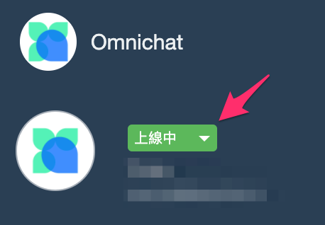

# 關鍵字自動指派


請注意！！關鍵字自動指派只有當該對話位於 「待處理」、「機器人」 及 「已結束」 的狀態時才會觸發，「處理中」 的對話我們視為已經由真人接手，所以不會觸發關鍵字自動指派



「關鍵字自動指派」會與「關鍵字自動回覆」同時觸發


## 添加指派分組

1. 點擊右方「**添加分組**」按鈕
2. 選擇「**目標通訊渠道**」：如您想同時設定在多個社群官方帳號或是粉專，也可以直接選擇
3. 按「**儲存**」完成添加分組

## 添加指派條件

1. 點擊「**添加條件**」
2. 設定條件啟用狀態
3. 設定關鍵字條件
4. 輸入「**關鍵字**」；如果**漏空「關鍵字」**欄位，代表**所有收到的訊息**都會觸發此條件
5. 當消費者輸入文字訊息觸發該關鍵字自動指派時，消費者也同時會被貼上標籤
6. 設定**指派到特定「團隊成員」或「指定權限角色」**（可多選）
7. 設定**指派順序**
   1. 「隨機」：隨機指派到其中一位按符合條件的團隊成員，注意有機會分佈不平均。
   2. 「按順序」：新事件會按符合條件的團隊成員的建立時間，順序自動指派。
8. 按「**儲存**」完成設定


如果團隊成員將自己的上線狀態改為「**已離線**」，將**不會自動指派**給該位成員


### 關鍵字條件

* 包含部分
  * 例：
    * 關鍵字： A、 B、 C
    * 收到訊息： 我想買A → 符合條件 ✅
* 包含所有
  * 例：
    * 關鍵字： 買、 B
    * 收到訊息： 我想買A → 不符合條件 ❌
    * 收到訊息：我想買B→ 符合條件 ✅
* 完全符合
  * 只可以輸入一個關鍵字
  * 例：
    * 關鍵字： 00
    * 收到訊息： 我想買00 → 不符合條件 ❌
    * 收到訊息： 00 → 符合條件 ✅

## 複製、修改或刪除指派分組或條件

1. 複製：即可以將您設定的分組進行複製
2. 點擊「**編緝**」按鈕可修改指派分組設定，下方條件圖示編輯可修改指派條件設定
3. 點擊「**刪除**」按鈕可刪除分組，下方條件圖示可刪除指派條件設定
4. 點擊「**QR Code**」按鈕會產生一個 QR Code 圖片及連結，只要客人掃描 QR Code 就會直接打開社群平台並帶上條件所設定的關鍵字（**只支援只有一個關鍵字/句子的指派條件**）
5. 顯示該關鍵字觸發次數，如果該條件是適用多平台則會顯示各平台的觸發次數

### **QRCode 支援 WhatsApp 原生連結**

* 在 WhatsApp 的關鍵字 QRCode，上方可以選擇原本的固定連結或是 WhatsApp 的原生連結
* _固定連結：_若有修改關鍵字，QR Code 和連結不會跟著變動
* _WhatsApp 原生連結_：若有修改關鍵字， QR Code 和連結會變動，主要提供給 WhatsApp 軟體內 QR Code Scanner 掃描使用

