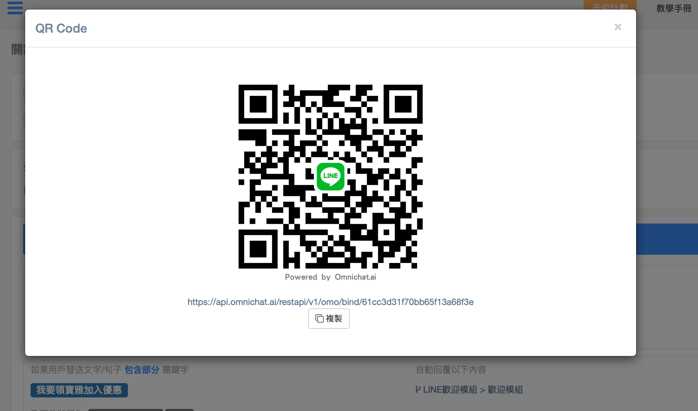

# 關鍵字自動回覆


1. 關鍵字自動回覆只有當該對話位於 「待處理」、「機器人」 及 「已結束」 的狀態時才會觸發。
2. 「處理中」 的對話我們視為已經由真人接手，除非在設定條件時的『及事件狀態為』有勾選『處理中』，否則不會觸發關鍵字回覆。


## 步驟一：添加回覆分組

## 步驟 二 : 填寫分組名稱，目標通訊渠道

## 步驟三：添加條件

## 步驟四：設定自動回覆條件及內容

### 設定回覆文字和選擇自動回覆的內容

如您選擇「機器人模組」，則需選擇想要回覆的機器人和機器人模組

<figure><figcaption></figcaption></figure>

### 設定回覆圖片

<figure><figcaption></figcaption></figure>

### 設定回覆圖片加文字 (支援 WhatsApp / 網站對話插件)


選擇以「**文字**」或「**圖片+文字**」回覆時，可以點選文字輸入框右下的藍色框框選取【聯絡人名稱】，系統會在內容中帶入 \{{system:cutomer\_name\}} 的姓名參數，會自動抓取聯絡人社群名稱。


<figure><figcaption></figcaption></figure>

### 設定回覆貼圖 (只支援 WhatsApp)

<figure><figcaption></figcaption></figure>


注意：貼圖背景必須是透明、大小必須是 512x512 像素、檔案大小不可超過 100 KB 及格式必須為 WebP。


### 設定回覆內容為 不回覆任何訊息

設定回覆內容為【不回覆任何訊息】可以針對消費者留言關鍵字後，對客戶加上標籤，並且不回覆任何訊息給消費者。

<figure><figcaption></figcaption></figure>

## 步驟5：設定關鍵字事件狀態

主要分為「待處理/已結束/機器人」與「處理中」兩種狀態，預設為「待處理/已結束/機器人」狀態，而在此處可決定是否需勾選「處理中」。


若勾選「處理中」的事件狀態，則代表當真人客服已經跟進該事件時，設定的關鍵字條件會被觸發。


#### 未勾選處理中時，關鍵字自動回覆僅能在「待處理、已結束、機器人」三種狀態被觸發：

<figure><figcaption></figcaption></figure>

有勾選處理中時，關鍵字自動回覆被觸發：

<figure><figcaption></figcaption></figure>

### 關鍵字條件

* 包含部分
  * 例：
    * 關鍵字： A、 B、 C
    * 收到訊息： 我想買A → 符合條件 ✅
* 包含所有
  * 例：
    * 關鍵字： 買、 B
    * 收到訊息： 我想買A → 不符合條件 ❌
    * 收到訊息：我想買B→ 符合條件 ✅
* 完全符合
  * 只可以輸入一個關鍵字
  * 例：
    * 關鍵字： 00
    * 收到訊息： 我想買00 → 不符合條件 ❌
    * 收到訊息： 00 → 符合條件 ✅

## **關鍵字自動回覆**可支援多選渠道


如果您發現無法直接變更該分組的通訊平台，請直接複製該分組後再行變更



注意：機器人模組可以選擇的選項也會根據所選渠道篩選。\
如：當現在選擇渠道為 LINE 及 Facebook，可以選到的機器人模組只有「全平台適用」；若是選擇 Facebook 及 Instagram ，可以選到的機器人為「全平台適用」、「只限 Facebook」


### 設定方式

#### 一、建立關鍵字分組時就直接多選社群平台

#### 二、建立單一社群平台分組和底下條件後，點擊「複製」到其他需要使用相同關鍵字條件的平台上

## 關鍵字貼標籤

當消費者觸發關鍵字時，可以為觸發關鍵字的聯絡人貼上標籤\
\*\* 消費者需為 LINE / Messenger / Instagram / WhatsApp 社群渠道聯絡人身份，或者為有留下 email的訪客，才可以貼上標籤）

<figure><figcaption></figcaption></figure>

## 關鍵字 QRCode


請注意！關鍵字 QRCode 僅支援一個關鍵字，如為多個關鍵字無法產生 QRCode


步驟一：先設計關鍵字條件（需只有包含『一個』關鍵字，才能產生 QRCode)，並且設定好自動回覆以下訊息內容（關鍵字自動回覆設定請參考[設定自動回覆條件及內容](keyword-autoreply.md#bu-zhou-4-she-ding-zi-dong-hui-fu-tiao-jian-ji-nei-rong))

步驟二：消費者掃描 QRcode 會在對話輸入框出現設定好的關鍵字詞，當消費者發送關鍵字，就會觸發已經設定好的自動回覆內容


在FB Message、LINE、IG的關鍵字 QR Code ，若有編輯修改關鍵字或觸發的回應內容後，QR Code 和連結不會跟著變動。


### **QRCode 支援 WhatsApp 原生連結**

* 在 WhatsApp 的關鍵字 QR Code，上方可以選擇原本的固定連結或是 WhatsApp 的原生連結
* _固定連結：_若有修改關鍵字，QR Code 和連結不會跟著變動
* _WhatsApp 原生連結_：若有修改關鍵字， QR Code 和連結會變動，主要提供給 WhatsApp 軟體內 QR Code Scanner 掃描使用


如果您的關鍵字設定是多分組時，在產生 QR code 時，需選擇是要產生哪一個社群平台的 QR code


#### 如選擇多社群平台時，觸發次數會依照平台分開顯示

## 活用關鍵字QRCode貼標籤

### 情境：針對不同實體通路加入 LINE 官方帳號的消費者貼標籤

步驟一：先選擇 LINE 官方帳號渠道建立分組，再設計關鍵字條件。可以依據不同的實體通路設計關鍵字，例如針對屈臣氏通路，設計含有屈臣氏相關的關鍵字，針對寶雅通路，設計與寶雅相關的關鍵字，並且設定與不同通路相對應的自動回覆內容。\
\
（關鍵字自動回覆設定請參考[設定自動回覆條件及內容](keyword-autoreply.md#bu-zhou-4-she-ding-zi-dong-hui-fu-tiao-jian-ji-nei-rong))


關鍵字自動回覆條件設定更動不會影響 QR code 和 Link 連結。


<figure><figcaption></figcaption></figure>

步驟二：當消費者掃描 QRCode，會進入到 LINE 官方帳號，並且會在對話框中看到設定好的字詞（如以上的範例字詞：我要領屈臣氏加入優惠），當消費者傳送關鍵字後，該名消費者會被貼上標籤

步驟三：到『聯絡人及推播訊息』LINE 官方帳號列表中，可以看到被貼上標籤的消費者，後續可以篩選出被貼上標籤的聯絡人（請參考 [聯絡人及推播訊息](broken-reference) 設定）

.png>)

## 常見問題

#### Q: 若有客人發出的訊息符合兩個關鍵字規則，會觸發哪一個規則？

A: 會觸發最後(最新)創建關鍵字規則。
