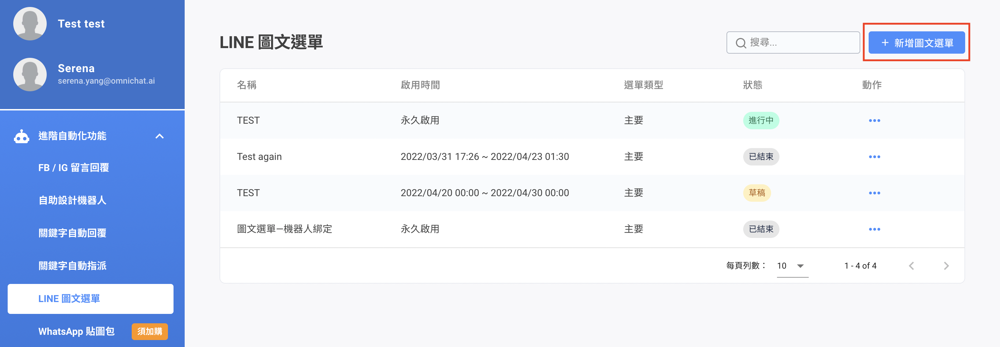

# LINE 圖文選單


1. 如果您在 LINE OA 後台已有設定圖文選單，之後進到 Omnichat 後台來進行設定並進行發布時，會以 **Omnichat 所設定的圖文選單為主**。
2. 由於透過『Messaging API 』設定圖文選單，消費者實際看到的選單可能與此有所差異，Omnichat 建議還是以其中一邊後台來進行設定，以免混淆唷！


### 步驟一：新增圖文選單

### 步驟二：設定圖文選單

1. &#x20;LINE 官方帳號（必填）：可以選定是要製作在哪一個 LINE OA 官方帳號
2. 名稱（必填）：是針對這個圖文選單活動命名，僅在後台顯示，不會讓客人看到（字數最多為300字）
3. 選單類型（必填）：主要選單為進到 LINE 官方帳號見到的第一個圖文選單；次要選單為另一個圖文選單
4. 圖文選單可顯示給綁定或是尚未綁定的人
   * 預設：為全部加入 LINE 官方帳號都可以看到的圖文選單
   * 勾選社群身份綁定：當已經完成「社群身份綁定」的消費者 LINE 帳號會優先看到該圖文選單
   * 如您的團隊有購買 OMO 方案，則完成「OMO 綁定」消費者 LINE 帳號會優先看到該圖文選單
   * _**「OMO 綁定」跟 「社群身份綁定」只會擇一彈出選擇**_
5.  啟用時間：

    <figure><figcaption></figcaption></figure>

    * 立即：可以是立即出現在 LINE 官方帳號底下圖文選單&#x20;
    * 排程：將配合行銷活動的圖文選單先行製作，並設定開始與結束時間


1. 排程時間不能與其他帶有排程的圖文選單 時間重疊
2.  排程開始及結束時間需要設定比現在時間 晚一分鐘以上

    例如：現在是 12/28 11:30 ，排程開始時間 需設定於 12/28 11:31 分後，結束時間同理且不得早於開始時間
3. 請先設計主要選單，再進行設計次要選單


6\. 預設顯示：客人進到 LINE 官方帳號時，圖文選單是展開還是收合

7\. 設定圖文選單樣板

_**自訂版型：可以在預覽頁面新增自定義區塊，且新增預覽區塊的英文順序對應下方行動的英文標題順序。**_

8\. 編輯選單列可顯示文字，右邊預覽可確認編輯後的圖文樣式（字數最多為14字）

9\. 上傳檔案：圖片格式需為 2500x1686 pixel，格式需為 JPEG、JPG、PNG，檔案大小為 1 MB&#x20;


目前暫時支援一種格式，無支援其他 LINE OA 後台樣版格式


10\. 定義行動：可選「文字訊息」、「開啟 URL」、「機器人模組」三種行動

* 文字訊息
* 開啟 URL：須填入『https://』 開頭網址


開啟 URL 僅能填寫網址，不能追加任何其他非網址的文字訊息


* 機器人模組：文字訊息為客人點擊後顯示的文字內容，這是非必填欄位 ; 標籤可新增五個且也為非必填欄位
* 切換圖文選單


請留意！圖文選單的三種行動中，**只有選擇「對話模組」時，有支援貼標籤**，其他兩種行動（開啟 URL 和文字訊息）皆無支援貼標籤


若選擇新增為主要選單，在定義行動中第一時間會沒有關聯的次要選單可以選擇，並同時會跳出提示訊息告知您下一步行動

### 步驟三：設定完成

圖文選單設定完成後可以選擇進行『儲存』或是『發佈』

1. 『儲存』：該圖文選單會進入『草稿』，可返回圖文選單列表點擊鉛筆圖示進行編輯
2. 『發佈』：該圖文選單會進入『排程中』，排程中的圖文選單無法編輯啟用時間、也無法儲存設定，只能直接發佈更新內容，**若要更改啟用時間須先將圖文選單暫停或結束**。

### 步驟四：設定次要選單


1. 若選擇次要選單，則需要選擇關聯的主要選單
2. 可以建立超過一個以上的次要圖文選單
3. 若選擇次要選單，則啟用時間必為立即，預設顯示必為展開，客戶無法選取
4. 如您設定「永久啟用」和「排程中」的圖文選單，在排程期間會**優先顯示排程中選單**，等排程時間結束會改為**永久選單**


1. LINE 官方帳號（必填）：可以選定是要製作在哪一個 LINE OA 官方帳號
2. 名稱（必填）：是針對這個圖文選單活動命名，僅在後台顯示，不會讓客人看到（字數最多為300字）
3. 選單類型（必填）：主要選單為進到 LINE 官方帳號見到的第一個圖文選單；次要選單為另一個圖文選單
4. 圖文選單可顯示給綁定或是尚未綁定的人
   * 預設：為全部加入 LINE 官方帳號都可以看到的圖文選單
   * 勾選社群身份綁定：當已經完成「社群身份綁定」的消費者 LINE 帳號會優先看到該圖文選單
   * 如您的團隊有購買 OMO 方案，則完成「OMO 綁定」消費者 LINE 帳號會優先看到該圖文選單
   * _**「OMO 綁定」跟 「社群身份綁定」只會擇一彈出選擇**_
5. 啟用時間：
   * 立即：可以是立即出現在 LINE 官方帳號底下圖文選單&#x20;
   * 排程：將配合行銷活動的圖文選單先行製作，並設定開始與結束時間
6.  設定圖文選單樣板

    _**自訂版型：可以在預覽頁面新增自定義區塊，且新增預覽區塊的英文順序對應下方行動的英文標題順序。**_&#x20;
7. 編輯選單列可顯示文字，右邊預覽可確認編輯後的圖文樣式（字數最多為14字）&#x20;
8. 上傳檔案：圖片格式需為 2500x1686 pixel，格式需為 JPEG、JPG、PNG，檔案大小為 1 MB
9. 定義行動：可選「文字訊息」、「開啟 URL」、「機器人模組」三種行動
   * 文字訊息
   * 開啟 URL：須填入『https://』 開頭網址。
   * 機器人模組：文字訊息為客人點擊後顯示的文字內容，這是非必填欄位 ; 標籤可新增五個且也為非必填欄位。
   * 切換圖文選單

#### 連結主要選單會出現的三種情況：

1. 如您先建立次要選單，而尚未建立任何一個主要選單，該關聯選單會出現其提示訊息
2. 關聯主要選單未選取的錯誤訊息
3. 如您已建立好主要選單，即可以在此列表點選關聯至哪一個主要選單

## 圖文選單列表

<figure><figcaption></figcaption></figure>


**不論主要或是次要選單，只要是「排程」、「進行中」狀態的圖文選單都無法變更選單類型、啟用時間，只有在「草稿」、「暫停中」、「已結束」的狀態才可以做更改。**


1. 搜尋：可搜尋圖文選單名稱來查找
2. 名稱：圖文選單名稱，僅出現在後台系統
3. 啟用時間：會顯示排程的時間間隔或是永久啟用
4. 選單類型：分為次要和主要，**在次要選單後方的行動，只有暫停沒有結束**
5. 主要選單顯示條件：如有設定為社群身份綁定則會顯示，若無則視為預設
6. 狀態：選單狀態分為五種。草稿、排程中、進行中、已暫停以及已結束
7. 更多：裡面列表可進行圖文選單進行編輯、暫停、結束、複製和點擊統計


**若要暫停、結束、刪除主要選單，會跳出提示訊息告知用戶會一並將關聯的次要選單暫停、結束、刪除（主次要選單狀態會相同）**



複製圖文選單後，該圖文選單名稱為「Copy of 原本 LINE 圖文選單名稱」且狀態為草稿狀態


### 點擊統計表

<figure><figcaption></figcaption></figure>

* 舊的圖文選單需要重新發佈才會開始計算點擊數和點擊率
* 草稿以外的選單才能看見點擊數和點擊率
* 點擊佔比 = 點擊數/總點擊數
* 點擊統計以行動區塊計算點擊數，若編輯區塊，會導致新舊數據累計在相同區塊
* 為避免數據混雜，建議複製選單後，再進行編輯。
* 文字訊息暫時不支援計算點擊數

## 製作圖文選單注意事項

#### 圖文選單列表上操作

* 需要先確認您原本暫停的圖文選單是什麼類型。若是暫停、結束、刪除主要選單，會跳出提示訊息告知用戶，將會一並把關聯的次要選單暫停、結束、刪除（主、次要選單狀態會相同）

<figure><figcaption></figcaption></figure>

#### 發佈圖文選單

* 若要發佈或排程目前是「暫停中」或是「已結束」的主要圖文選單，系統會先檢查在主要選單定義行動區塊有相關聯的次要選單狀態
* 若此時次要選單不是 _**進行中**_ 的狀態，在發布主要選單時就會跳出提醒訊息，請客戶先將有在定義行動區塊關聯的次要選單都先發布，才能發佈此主要選單

* 若在排程時間到之前，次要選單被手動暫停。此時若已到排程時間，但次要選單狀態依然是暫停的話，主要選單會無法被正常發佈，且會在列表中將主要選單前面加『暫停』文字，並更改主要選單狀態為暫停


如遇到該情況，請先確認兩個部分：

1. 主要選單是否唯有設定排程的主要選單
2. 與該主要選單相關連的次要選單狀態是否已正常上線


