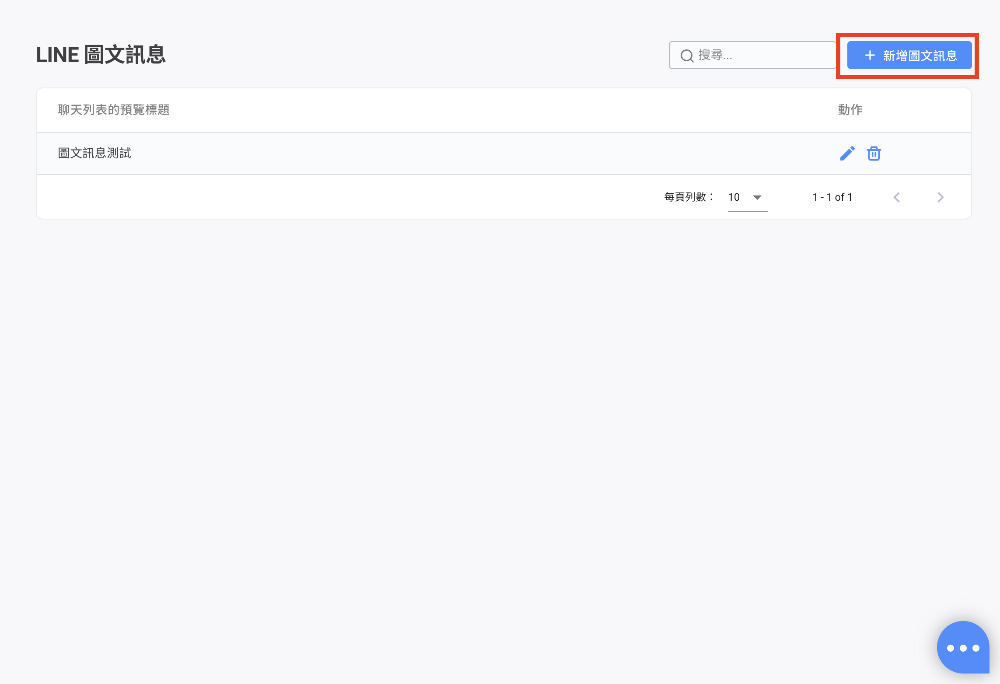
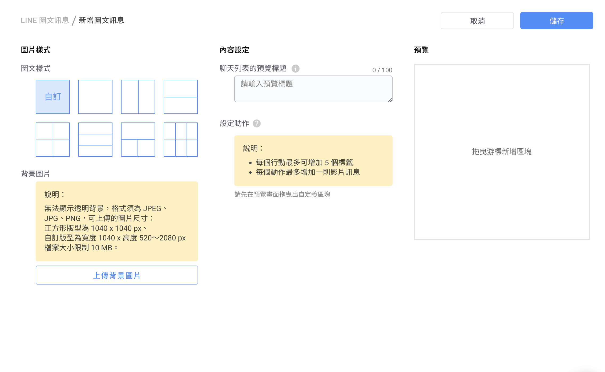
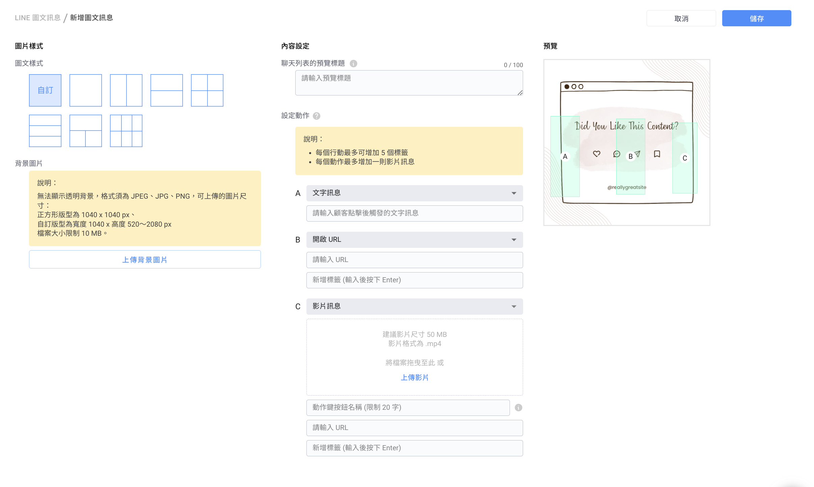
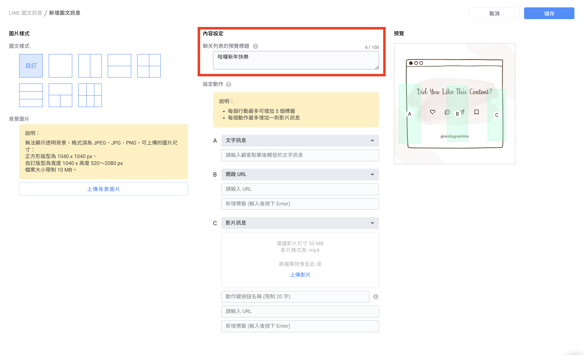
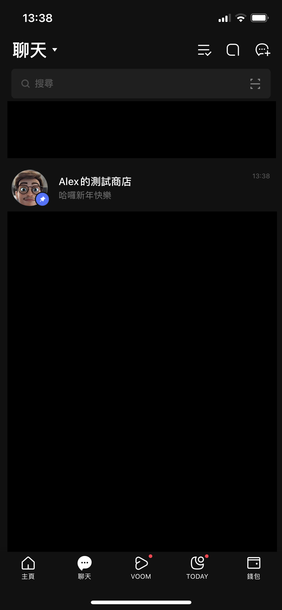
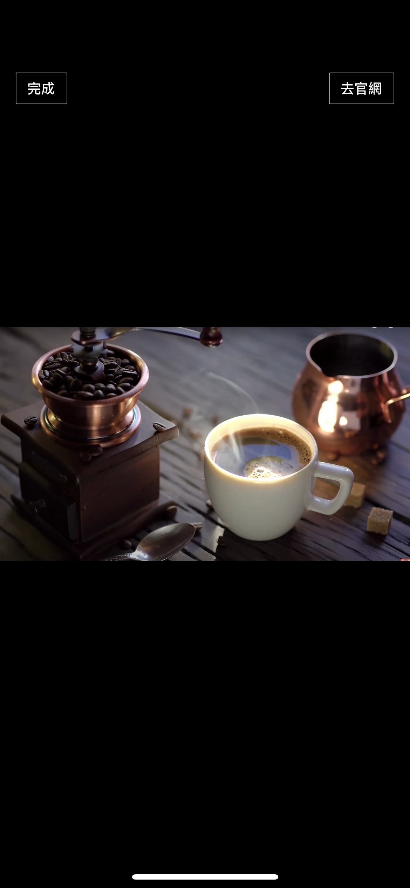
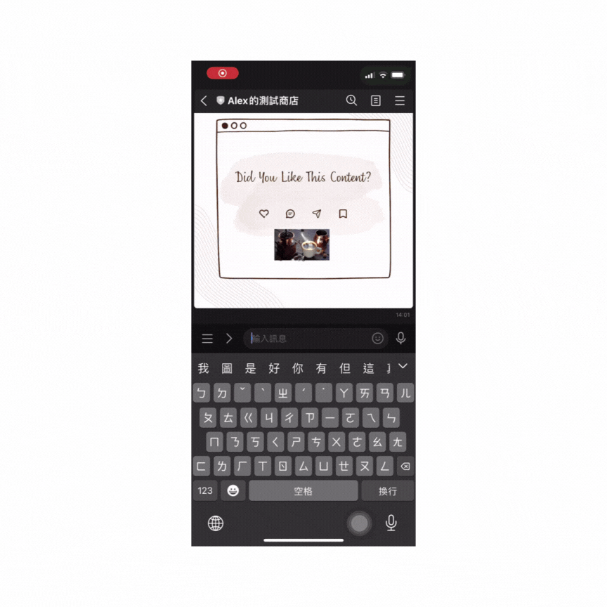
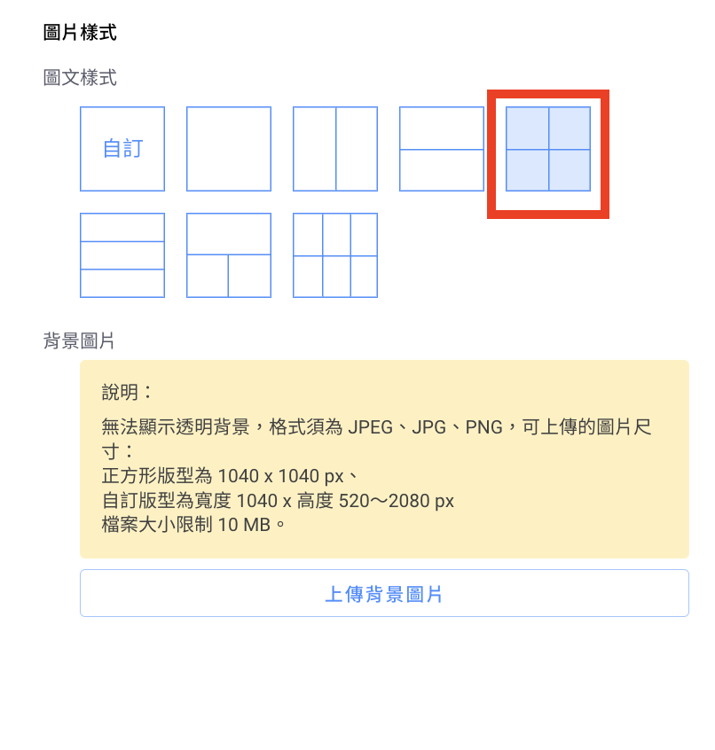
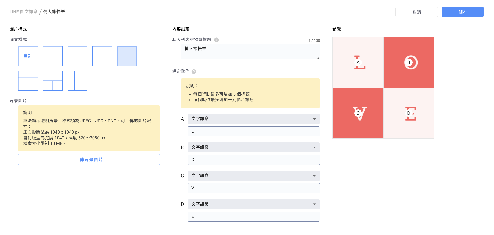

# LINE 圖文訊息


設定完圖文訊息後，請在「 LINE 專用平台機器人」內使用「圖文訊息卡片」\
\
設定步驟可參考：[https://reurl.cc/8q6m9g](https://reurl.cc/8q6m9g)


## 進階自動化功能 > LINE 圖文訊息 > 點選「新增圖文訊息」

<figure><figcaption></figcaption></figure>

### **以下為設定「圖文訊息」的步驟：**

#### 步驟**一**：選擇模板

<figure><figcaption></figcaption></figure>


1. 無法顯示透明背景，格式須為 JPEG、JPG、PNG
2.  可上傳的圖片尺寸：

    正方形版型為 ：1040 x 1040 px

    自訂版型為：長寬比不能大於3、寬度最寬1040px；高度最高3120px

    檔案大小限制 10 MB


#### 步驟二 定義行動：輸入 URL、影片、標籤及文字訊息

**URL、影片、文字訊息框**為**必填**欄位，標籤為非必填


1. 點擊圖文訊息後需要**自動貼標籤**時，請在標籤名稱欄位輸入標籤**。**
2. 自動貼標動作若網址為短網址、縮網址、轉網址或網址非帶有 Omnichat 網站插件的網頁時，上述情況**均可做到自動貼標**。
3. **只能有一個行動為影片**，當其中一個動作為影片時，其他行動能選無法擇影片
4. 影片動作可支援：動作鍵顯示文字、連結網址、按下動作後貼上標籤。


<figure><figcaption></figcaption></figure>

1. 文字訊息：設定點擊後送出的訊息內容，可與「[關鍵字自動回覆](keyword-autoreply.md#bu-zhou-si-she-ding-zi-dong-hui-fu-tiao-jian-ji-nei-rong)」搭配使用
2. 可設定 URL，不可包含其他文字
3. 影片
   * 「上傳影片」按鈕：將影片檔案進行上傳
   * 「動作鍵顯示文字」：設定影片按鈕鍵顯示文字
   * 連結網址以及點擊按鈕鍵之後被貼上的標籤，建立標籤時，務必按下「Enter」鍵後，讓原本的文字呈現**藍底白字**，這樣才有成功建立標籤

#### &#x20;步驟三： 「內容設定」>「聊天列表的預覽標題」

* 用戶可以自訂當客人的LINE收到圖文訊息時所顯示的新訊息通知
* Omnichat 提供「編輯」欄位，讓用戶可以自訂當客人的 LINE 收到圖文訊息時所顯示的新訊息通知（可查看下方手機截圖畫面）
* 「聊天列表的預覽標題」欄位：字數上限 100 字\

<figure><figcaption></figcaption></figure>

#### 步驟四： 按下「儲存」按鈕之後，即完成設定！

<figure><figcaption>
客人收到圖文訊息時，聊天列表會出現預覽標題
</figcaption></figure>

### 圖文訊息設定影片

已經設定完的影片動作，若有設定按鈕時，按鈕會出現在影片右上角上方（如下圖的「去官網」）\

<figure><figcaption></figcaption></figure>

## 圖文訊息應用

### 以應用於「推播訊息」為例

當您推播圖文訊息給消費者之後，消費者的 LINE 聊天列表會查看到新訊息通知（即是您在「聊天列表的預覽標題」欄位裡設定的文字內容）：

<figure><figcaption></figcaption></figure>

<figure><figcaption>
影片會顯示在圖文訊息裡，客人點擊後可瀏覽影片
</figcaption></figure>

### 消費者點擊圖文訊息卡片後可以跳轉至下一層機器人模組

#### 步驟ㄧ：先依照樣板，並依照樣板上傳適合的背景圖片

<figure><figcaption></figcaption></figure>

#### 步驟二：在行動中選擇「文字訊息」並填上每個選項中代表的答案

<figure><figcaption></figcaption></figure>

#### 步驟三：到「關鍵字自動回覆」中將選項內的文字設定為關鍵字


1. 建議設定關鍵字條件為「完全符合」以免消費者手動輸入有關字詞時誤觸發
2. 如果是設計問卷方式將客人貼上標籤，可以在關鍵字自動回覆內設計標籤內容


#### 步驟四：當消費者觸發出圖文訊息時，點擊圖片即會彈出設定好的文字，而觸發相對應的機器人模組內容

