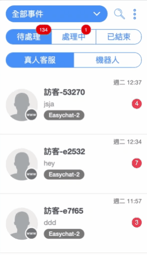

# 對話

## **對話事件狀態**

對話事件分為「待處理」、「處理中」、「已結束」

| 狀態             |                                                                                                                     |
| -------------- | ------------------------------------------------------------------------------------------------------------------- |
| **待處理**        | <ul><li>當新的客人發問，事件狀態會預設為「待處理」</li><li>如對話事件為「已結束」狀態，客人再次發問，事件狀態會重新回到「待處理」</li></ul>                                 |
| **處理中**        | <ul><li>如對話事件為「待處理」狀態，其一位團隊成員點擊「跟進」按鈕，事件狀態會轉為「處理中」</li><li>如對話事件為「已結束」狀態，其一位團隊成員點擊「↻ 重啟事件」按鈕，事件狀態會轉為「處理中」</li></ul> |
| **已結束**        | <ul><li>如對話事件為「處理中」狀態，客服跟進完成後，按上方的「✓ 結束事件」圖示，事件狀態會轉為「已結束」</li></ul>                                               |

.png>)

### **待處理**

待處理事件細分為「真人客服」及 「機器人」

| **真人客服**              | 機器人                                                                                                                                                                                                                                                                                                                                                                                 |
| --------------------- | ----------------------------------------------------------------------------------------------------------------------------------------------------------------------------------------------------------------------------------------------------------------------------------------------------------------------------------------------------------------------------------- |
| 所有需要 **真人客服** 跟進的對話事件 | 
當客人送出訊息符合關鍵字或是觸發機器人模組時，該對話事件會落在『機器人』頁面。

 以下狀況，對話會轉移到「真人客服」的狀態：     1. 客人要求「真人客服」或客服人員主動跟進該對話。     2. 客人輸入的訊息<strong>不符合任何的關鍵字</strong>。 關於關鍵字自動回覆的設定請參閱 <a href="../marketing/keyword-autoreply.md"><strong>關鍵字自動回覆</strong></a>

關於如何設定 <strong>機器人</strong> 請查看<a href="../marketing/chatbot-builder/"><strong>自助聊天機器人 (DIY Chatbot)</strong></a>
 |

### **處理中 / 已結**束

處理中 / 已結束事件會細分為「我的跟進事件」及 「團隊跟進事件」

| 我的跟進事件                              | 團隊跟進事件                        |
| ----------------------------------- | ----------------------------- |
| 
所有屬於當前登入帳號的

客服人員所有跟進事件
 | 
所有其他

客服團隊人員的跟進事件
 |

.gif>)

## 篩選對話事件

你可以點選左上方「**全部事件**」按鈕查看所有你已經串接的通訊渠道；點選下拉選單其中一個頻道，事件列表就會只顯示該頻道的事件。

.png>)

## 搜尋對話事件

可透過搜尋功能，依照類別來進行查詢

.png>)

使用者在『標籤』類別搜尋對話時，可以直接選擇已經創建過的標籤

.png>)

## 對話事件管理

### ✓ 邀請團隊成員跟進

處理中 ->「我的跟進事件」中的事件，可以在右側把事件移轉給團隊成員，按下後此事件將會移轉到被邀請者的「我的跟進事件」中：

.png>)

### ✓ 接手團隊成員跟進中的事件

在處理中 -> 「團隊跟進事件」中的事件，在右側的團隊成員 -> 按下「跟進」按鈕後，此事件的主負責人將會轉移成自己，並且會出現在「我的跟進事件」中：

.png>)

### ✓ 結束已處理完的事件

處理中 ->「我的跟進事件」中的事件，按下事件左上角的「✔」圖示，可將此事件結束：

### ✓ 對話事件團隊成員頭像顯示

* 如果對話事件<mark style="color:blue;">**有客服人員跟進**</mark> or 在<mark style="color:blue;">**「待處理 > 真人客服」**</mark>那麼就會顯示<mark style="color:blue;">**3個團隊成員頭像**</mark>（如果團隊成員只有2個，那就會顯示2個）

<figure><figcaption></figcaption></figure>

* 如果對話是 <mark style="color:blue;">**待處理 > 機器人**</mark>，對話事件就會顯示<mark style="color:blue;">**1個頭像**</mark>

<figure><figcaption></figcaption></figure>

## 查看過往結束的對話

在左側導航列，切換到「已結束」，可以看到過去自己與團隊結束的事件

.gif>)

## 客戶資料

點選對話事件後，右側版面會顯示客戶資料。\
您可以記錄客人名稱、郵件、電話，亦可以添加筆記，記錄客人的其他資料。\
另外，您可以查看到**對話中事件發生的日期、時間，可明確掌握對話歷程與事件負責人員。**

<figure><figcaption>
客戶資料
</figcaption></figure>

 

<figure><figcaption>
點開「事件狀態紀錄」後
</figcaption></figure>

#### 對話頁面編輯客戶資料時自動帶入原本的內容


當您所購買的方案含有 Omnichat pixel 追蹤，可以透過 Omnichat pixel 追蹤到會員 ID



只有 **官網對話插件** 的對話事件才會顯示「**現正訪問**」及「**最後訊息發問頁面**」



WhatsApp 對話事件不提供修改電話號碼


## 綁定資料

當消費者透過「[社群身份綁定](../social-subscriber-integration/)」、「[追蹤插件](../gou-wu-che-zai-hang-xiao-jia-gou-gong-neng/she-ding-gou-wu-che-zhui-zong-an-niu.md#kai-qi-gou-wu-che-zai-hang-xiao-she-ding)」和「[機器人綁定](../marketing/chatbot-builder/ji-qi-ren-bang-ding-zhan-wai-bang-ding.md)」等功能完成綁定身份，之後透過官網插件、FB Messenger、LINE、WhatsApp，您就可以從 Omnichat 後台的對話事件內的綁定資料，看到該客人的社群身份，以及是否有被綁定。


綁定身份指的是 **客人的社群身份** 與 **瀏覽器** 做綁定


### **範例：當消費者綁定的是** WhatsApp 身份（單一渠道）

.png>)

* 如果客人目前已經綁定了一個社群身份（WhatsApp 身份＋官網瀏覽器），當客人在該社群渠道留言之後（在 WhatsApp 留言），後台事件綁定資料就會顯示「官網」，即表示綁定了官網
* 左邊兩個橘色框框，上面是該客人透過 WhatsApp 社群留言的對話事件，下面是該客人透過官網插件留言的對話事件

### 多個社群身份綁定

.png>)

* 如果在同一個瀏覽器綁定了兩個社群身份（Facebook & LINE），日後只要透過這兩個社群身份留言，後台創建的事件除了會顯示已綁定了官網，還會顯示出另一個社群身份

## 客戶標籤管理


只有 **Facebook Messenger / LINE / WhatsApp / Instagram** 的對話事件才會顯示「**標籤**」

當從**網站對話插件**進來的訪客有提供 E-mail 或是客服人員有編輯客戶資料時，客服人員也可以手動上標籤。


<figure><figcaption></figcaption></figure>

### 使用教學

<figure><figcaption></figcaption></figure>

1. 點擊「添加標籤」會顯示團隊使用過的標籤
   * 當你開始輸入後，列表會更新為團隊使用過而又符合的標籤
   * 按「確定」鍵或右邊的「**＋**」圖示，可以把輸入的文字加為標籤
2. 點選列表中的標籤會立即加到客戶身上
3. 點擊「**-**」圖示，可以移除客人的標籤

點擊「**＋**」圖示，可以把輸入的文字加為標籤

## 批量管理事件

面對大量由活動產生的對話事件，Omnichat 支援批量管理，可以輕易地跟進多於一個對話事件；亦可以把不用回覆的對話事件批量結束。

.png>)

### 使用教學

<figure><figcaption></figcaption></figure>

首先，點選左側導航列上的三個點點，選擇「**批量管理事件**」就可以啟動批量管理模式。

啟動「批量管理」模式後，會依照可支援的類型來執行以下動作：

1. 點擊對話事件列，選取要執行批量動作的事件
2. 點擊批量動作左方的「圈圈」圖示，可以 Select All 選取所有顯示中事件列表的對話事件
3. 括號內的數字是已選取的事件數量（圖片已經選取了 1 個）
4. 點擊「批量動作」會出現下拉選單，顯示可以執行的動作
5. 點擊「✕」圖示可以結束批量動作模式

### 支援的批量動作

| 事件狀態 / 動作 | 跟進事件 | 結束事件 | 重新開啟事件 |
| --------- | ---- | ---- | ------ |
| **待處理**   | ✔    | ✔    | ✕      |
| **處理中**   | ✕    | ✔    | ✕      |
| **已結束**   | ✕    | ✕    | ✔      |

## 導出對話事件

您可以對單一 LINE 或 FB 對話事件來導出對話資料。

<figure><figcaption></figcaption></figure>
