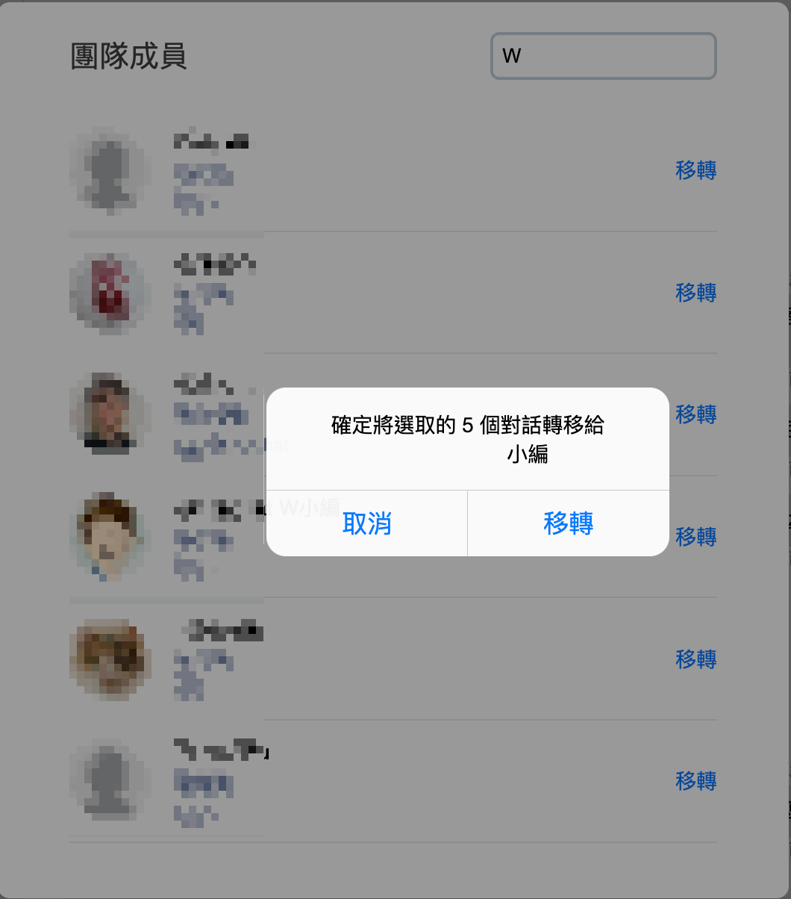
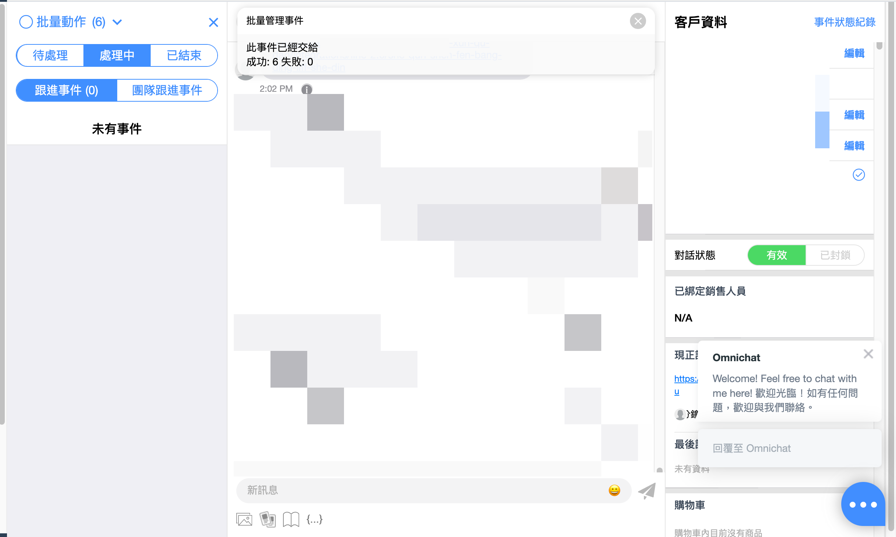
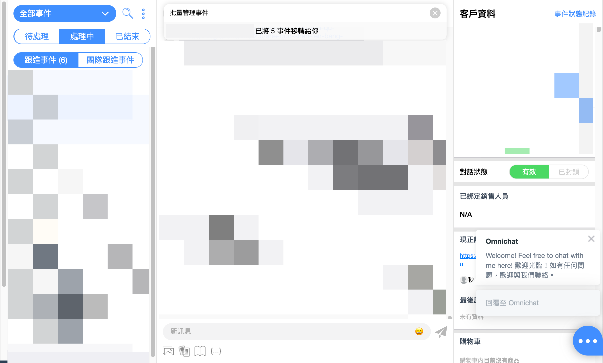

# 對話事件狀態

## 新對話事件

| 第一則接收到的訊息類型                                      | 初始事件狀態 |
| ------------------------------------------------ | ------ |
| LINE 圖文選單 > 機器人卡片按鈕                              | 機器人    |
| 
LINE 圖文選單 > 文字按鈕 

（於 Omnichat 後台設定）
 | 機器人    |
| 
LINE 圖文選單 > 文字按鈕 

（於 LINE 後台設定）
     | 真人客服＊  |
| LINE 社群訂閱六位數字碼                                   | 機器人    |
| Facebook 點選「開始使用」                                | 機器人    |
| Facebook 長駐選單                                    | 機器人    |
| 文字訊息（觸發關鍵字自動回覆）                                  | 機器人    |
| 文字訊息（沒有觸發關鍵字自動回覆）                                | 真人客服＊  |
| 圖片、影片、音訊、文件、貼圖等訊息                                | 真人客服＊  |


＊如有指定客服人員，事件狀態會是「**處理中**」


## 待處理

### 「真人客服」狀態

所有在「真人客服」狀態的事件**並不會因為收到的訊息類型而改變狀態**。

例如：客人點選「圖文選單」的機器人卡片按鈕，事件會停留在「真人客服」

### 「機器人」狀態

| 接收訊息類型                                           | 事件狀態           |
| ------------------------------------------------ | -------------- |
| LINE 圖文選單 > 機器人卡片按鈕                              | 機器人 （不變）       |
| 
LINE 圖文選單 > 文字按鈕 

（於 Omnichat 後台設定）
 | 機器人 （不變）       |
| 
LINE 圖文選單 > 文字按鈕 

（於 LINE 後台設定）
     | **跳到 > 真人客服＊** |
| LINE 社群訂閱六位數字碼                                   | 機器人 （不變）       |
| Facebook 點選「開始使用」                                | 機器人 （不變）       |
| Facebook 長駐選單                                    | 機器人 （不變）       |
| 文字訊息（觸發關鍵字自動回覆）                                  | 機器人 （不變）       |
| 文字訊息（沒有觸發關鍵字自動回覆）                                | **跳到 > 真人客服＊** |
| 圖片、影片、音訊、文件、貼圖等訊息                                | **跳到 > 真人客服＊** |


＊如有指定客服人員，事件狀態會是「**處理中**」


## 處理中

所有在「處理中」狀態的事件**並不會因為收到的訊息類型而改變狀態**。


「關鍵字自動回覆」若在『及事件狀態為』中有勾選『處理中』才會觸發，**否則不會觸發**


## 支援批次移轉事件

<figure><figcaption></figcaption></figure>

<figure><figcaption></figcaption></figure>

<figure><figcaption></figcaption></figure>


角色權限「管理員」、「主管」、「客服人員」、「銷售經理」、「銷售人員」可以進行移轉

移轉事件單次操作**上限為20筆**

移轉者會提示**成功**以及**失敗**筆數

被移轉者會提示移轉人姓名以及移轉事件筆數


## 已結束

| 接收訊息類型                                           | 事件狀態           |
| ------------------------------------------------ | -------------- |
| LINE 圖文選單 > 機器人卡片按鈕                              | **跳到 > 機器人**   |
| 
LINE 圖文選單 > 文字按鈕 

（於 Omnichat 後台設定）
 | **跳到 > 機器人**   |
| 
LINE 圖文選單 > 文字按鈕 

（於 LINE 後台設定）
     | **跳到 > 真人客服＊** |
| LINE 社群訂閱六位數字碼                                   | **跳到 > 機器人**   |
| Facebook 點選「開始使用」                                | **跳到 > 機器人**   |
| Facebook 長駐選單                                    | **跳到 > 機器人**   |
| 文字訊息（觸發關鍵字自動回覆）                                  | **跳到 > 機器人**   |
| 文字訊息（沒有觸發關鍵字自動回覆）                                | **跳到 > 真人客服＊** |
| 圖片、影片、音訊、文件、貼圖等訊息                                | **跳到 > 真人客服＊** |


＊如有指定客服人員，事件狀態會是「**處理中**」

