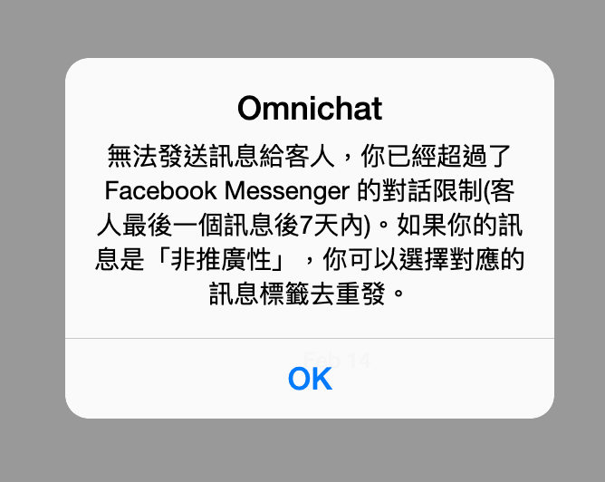
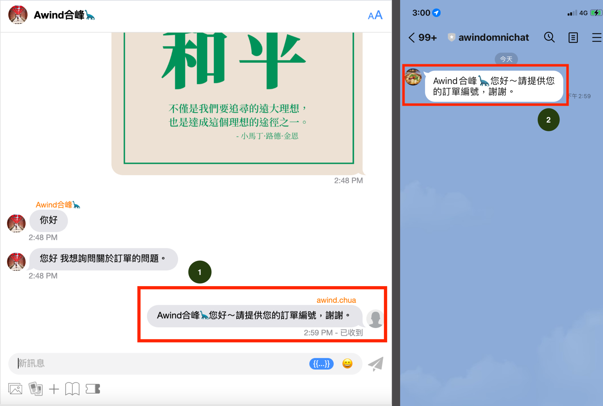

# 對話進階功能

## 訊息標籤（Message Tags）


&#x20;此為 FB Messenger 私訊事件限定


在對話頁面回覆 **Facebook Messenger** 訊息，Omnichat 會自動加上「HUMAN\_AGENT」的標籤，用戶將有 7 天時間可以回覆客人的私訊訊息。

若是超過 7 天回覆 FB Messenger 的事件，發送訊息後會出現以下提示，提醒用戶因為超過 7 天時限而無法送出訊息：

若是客人傳送最後一則訊息後已經超過七天，而仍須回覆客人，建議先回到 FB 粉專收件匣進行回覆，當客人有再傳送新訊息後，回覆時效會再重新計算，這時 Omnichat 用戶即可再回到 Omnichat 後台回覆客人訊息。

更多關於 FB 24 政策與訊息標籤的資訊，歡迎詳閱 Omnichat 部落格文章：\
[FB 臉書新規則 (2020更新) MESSENGER 24+1 政策掰掰，只有新聞粉專才有訂閱訊息資格](https://blog.omnichat.ai/2020/03/facebook-messenger-policy-updated-aug-29-2019/)

如有任何問題，歡迎與 Omnichat 線上顧問聯繫！

## 對話頁面顯示

當消費者透過 WhatsApp / Instagram / Facebook 之社群渠道使用回覆特定訊息的功能，在 Omnichat 也會同步顯示這些回覆的訊息。 \
點擊回覆的區塊，若原訊息已載入，聊天室會直接向上跳回原訊息，若尚未載入會彈出提示訊息請使用者再向上載入更多訊息

## 對話頁面訊息回覆-加入聯絡人姓名參數

當客服人員跟進對話事件後，回覆客人訊息時能夠帶入客人的姓名參數。

<figure><figcaption></figcaption></figure>

在Omnichat後台的對話頁面中，點選訊息輸入框下方的 \{{...\}} 按鈕，選擇【聯絡人姓名】。

<figure><figcaption></figcaption></figure>

點選【聯絡人姓名】後，訊息輸入框將會出現 \{{system:customer\_name\}} 的姓名參數，請勿修改此參數內容，只需將要回覆的內容輸在參數前後即可發送。

<figure><figcaption>
訊息回覆後，呈現的實際畫面
</figcaption></figure>

1.當客服人員將帶有姓名參數的訊息送出後，Omnichat對話訊息會將聯絡人的姓名帶出。

2.當客服人員將帶有姓名參數的訊息送出後，客人收到訊息的會將聯絡人的姓名帶出。


來自官網的對話事件，右側的【客戶資料】中需要有姓名，才能帶入姓名參數。


## 釘選對話功能

當客服人員跟進對話事件，可以將對話事件釘選至上方。

1. 只有『我的跟進事件』中的對話，會有釘選對話 ／取消釘選按鈕。
2. &#x20;被釘選的對話會被置頂在最上方，並且被置頂的對話也會依照最後訊息的時間排序。
3. &#x20;當對話狀態進到結束事件 ; 轉移對話事件給他人或是被其他人員跟進後釘選的狀態就會消失。

## **新增 WhatsApp 對話**

您可以在對話頁面新增WhatsApp 對話與消費者展開互動。

### 使用教學

在對話頁面，點選紅框中的三點圖示，選擇「**新增WhatsApp對話**」。

選擇需要新增WhatsApp對話的帳號

1. 選擇需要新增WhatsApp對話的帳號。
2. 輸入姓名。
3. 選擇"國家/地區"，輸入電話號碼後按"新增"。

.png>)

新增 WhatsApp 對話後，會立刻建立對話事件，並且進入處理中的跟進事件。


完成新增對話後，請使用 WhatsApp 訊息範本與消費者進行互動。



該新增對話事件還在「**處理中」、「已結束」**狀態的時候，如果被其他團隊成員重覆新增，系統會彈出通知提醒是否要接手該話事件。

彈出以下通知訊息的埸景為：

場景 1： 客服 A 新增對話後未與消費者進行互動，客服B新增對話。

場景 2：客服 A 新增對話後使用訊息範本與消費者進行互動，客服B新增對話。

場景 3：客服 A 在結束與消費者的對話後，客服 B 新增對話。

**聯絡人姓名以重覆新增對話後為準。**


### WhatsApp 對話支援指定回覆 

可針對團隊成員/客人回覆的句子，進行指定回覆（reply）的功能，操作方式如下：

將滑鼠游標移動到指定對話旁，會出現「回覆」的圖示，點選之後會出現可輸入對話的頁面。

<figure><figcaption>
此為網頁瀏覽器版本，可以在對話頁面當中針對需要回覆的內容點選「回覆」的 icon 
</figcaption></figure>

<figure><figcaption>
若點選回覆自己所發出的對話，會在對話框當中顯示指定回覆的人與對話前半部訊息
</figcaption></figure>

#### 此為回覆給自己/其他團隊成員所發出的對話，呈現的畫面

<figure><figcaption>
此為實際發送訊息後的畫面
</figcaption></figure>

#### 此為回覆給消費者的指定對話時，呈現的畫面

<figure><figcaption>
此為回覆客人指定對話的畫面
</figcaption></figure>
