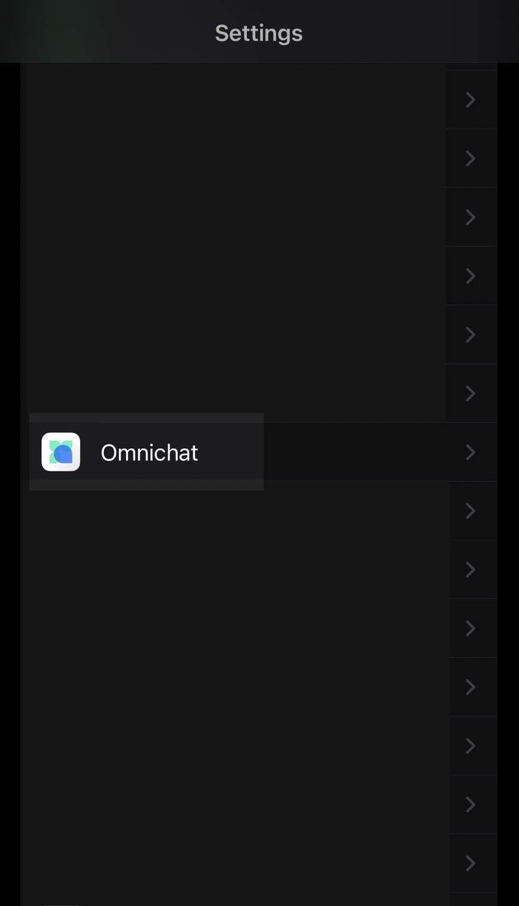
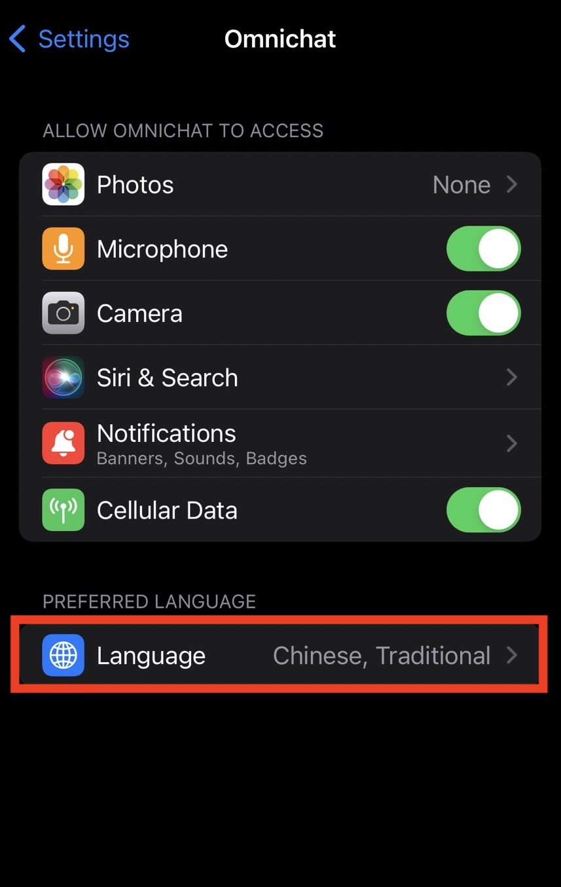
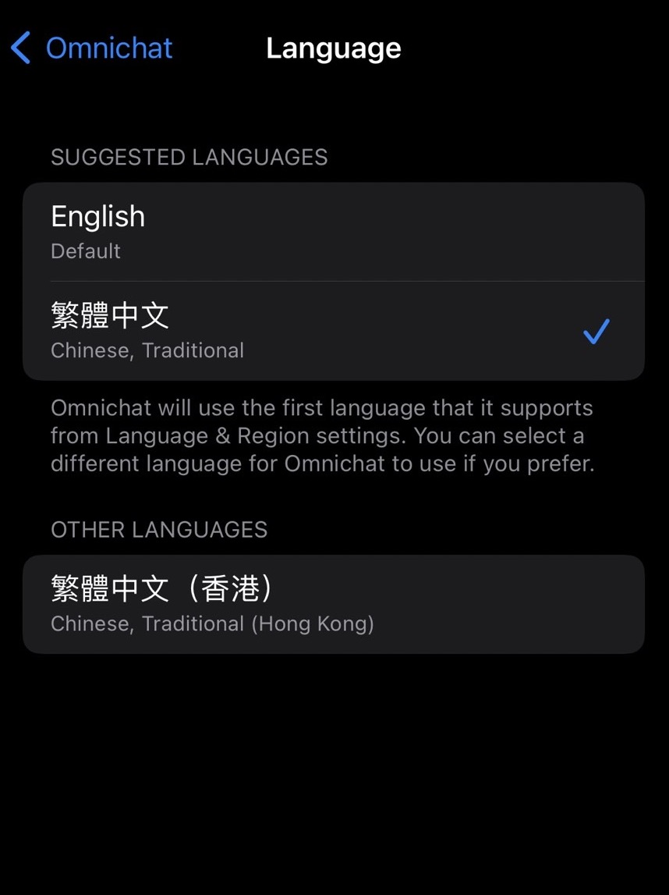

# APP 使用常見問題

#### &#x20;Q1：打開 Omnichat App 介面是深色的，我都看不到客人發送的訊息？

Ans 1：APP 的介面若為深色狀態（ Dark Mode ）時，文字的顏色會隨之調整為白色字體，因此仍可以正常與客人進行回覆

#### Q2：是否可以一次發多張照片呢？

Ans 2：目前暫時還未支援該功能

#### Q3：我當時沒有設定密碼，請問要如何登入呢？

Ans 3：Omnichat 系統都是輸入帳號（E-mail 或是 手機號碼）後，會收到六位數驗證碼的信件或簡訊，將收到的六位數驗證碼輸入即可登入

#### Q4：請問我怎麼在手機 App 內查看機器人事件呢？因為想確認是否有遺漏。

Ans 4：您可以切換到「機器人」頁面來進行查看

**Q5：請問為什麼我都收不到六位數驗證碼的簡訊呢？要如何解決呢？**

Ans5：這部分您可以確認是否有封鎖到發送簡訊碼的手機號碼，可以從手機的設定中查看已封鎖的電話號碼，並把有可能的號碼先進行解除封鎖後，再次重新登入測試是否有正常收到六位數驗證碼簡訊。

**Q6：請問如何在不調整手機系統的語言設定下，僅調整 Omnichat APP 的語言呢？**

Ans6：您好，目前 iOS系統手機有支援獨立調整 APP 的語言，可以參考下圖的步驟進行調整，目前該APP有提供繁體中文、繁體中文（香港）、英文等共三種語言顯。

<figure><figcaption>
先到設定當中找到 Omnichat APP
</figcaption></figure>

 

<figure><figcaption>
點選語言的位置
</figcaption></figure>

 

<figure><figcaption>
選擇需要的語言介面
</figcaption></figure>

Q7：請問如何調整手機 APP 當中的字型大小呢？


該調整僅支援 iOS 系統手機


\
Ans7：您可以從手機的設定(Setting) 當中選擇 > 輔助使用(Accessibility) > 顯示與字型大小 (Display & Text Size) > 放大字形(Large Text) ，將此功能打開之後，可依據您需要的字型尺寸來調整 App 當中顯示樣式。

<figure><figcaption></figcaption></figure>

\
