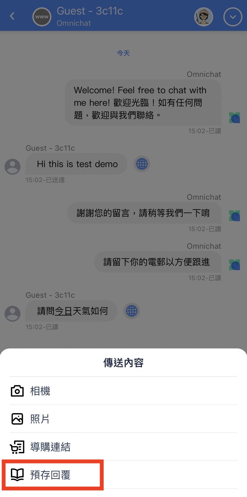

# 開始使用 Omnichat App


iOS 下載點：[https://apps.apple.com/tw/app/omnichat/id1487897117](https://apps.apple.com/tw/app/omnichat/id1487897117)

Android 下載點：[https://play.google.com/store/apps/details?id=co.omnichat.omnichat](https://play.google.com/store/apps/details?id=co.omnichat.omnichat)



App 語言介面會跟著手機本身語言設定來變動！


1. 待處理（Opens）：所有在「待處理」中真人客服頁籤內的對話事件都會出現在這邊
2. 處理中（Processing）：當客服人員按下「接手處理」（Take Over）後的對話事件都會出現在這邊
3. 已結束（Closed）：當客服人員在該對話事件右上角按下 Close The Case 時，該對話事件就會移轉到這邊
4. 更多（More）：可在此畫面看到團隊名稱、團隊成員、修改上線狀態、導購連結報表（個人）以及開啟通知
5. 篩選：可以利用它來篩選特定社群渠道
6. 搜尋：可以依照客人資料（如：姓名、電話、E-mail、標籤、備註、訊息內容等項目）來做搜尋，或是依照成員資料（如：權限、成員名稱）來做搜尋。【標籤搜尋功能支援模糊搜尋】
7. 批量管理事件：可使用該功能多選對話事件作批量接手、批量轉移或結束事件。
8. 真人客服（Live Chat）：指狀態為真人客服的對話事件，並且可依照對話事件新舊狀態進行排序
9. 機器人（Chatbot）：指狀態為機器人的對話事件，機器人對話事件狀態不支援排序功能，且銷售經理與銷售人員無法看到此功能

## 處理中的對話事件處理

當客服人員按下「接手處理」(Take Over）的按鈕時，該對話事件會進到『處理中』的頁籤內，可直接輸入文字訊息或是依照社群渠道的不同來傳送資訊給消費者。

 

 

 

<figure><figcaption>
點開 Customer Info 客戶資訊後介面
</figcaption></figure>

1. 點開後可以選擇相機、錄音、影片、檔案、預存回覆及導購連結等訊息內容發送給消費者。依照 iOS & Android 系統不同顯示方式會略有不同；此外，針對不同社群平台支援可傳送的內容也會略有不同
2. 可選擇相機進行拍攝並傳送給消費者（請先開啟相機權限）
3. 支援錄製音訊檔案傳送給消費者（限 LINE、FB、WhatsApp 對話事件，請先開啟麥克風權限）
4. 可從手機相簿中選擇照片傳送（請先授權 App 有讀取手機相片）
5. 可傳送手機相簿中的影片
6. 可傳送優惠券給消費者（該功能僅限有加購優惠券模組用戶）
7. 可傳送導購連結給消費者
8. 可傳送預先儲存的預存回覆給消費者
9. 點擊頭像可看到其他團隊成員並按下「移轉」（Transfer）
10. 點開可查看客戶資訊和結束事件
11. 客戶資訊：可手動編輯姓名、電話、 E-mail、備註和標籤
12. 點擊後結束該對話事件

## 標籤支援模糊搜尋

* 進行標籤搜尋時，如未輸入關鍵字，自動帶出該團隊「所有標籤」。
* 輸入關鍵字後顯示所有包含關鍵字的標籤。

<figure><figcaption></figcaption></figure>

## 支援批次移轉事件


移轉事件單次操作上限為  20 筆


擁有客服權限的角色，能夠將處理中的【我的事件】批次轉移至其他擁有客服權限的團員。

<figure><figcaption></figcaption></figure>

### 完成移轉事件後：

* 移轉者會提示成功以及失敗筆數
* 被移轉者會提示移轉人姓名以及移轉事件筆數

<figure><figcaption></figcaption></figure>

## IOS-團隊成員介面

<figure><figcaption></figcaption></figure>

1. 團隊成員數量提示
2. 團隊成員搜尋
3. 列表以權限進行排列
4. 編輯團隊成員資料與動作
5. 編輯團隊成員相關資料與動作：撥打電話、發送信件、設定為已離線、停用此成員帳號


* 管理員及主管可將成員設為已離線
* 管理員可將成員帳號停用


## 不同社群渠道可支援的檔案類型

| 項目 / 社群渠道 | 官網對話插件 | LINE | Facebook | Instagram | WhatsApp |
| :-------: | :----: | :--: | :------: | :-------: | :------: |
| 圖片（含相機拍攝） |    Ｖ   |   V  |     Ｖ    |     V     |     V    |
|     影片    |    X   |   V  |     Ｖ    |     V     |     V    |
|     音訊    |    X   |   V  |     Ｖ    |     V     |     V    |
|     檔案    |    X   |   X  |     Ｖ    |     V     |     V    |

### WhatsApp 處理中對話頁面

針對 WhatsApp 對話事件，可以傳送不同的檔案內容，以下逐一說明

<figure><figcaption>
點擊對話框中左下角的 + 號後，出現可傳送的檔案內容
</figcaption></figure>

1. 支援相機拍攝照片傳送給消費者（請先開啟相機權限）
2. 支援錄製音訊檔案傳送給消費者（請先開啟麥克風權限）
3. 可傳送手機中照片
4. 可傳送手機中影片
5. 可傳送手機中的檔案
6. 可傳送優惠券（該功能僅限有加購優惠券模組用戶）
7. 可傳送導購連結檔案給消費者
8. 可傳送預先儲存的預存回覆給消費者
9. 可傳送訊息範本（Template Message）

## 如何使用將該對話事件釘選

將需要釘選的對話事件輕觸長按，會彈出一個「釘選」，點擊後該對話事件將會被釘選在『處理中」的最上方。如釘選多個對話事件時，則會按照時間來進行排序。

.jpg>) .jpg>) 

## 如何使用預存回覆功能

透過預存回覆功能，可以將常見的回覆圖文內容先新增至預存回覆中，可協助客服人員更快速回覆客人的問題。目前該功能一次發送最多支援 5 則訊息（圖+文的形式），在發送前用戶可先針對已儲存的預存回覆內容進行增減與確認後再進行發送。


若要新增預存回覆內容，請使用網頁版後台，至「客服設定>預存回覆」進行新增。


#### 手機APP新增預存回覆：

<figure><figcaption>
步驟一：點擊手機APP頁面右下的【更多】， 就會看到【管理預存回覆】
</figcaption></figure>

 

<figure><figcaption>
步驟二：進到【管理預存回覆】後， 右上會有個+  可以新增預存回覆訊息。
</figcaption></figure>

 

<figure><figcaption>
步驟三：新增後將內容填寫好， 點擊右上的【下一步】
</figcaption></figure>

<figure><figcaption>
步驟四：填寫該預存回覆標題、適用對象、類別後點擊【新增】。
</figcaption></figure>

 

<figure><figcaption>
步驟五：新增完成後，會跳出預存【回覆新增成功】的提示畫面。
</figcaption></figure>

 

<figure><figcaption>
若要刪除該預存回覆，請往左滑就會出現【刪除】的符號，點擊刪除即可。
</figcaption></figure>


若想要調整該預存回覆的適用對象，請點擊進入該預存回覆，會看到步驟三的畫面，到步驟四時再調整適用對象即可往後繼續設定並新增。


#### 手機APP預存回覆使用：

<figure><figcaption>
處理中對話頁面點選+號
</figcaption></figure>

 

<figure><figcaption>
傳送內容中點選預存回覆
</figcaption></figure>

 

<figure><figcaption>
出現已儲存的預存回覆內容，並選擇需要發送的主題與內文
</figcaption></figure>

 

<figure><figcaption>
至編輯頁面完成內容後點選發送即完成送出訊息
</figcaption></figure>

## 查看對話事件狀態 

透過該功能可以查看對話事件的紀錄歷程，並且了解跟進人員轉變紀錄。

<figure><figcaption>
點擊事件狀態後即可看到該則對話事件狀態轉變紀錄
</figcaption></figure>

## WhatsApp 回覆指定訊息 

**WhatsApp 回覆指定訊息**，長按欲回覆的對話，對話輸入框會顯示「回覆/複製」的選項。

<figure><figcaption>
長按指定訊息，會出現回覆或複製的按鈕選項
</figcaption></figure>

 

<figure><figcaption>
點選回覆後可輸入文字訊息
</figcaption></figure>

 

<figure><figcaption>
回覆<strong>指定訊息</strong>後的畫面
</figcaption></figure>

若是針對 **WhatsApp 範本訊息**，同樣也可以使用指定回覆的功能

<figure><figcaption>
長按範本訊息，會顯示回覆按鈕
</figcaption></figure>

 

<figure><figcaption>
點選回覆後可輸入文字訊息
</figcaption></figure>

 

<figure><figcaption>
回覆<strong>範本訊息</strong>後的畫面
</figcaption></figure>

### WhatsApp 新增對話事件 

該功能僅支援有串接 WhatsApp 帳號才能使用，以下分不同角色權限進行新增對話事件的說明。

#### 新增對話事件（一）


角色權限為：管理員、主管、客服經理、客服人員

直接於「處理中」對話事件狀態新增 WhatsApp 對話


<figure><figcaption>
先切換至處理中列表
</figcaption></figure>

 

<figure><figcaption>
點選右上角功能表後，選擇新增 WhatsApp 對話
</figcaption></figure>

 

<figure><figcaption>
至對話頁面中輸入客戶資訊，並點選新增
</figcaption></figure>

 

<figure><figcaption>
確認新增資訊
</figcaption></figure>

 

<figure><figcaption>
直接進到對話頁面
</figcaption></figure>

#### 新增對話事件（二）


角色權限為：銷售經理、銷售人員

僅能於「客戶名單」新增 WhatsApp 對話


<figure><figcaption>
點選客戶名單列表新增
</figcaption></figure>

 

<figure><figcaption>
至對話頁面中輸入客戶資訊
</figcaption></figure>

 

<figure><figcaption>
確認新增資訊
</figcaption></figure>

 

<figure><figcaption>
回到客戶名單列表
</figcaption></figure>

 

<figure><figcaption>
點選客戶後可選擇聊天或客戶資訊
</figcaption></figure>

### 已結束的對話事件處理

當客服人員處理完該對話事件後，可於對話頁面當中點選右上角的箭頭服後，並按下『結束事件』（Close The Case），該對話事件會進到『已結束』中的『我的事件」。

當您需要再與消費者進行對話時，可以進到『已結束』內將該對話事件點選『重啟事件』，該對話會再次回到『處理中』的『我的事件』頁籤。

  

## 在「更多」查看其他資訊 

 

<figure><figcaption>
點選團隊名稱頭像後可更改照片
</figcaption></figure>

 

<figure><figcaption>
點選個人資料可進行修改
</figcaption></figure>

 

<figure><figcaption>
點選團隊成員後可檢視資訊
</figcaption></figure>

1. 團隊名稱：點選頭像後可修改團隊照片（僅支援角色權限為：管理者、主管）
2. 個人資料：點選個人資料後可進入到修改頁面，可修改個人頭像、名稱、電話與Email資料
3. 團隊成員（Teammate）：可查看其他團隊成員資料【⚠️：目前 IOS14 版本 支援團隊成員狀態設定】
4. 後台的上線狀態（Status）：可再此調整為上線中/已離線狀態。消費者不會看到該狀態變更。當從「上線中」調整成「已離線」將不會收到自動指派的對話事件
5. 導購業績統計（Product Referral Performance）：可以從這裡看到自己發出的導購連結及對應的業績內容
6. 回饋 / 回報（Feedback）：有任何回饋可點擊並撰寫 E-mail 來提供給我們產品團隊
7. 開啟 / 關閉所有推送通知（Push Notification）
8. 軟體版本（Software Version）：顯示您當前使用 APP 的版本

### 導購業績統計 Product Referral Performance

<figure><figcaption>
選擇單日畫面
</figcaption></figure>

 

<figure><figcaption>
選擇區間畫面
</figcaption></figure>

 

<figure><figcaption>
查詢導購業績項目
</figcaption></figure>

1. 如果有購買 **OMO 系統**，可在這裡選擇您的分店
2. 可選擇導購連結報表查詢單日，或是一段時間區間
3. 如日期選擇為**單日**，則可以透過左右來選擇日期，或是直接點選日曆圖是選擇天數；\
   而日期選擇為**區間**，則可以使用日曆圖是來拖曳區間。
4. 如您是有購買 OMO 系統，可依照您的角色權限以及被分配到的門店來確認該門市業績。
5. 導購連結業績—OMO 綁定客戶數目：

* 店員 QR Code：透過團隊成員在實體店面，在手機上產生的 QR Code，讓客戶掃描的綁定人數
* 手動新增客戶
* 關鍵字自動指派（分店 QR Code／連結）

&#x20; 6\. 導購連結數目（Product Referral Links Sent）：發出的導購連結訊息數

&#x20; 7\.  導購連結訂單（Order Count）：發出的導購連結轉成真實訂單

&#x20; 8\.  導購連結收益（Revenue）：導購連結帶來的收益

&#x20; 9\.  導購連結 AOV：導購連結收益/導購連結訂單

&#x20;10\. 總訊息數目（Total Message Count）：

* 因為導購連結是透過訊息的方式，由團隊成員傳送給客戶，所以總訊息數目包含導購連結數目
* 只計算 Omnichat 用戶從後台手動發出的訊息數量，如自動觸發的回覆或是機器人訊息不算在內

&#x20;11\. 導購連結訊息費用（Total Message Cost）: 有四個訊息渠道，但只有 LINE 跟 WhatsApp 會收費

* LINE：後台每則以 `NTD 0.20` 計算，實際收費請以 LINE OA 後台購買的方案計價方式為主
* 因為 LINE 2.0 不同用量的方案（輕用量、中用量、高用量）有不同**免費訊息則數**跟**額外訊息費用，**當這裡統一用 NTD 0.20 計算的情況下，實際的費用會比顯示的便宜
* WhatsApp：每則以 `HKD 0.15` 計算為參考值，實際計價請致對話統計表內顯示為主
* Facebook Messenger：發送訊息不另計計價
* Web：Omnichat 提供的網站對話插件，發送訊息不另計價

&#x20;12\. 廣告投資報酬率 ROAS： ROAS = 導購連結收益 Revenue / 訊息費用 Message Cost

