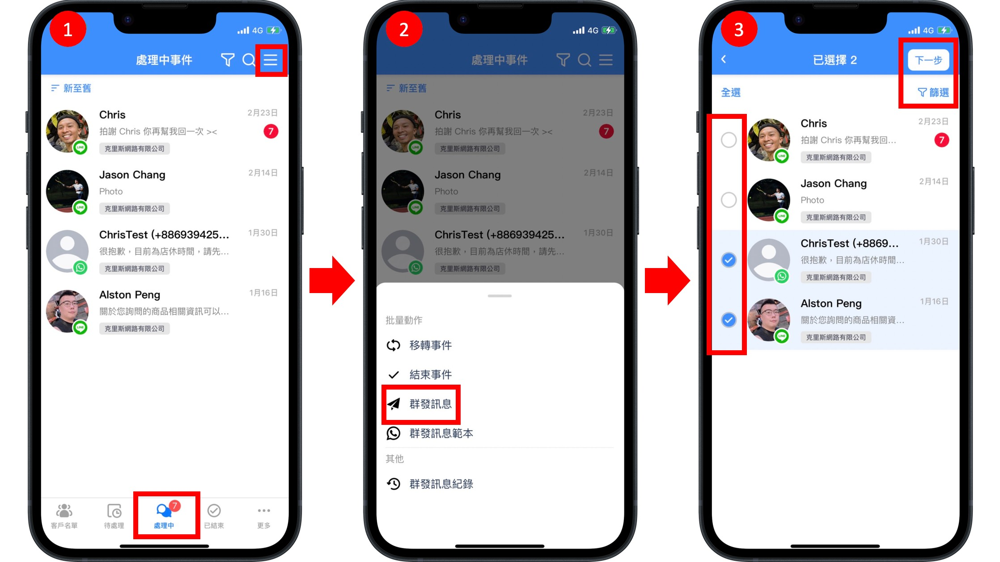
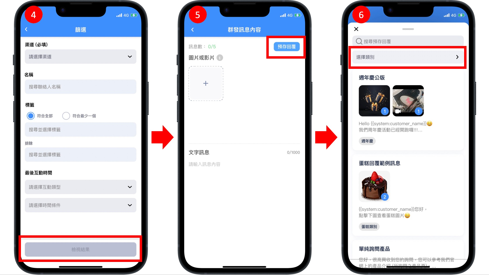
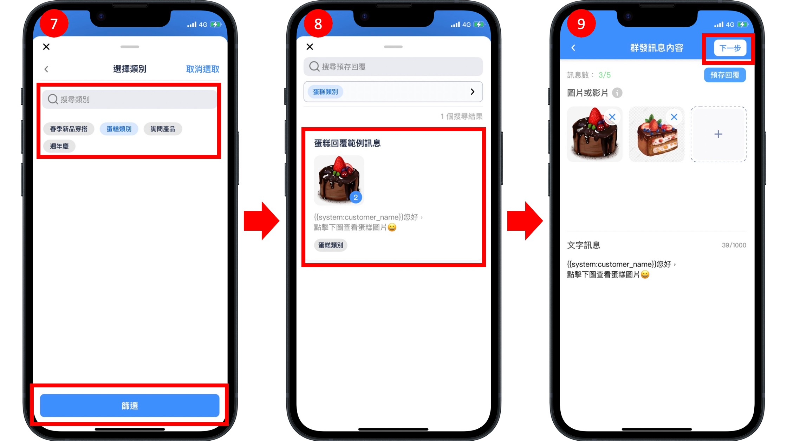
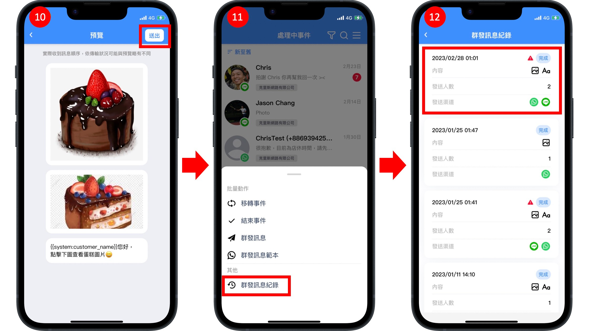
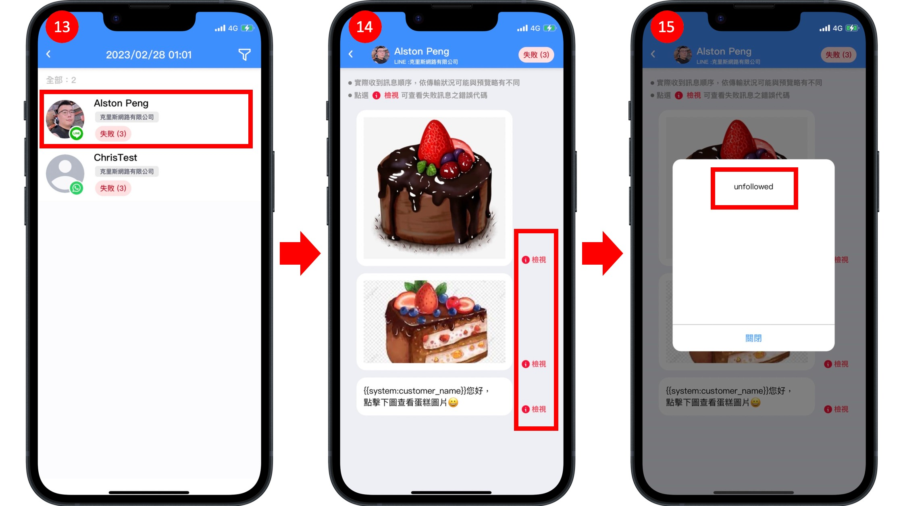
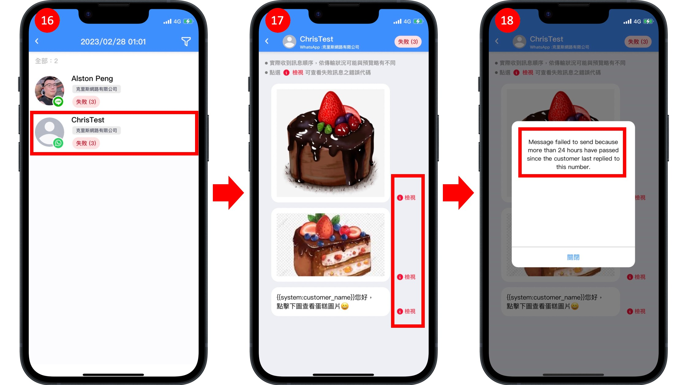

# 群發訊息（OMO 限定）


只有購買 OMO 方案才可以使用此功能，並僅限**「銷售經理」、「銷售人員」**方可使用



**群發訊息**：針對 LINE 用戶發送

**群發範本訊息**：針對 WhatsApp 用戶發送



群發訊息僅能向對話事件狀態為「處理中事件」的消費者使用。


首先將手機頁面點擊至「處理中」頁籤

<figure><figcaption></figcaption></figure>

1. 銷售經理/銷售人員進入 APP 後點擊「處理中」事件，並點擊右上方三條線按鈕。
2. 選擇「群發訊息」or「群發範本訊息」，此範例以「群發訊息」為例進行說明。
3. 可直接點擊勾選欲發送對象，也可以點擊「篩選」使用更多條件進行發送對象選擇，並點擊「下一步」進行訊息內容編輯。

<figure><figcaption></figcaption></figure>

4. 使用「篩選」功能以消費者所屬條件進行發送對象選擇。
5. 訊息內容編輯頁面可手動輸入本次獄發送的內容（支援 圖片、影片、文字，限五則訊息內容）；也可以點擊右上方「預存回覆」按鈕選擇先前已建立完成的預存回覆訊息進行發送。
6. 進入預存回覆頁面可點擊「選擇類別」快速選取已建立的預存回覆訊息。

<figure><figcaption></figcaption></figure>

7. 預存回覆訊息類別選擇完成後點擊「篩選」。
8. 選取欲傳送的預存回覆訊息。
9. 點擊「下一步」進入傳送訊息的預覽畫面。

<figure><figcaption></figcaption></figure>

10. 進入預覽畫面（消費者實際收到的訊息順序，依據傳輸狀況可能與預覽略有不同）後點擊「送出」，成功將本次訊息傳送給所選擇的對象。
11. 點擊「群發訊息紀錄」查看訊息是否成功傳送。
12. 若發現群發訊息記錄中有「⚠」︎圖示，代表本次群發訊息中有部分對象傳送失敗。點擊本次群發訊息紀錄查看傳送失敗的對象。

<figure><figcaption></figcaption></figure>

13. 點擊傳送失敗對象。
14. 點擊「檢視」查看傳送失敗原因。
15. 此範例傳送失敗原因為「unfollowed」(該名消費者已將 LINE 官方帳號封鎖)。

<figure><figcaption></figcaption></figure>

16. 點擊傳送失敗對象。
17. 點擊「檢視」查看傳送失敗原因。
18. 此範例傳送失敗原因為「Message failed to send because more than 24 hours have passe since the customer last replied to this number.」(該名消費者與該商家的 WhatsApp 商業帳號對話已超過 24 小時)。


若欲使用 WhatsApp 商業帳號進行群發訊息，建議採用「群發範本訊息」以避免無法成功將訊息傳送給消費者。


## Q\&A

1. 群發訊息是否能發送導購連結？是否可以認列業績？
   * 群發訊息內文中若帶有連結，將會列入導購連結的計算，因此可以認列店櫃人員業績。
   * 若內文中帶有 3 個連結，則導購連結發送數目則會計算為 3 則。
2. 群發訊息是否支援 UTM 追蹤？
   * 目前 Omnichat 系統不會在群發訊息中自動加上 Omnnichat UTM，但可以自行在連結中手動加入UTM 。
