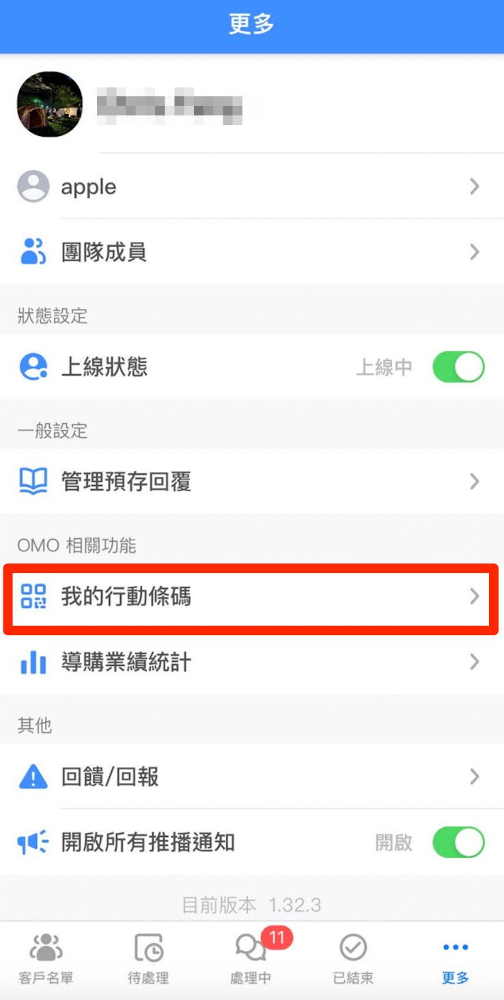
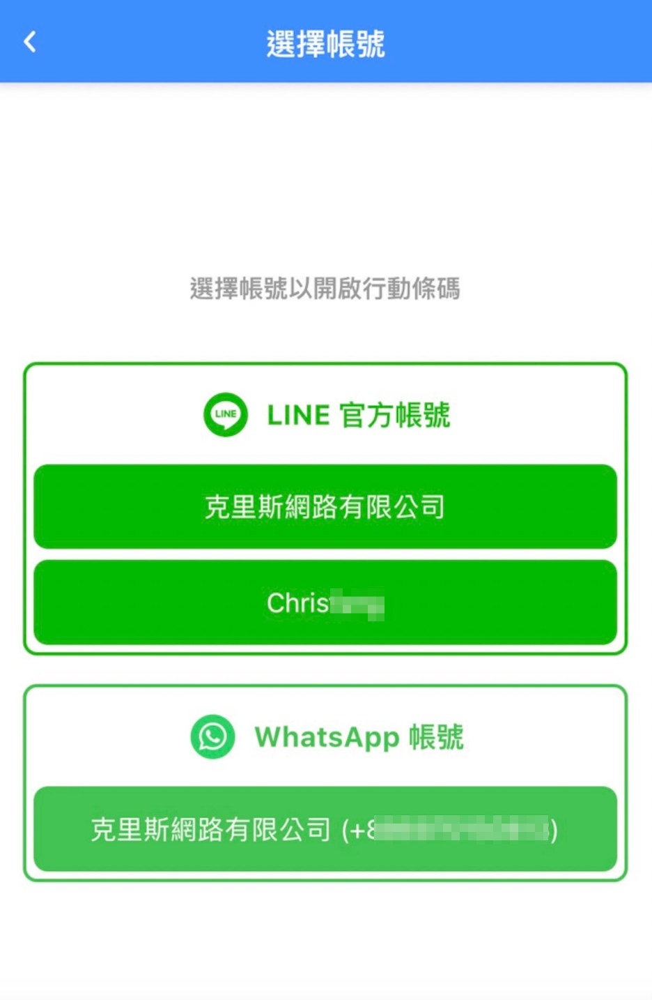
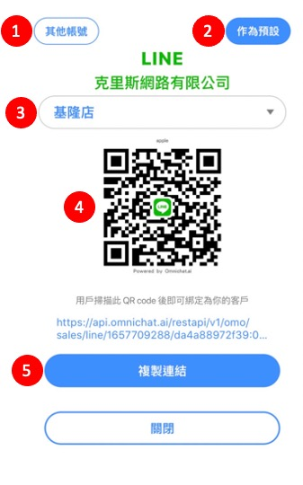

# 匯出店員 QR Code

## 匯出單一店員 QR Code（Web）


只有管理員以及主管權限可以使用匯出店員 QR Code 的功能。



若有修改銷售經理、銷售人員的 OMO 資訊（分店編號），則需要重新產出 QR Code，舊的 QR Code 將無法使用。


設定教學請參考「[產生 QR Code](https://docs.omnichat.ai/features/omo-she-ding/jian-li-dian-yuan#chan-sheng-qr-code)」。

路徑：OMO 設定 -> 建立店員 -> 團隊成員列表動作 -> 產生 QR Code。

## 匯出單一店員 QR Code（APP）

Step 1：開啟 Omnichat APP 完成登入後點擊右下方「更多」按鈕

<figure><figcaption>
APP 「更多」頁面
</figcaption></figure>

Step 2：選擇社群帳號（LINE、WhatsApp）

<figure><figcaption></figcaption></figure>

Step 3：選擇分店資料，並可在下方查看 QR Code 及連結資料

<figure><figcaption></figcaption></figure>

1. 其他帳號：返回 Step 2 重新選擇其他社群帳號。
2. 做為預設：未來點擊「我的行動條碼」時將直接顯示此 QR Code。
3. 選擇該店員所屬的門市分店。
4. 店員 QR Code：將此 QR Code 出示給門市消費者掃描，進行 OMO 綁定流程。
5. 複製連結：可將此連結複製後分享給門市消費者點擊，進行 OMO 綁定流程。

## 批次匯出店員 QR Code


注意：只有「管理員」以及「主管」權限可以使用匯出店員 QRCode 的功能


設定教學請參考「[批次匯出 QR Code](https://docs.omnichat.ai/features/omo-she-ding/jian-li-dian-yuan#pi-ci-hui-chu-qr-code)」。

路徑：OMO 設定 -> 建立店員 -> 批次匯出 QR Code。
