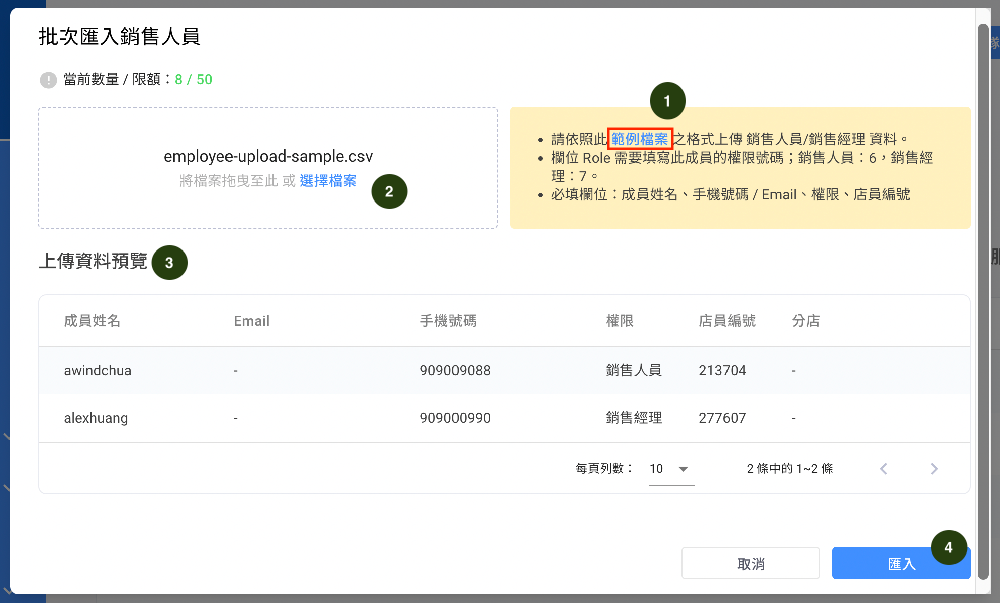
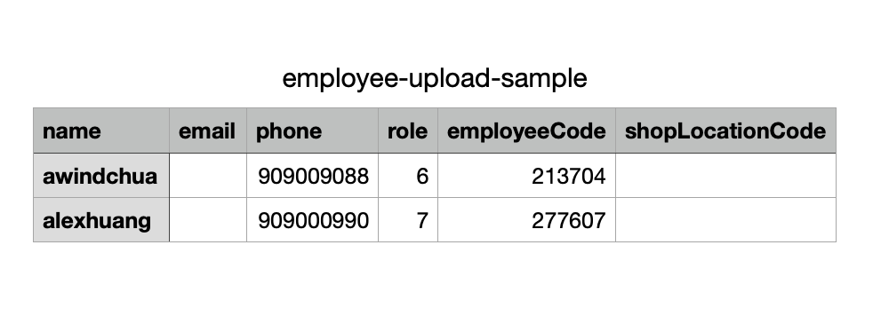
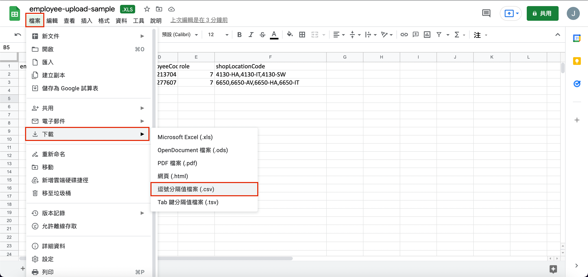
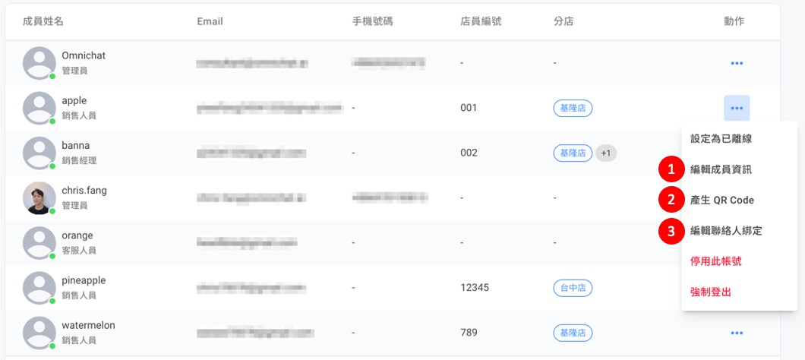
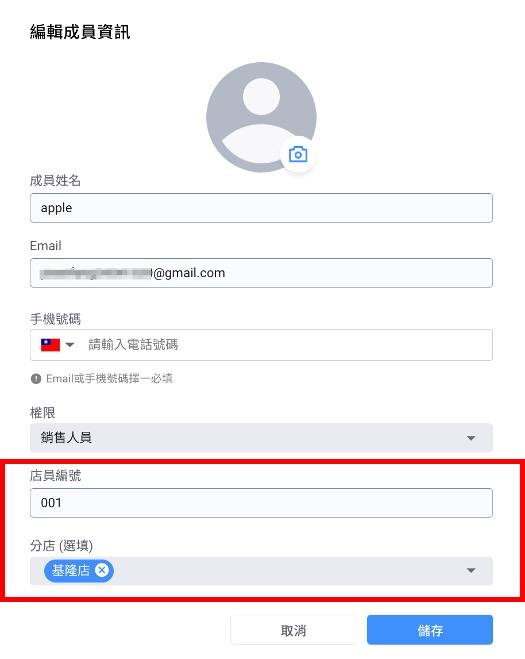
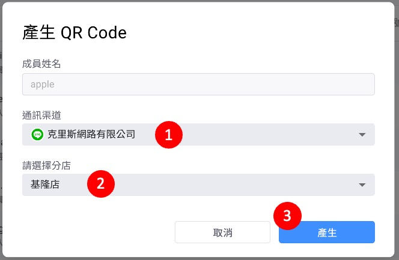
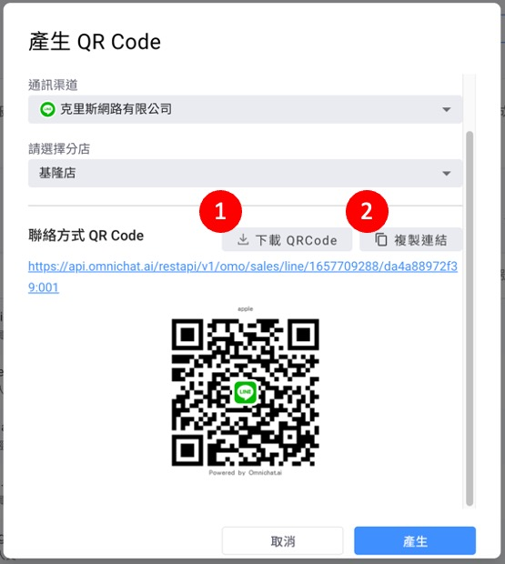
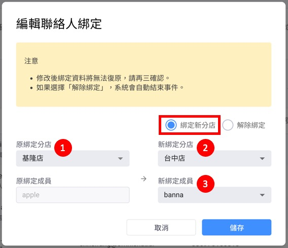
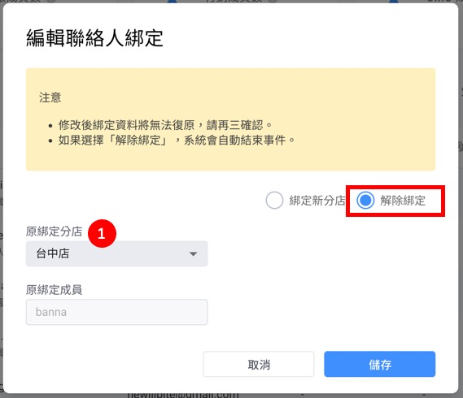

# 建立店員（銷售人員）

## 團隊成員


只有管理員可以新增、編輯、停用與刪除店員（若刪除，則所有資料都會不見）


.jpg>)

路徑：設定 -> 團隊成員

1. 新增團隊成員：一次建立單筆銷售成員資訊
2. 批次匯入銷售人員：一次建立多筆銷售成員資訊
3. 批次匯出 QR Code：匯出所有 銷售成員 的 QR Code
4. 查看所有成員權限（[點我查看角色權限](https://docs.omnichat.ai/features/she-ding/teammates#geng-duo-gong-neng-cha-kan-jiao-se-quan-xian)）
5. OMO 成員數量總計（包含銷售經理、銷售人員）

## 新增團隊成員 / 銷售人員


新增的團隊成員權限若為「銷售經理」、「銷售人員」，畫面會出現「員工編號」、「分店」 資料欄位。


1. 上傳銷售成員照片。
2. 填入銷售成員名稱。
3. 填入電子信箱（與手機擇一填寫即可）。
4. 填入電話號碼（與信箱擇一填寫即可）。
5. 選擇銷售成員權限（OMO 成員：銷售人員 or 銷售經理）。
6. 填入銷售成員編號。
7. 選擇銷售成員所屬分店（可選擇多間門市）。
8. 發出邀請（以 Email 為例，會收到一封邀請信件）。

## 批次匯入銷售人員


若匯入檔裡有包含已經存在的銷售成員，則匯入後會直接更新該銷售成員的資料


<figure><figcaption></figcaption></figure>

1.步驟一：先下載範例檔案，將即將上傳的銷售成員資料填寫好。

2.步驟二：將填寫好的資料點擊【選擇檔案】選擇填寫好的 CSV 檔案資料。

3.步驟三：即將上傳的資料會在下方能夠預覽。

4.步驟四：確認預覽資料無誤後，點擊【匯入】按鈕即可。

### **批次匯入銷售人員-範例檔案：**

<figure><figcaption>
範例檔案內容
</figcaption></figure>

1.「**name**」：銷售成員名稱。\
2.「**email**」：銷售成員Email（email / phone 二者選一皆可）。\
3.「**phone**」：銷售成員手機號碼（email / phone 二者選一皆可）。\
4.「**role**」：銷售成員權限（銷售人員：6、銷售經理：7）。\
5.「**employeeCode**」：銷售成員編號（可以自訂）。\
6.「**shopLocationCode**」：銷售成員所屬分店的分店編號（若有多個分店，請用逗號隔開），分店編號可以在 [分店管理頁面](https://docs.omnichat.ai/features/omo-she-ding/fen-dian-guan-li#fen-dian-guan-li) 設定。

### 匯入檔案格式


範例檔案下載下來的檔案格式為「逗號分格值檔案(.csv)」。


<figure><figcaption>
上傳至 Google Drive 後開啟並下載
</figcaption></figure>

上傳檔案時也務必為同樣格式，Windows 系統可用以下步驟將 Excel 的檔案格式轉成 CSV：

1. 檔案 -> 下載 -> 逗號分隔值檔案(.csv)。
2. 上傳原 Excel 檔至 Google Drive，並以試算表形式開啟檔案。

## 批次匯出 QR Code


注意：只有「管理員」以及「主管」權限可以使用匯出店員 QRCode 的功能。


按下此按鈕你可以匯出一個 CSV 檔，裡面包含所有店員在所有 LINE / WhatsApp 帳號中，還有店員在每個分店裡的綁定 QR Code。

<figure><figcaption>
點選批次匯出 QR Code 按鈕
</figcaption></figure>

首先，先點選「批次匯出 QR Code」。

<figure><figcaption></figcaption></figure>

點選【批次匯出 QR Code】後會出現確定要匯出的畫面，點選【確定】後會匯出一份 CSV 檔案，QR Code會以「網址」來呈現，點擊網址後會出現QR Code畫面。

### 批次匯出銷售人員 QR Code 檔案內容

<figure><figcaption>
銷售人員QR Code檔案內容
</figcaption></figure>

1.**「Agent Name」**：銷售成員名稱。\
2.**「Employee Code」**：銷售成員編號。\
3.**「Shop Location Name」**：分店名稱。\
4.**「Shop Location Code」**：分店編號。\
5.**「Channel」**：社群渠道\
6.**「Channel Name」**：社群渠道名稱\
7.**「Channel ID」**：社群渠道 ID\
8.**「Message Link」**：銷售成員訊息連結\
9.**「QR Code Image URL」**：銷售成員的QR Code。

## 團隊成員列表動作


可用來修改已建立的銷售成員資訊、產出 OMO 綁定 QR Code、編輯銷售成員綁定資訊。


<figure><figcaption>
團隊成員列表
</figcaption></figure>

### 編輯成員資訊


編輯成員資訊時，如選擇「銷售人員／銷售經理」權限，則可調整 銷售成員編號、分店 資訊。


後台團隊成員列表，點擊「動作」後，點擊【編輯成員資訊】，會跳出編輯成員資訊畫面。

<figure><figcaption>
銷售人員/經理 資訊編輯畫面
</figcaption></figure>

### 產生 QR Code


產出店員 QR Code 可讓消費者掃描並對銷售成員進行 OMO 綁定。



注意：只有「管理員」以及「主管」權限可以使用匯出店員 QRCode 的功能。


<figure><figcaption>
產生 OMO 綁定 QR Code
</figcaption></figure>

1. 選擇 QR Code 產出的對應通訊渠道（僅限 LINE、WhatsApp 兩種單一渠道）。
2. 選擇 QR Code 產出的對應分店門市（僅限單一分店門市）。
3. 確認上述資訊選擇無誤後，點選「產生」即可生成銷售成員 QR Code。

<figure><figcaption>
下載 OMO 綁定 QR Code
</figcaption></figure>

1. 下載 QR Code 圖片檔案（png 檔）：可將圖檔交由門市銷售成員使用，讓消費者掃描進行 OMO 綁定。
2. 複製連結：可將連結設定於自助機器人按鈕中，讓消費者自行點擊進行 OMO 綁定。

### 修改聯絡人綁定


修改後綁定資料將無法復原，請再三確認。


<figure><figcaption>
移轉綁定資訊
</figcaption></figure>

1. 原綁定分店：選擇欲移轉該名銷售成員的綁定分店對話事件。
2. 新綁定分店：選擇新綁定的分店門市。
3. 新綁定成員：選擇新綁定的分店銷售成員。


如選擇「解除綁定」，系統將自動結束已綁定的對話事件。


<figure><figcaption>
解除綁定資訊
</figcaption></figure>

1. 原綁定分店：選擇欲解除該名銷售成員的綁定分店對話事件。
