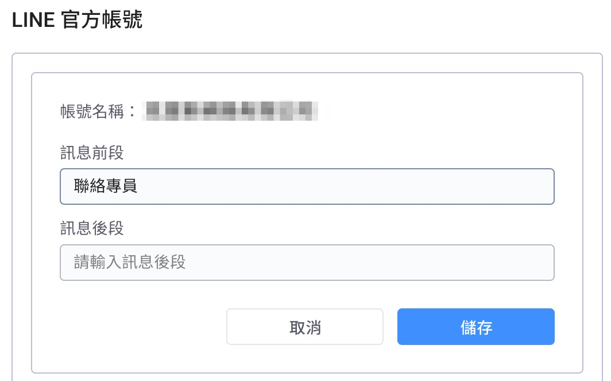
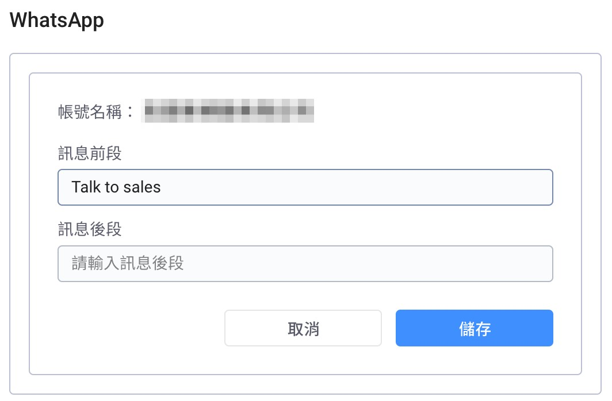
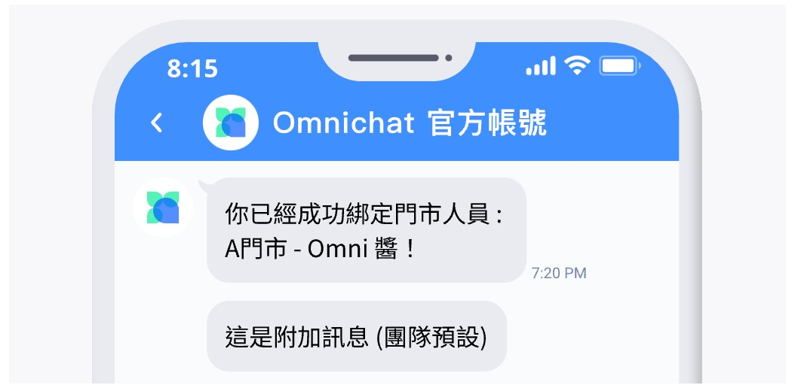
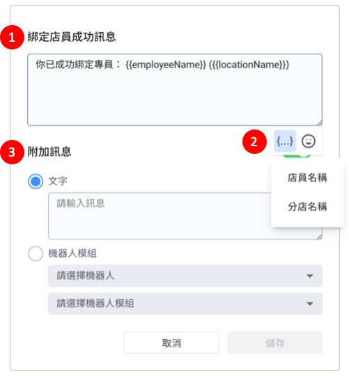
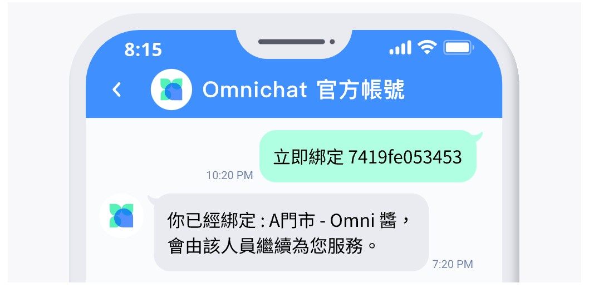
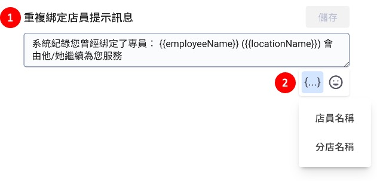
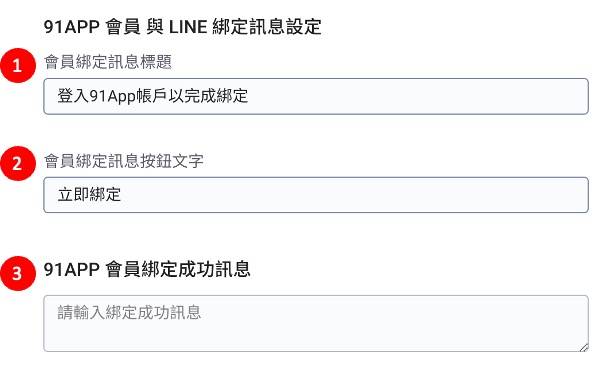

# OMO 綁定設定

## 導購連結設定

如何發送導購連結，請參考此篇文章說明：[導購連結](https://docs.omnichat.ai/features/omnichannel-messenger/dui-hua-xiao-shou-dao-gou-lian-jie)

位置：OMO 設定 -> OMO 綁定設定

1. 設定連結的有效天數。
2. 選擇連結的有效時間計算方式：
   * 以點擊時間開始計算
   * 以發送時間開始計算

## 導購連結的有效時間說明

## QR Code 綁定訊息設定


顧客掃完 QR Code 後自動帶入客人輸入框的訊息，客人送出訊息後即完成綁定。


<figure><figcaption>
顧客在 LINE、WhatsApp 所看到的畫面
</figcaption></figure>

> 綁定訊息是由三個部分組成：
>
> 1. **訊息後段** (預設為空白，可自行修改)。
> 2. **店員編號** (系統自動帶上，無法修改)。
> 3. **訊息前段** (預設是：聯絡專員，可自行修改)。

訊息前段以及訊息後段的部分可以自訂內容

<figure><figcaption>
OMO 綁定訊息設定欄位（LINE）
</figcaption></figure>

<figure><figcaption>
OMO 綁定訊息設定欄位（WhatsApp）
</figcaption></figure>

## 綁定店員成功訊息

客人掃完 QR Code 並送出後成功綁定店員的訊息。


此處的設定為團隊預設的綁定成功訊息，若需要針對各個分店設定不同綁定成功訊息，請至「[分店管理](https://docs.omnichat.ai/features/omo-she-ding/fen-dian-guan-li)」頁面設定。


<figure><figcaption>
顧客在 LINE、WhatsApp 所看到的畫面
</figcaption></figure>

自訂綁定店員成功後自動觸發的訊息內容

<figure><figcaption></figcaption></figure>

1. 客人掃完 QR Code 後成功綁定店員的訊息。
2. 點擊右下角可以在訊息中自動帶入「店員姓名」或「分店名稱」。
3. 此功能品牌可自行斟酌是否需要開啟設定，目前支援兩種訊息回覆：
   * 純文字訊息
   * 機器人模組

## 重覆綁定店員顯示訊息

若**客人**顧客曾經綁定過店員，再掃另一店員 QR Code 時會出現的提醒訊息。


若品牌想開啟 OMO 重複綁定功能，請與 Omnichat 專員聯繫


<figure><figcaption>
顧客在 LINE、WhatsApp 所看到的畫面
</figcaption></figure>

自訂重複綁定店員時自動觸發的訊息內容

<figure><figcaption></figcaption></figure>

1. 客人掃完 QR Code 後重覆綁定店員的訊息。
2. 點擊右下角可以在訊息中自動帶入「店員姓名」或「分店名稱」。

## 91APP LINE 會員綁定訊息設定（只限 91APP 客戶）


此功能僅限使用 91APP 平台客戶，若要開啟此功能設定，請先於 91APP 後台開啟會員綁定功能！


> 路徑：通訊渠道 -> 91APP 會員設定

<figure><figcaption>
顧客在 LINE 所看到的畫面
</figcaption></figure>

自訂 91APP 會員綁定卡片的標題文字、按鈕文字、91APP 會員綁定成功訊息文字

<figure><figcaption></figcaption></figure>

1. 設定標題訊息。
2. 設定按鈕文字訊息。
3. 設定 91APP 會員綁定成功時送出的文字訊息。

> Omnichat OMO 綁定成功後，自動觸發 91APP LINE 會員綁定訊息。

* 91APP LINE 會員綁定成功訊息 示意圖：

> 可將 91APP LINE 會員綁定成功訊息 內容設定為贈送優惠券路徑，引導消費者點選。

