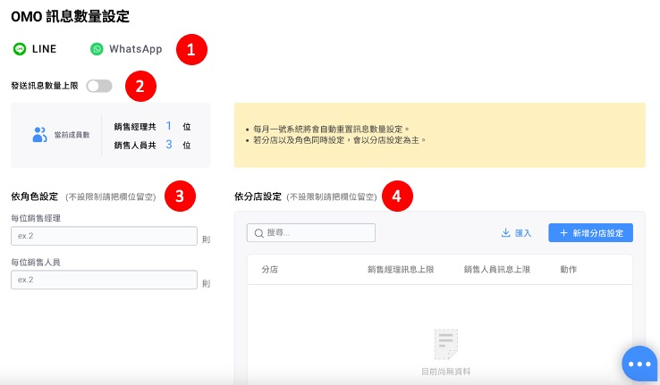
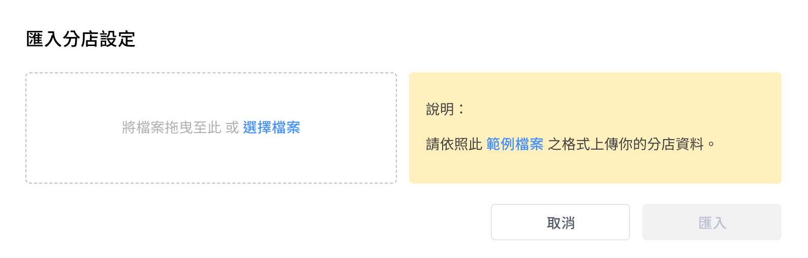
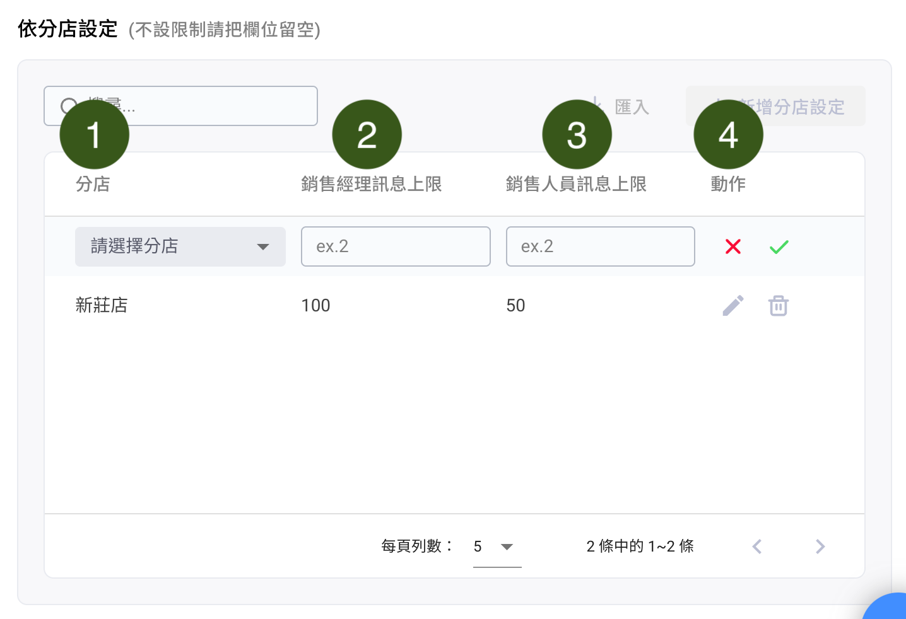

# OMO 訊息數量設定


目前有支援 LINE、WhatsApp 兩種社群渠道。



**每月一號**系統將會自動重置訊息數量設定。

若分店以及角色同時有做設定，系統會以**分店設定**為主。


## **如何開始**設定**？**

<figure><figcaption></figcaption></figure>

1. 先選擇社群渠道：LINE 或 WhatsApp
2. 打開功能開關
3. 若選擇：依角色設定
   * 銷售經理與銷售人員 OMO 訊息數量可分別設定
   * 若無限制欄位請空白
4. 若選擇：依分店設定
   * 可選擇批次匯入或是逐筆新增
   * 若無限制欄位請空白

### 依分店設定：匯入


範例檔案下載下來的檔案格式為「逗號分格值檔案(.csv)」


<figure><figcaption></figcaption></figure>

<figure><figcaption></figcaption></figure>

請先下載範例檔案，填寫完成後要上傳檔案時也務必為同樣格式

1. 填寫分店編號
2. 填寫銷售經理訊息數量
3. 填寫銷售人員訊息數量

### 依分店設定：新增分店設定

<figure><figcaption></figcaption></figure>

1. 選擇分店
2. 填寫銷售經理訊息數量
3. 填寫銷售人員訊息數量
4. 完成後儲存即可，如果要修改刪除也從這邊編輯

## Q\&A

### **問題(1)：如果同時有 「依角色設定」 和 「依門市設定」，則各成員訊息限制為何？**

假設設定如下：

<figure><figcaption></figcaption></figure>

**答案：**

A 門市 (有針對 A 門市的訊息上限，會以<mark style="color:blue;">**依門市設定**</mark>**為主**)

銷售經理：無限\
銷售人員：35 則

B 門市 (無針對 B 門市設定上限，以<mark style="color:blue;">**依角色設定**</mark>為主)

銷售經理：50 則\
銷售人員：無限

### **問題(2)：原本沒有限制訊息數量上限，若突然新增上限規則，則會如何計算訊息數量？**

假設 9/1～9/10 無限制訊息數量

A 門市銷售經理：已發送 40 則；A 門市銷售人員 ：已發送 60 則

9/11 依角色設定訊息數量上限

銷售經理：限制 50 則；銷售人員：限制 50 則

9/11～9/30 可發送剩餘數量

A 門市銷售經理：剩餘 10 則；A 門市銷售人員 ：剩餘 0 則

<figure><figcaption></figcaption></figure>

