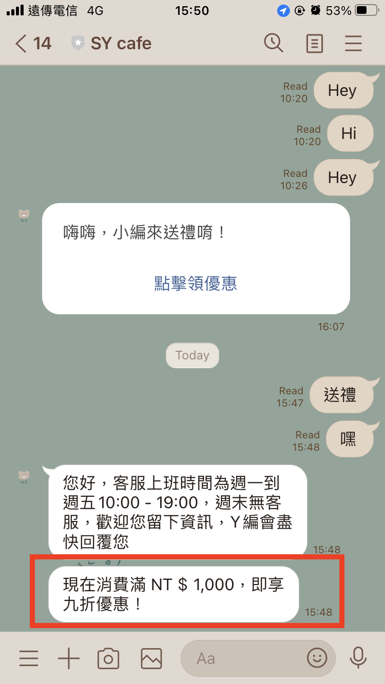

# 官網顧客行銷應用

這邊將依照應用場景來介紹幾種基本應用方式，如您想了解更多關於 Omnichat 客戶如何使用此功能，請參考我們的[部落格文章](https://blog.omnichat.ai/category/advanced-marketing-tips/user-marketing-campaign/)

## 站內行銷訊息（網站訊息）

站內行銷訊息就像是網站多一個廣告版位，還可以依照規則不同讓造訪顧客看到不一樣的行銷內容。還不知道怎麼開始使用，可以先從這裡下手設定！

### 站內行銷訊息為『文字』

#### 實例1：

> #### _當客戶進入某個 URL 後自動發送優惠訊息給他（透過站內右下角插件）_
>
> _URL為：_[_https://apitest13.91app.com/SalePage/Index/6665191_](https://apitest13.91app.com/SalePage/Index/6665191)
>
> _優惠訊息為：_**本店限時優惠：現在結帳享八折優惠**
>
> _逗留時間：_**15 秒**
>
> _訪問次數：_**2 次或以上**

Omnichat 後台設定

網站前台顯示畫面：（當用戶第 2 次進來，且這次進來逗留了 15 秒）

右下角成功出現 『_本店限時優惠：現在結帳享八折優惠_』  _文字_訊息

#### 實例2：

> #### _我想讓我的客戶進入符合某些條件的 URL 後自動發送優惠訊息給他（透過站內右下角插件）_
>
> _URL條件為：_**包含 「**SalePage」  **這個字詞**
>
> _優惠訊息為：_全館九折，限量搶購中
>
> _逗留時間：_**5 秒**
>
> _訪問次數：_**2 次或以上**

Omnichat 後台設定

網站前台顯示畫面：

插件成功出現 『全館九折，限量搶購中』 的訊息

插件不會出現所設定的訊息 （因為 URL 中沒有包含**「**SalePage」  **這個字詞** ）

### 站內行銷訊息為『圖片＋文字』

#### 實例：

> #### _當客戶進入某個 URL 後自動發送優惠訊息給他（透過站內右下角插件）_
>
> _URL為：_[_https://omostore.91app.com/SalePage/Index/6815735_](https://omostore.91app.com/SalePage/Index/6815735)
>
> _優惠訊息為：_**加入會員可以拿到 50 元折價券**
>
> _逗留時間：_**4 秒**
>
> _訪問次數：_**1 次或以上**

Omnichat 後台設定

網站前台顯示畫面：（當用戶第 1 次進來，且這次進來逗留了 4 秒）

右下角成功出現 『加入會員立即拿 NT$50 折價券』  _圖片＋文字_ 訊息

### 站內行銷訊息為『影片』

#### 實例：

> #### _當客戶進入**網站**後自動發送說明影片給他（透過站內右下角插件）_
>
> _URL為：_[_https://omostore.91app.com/SalePage/Index/6815735_](https://omostore.91app.com/SalePage/Index/6815735)
>
> _顯示訊息為：點選影片看看其他人怎麼買＋影片_
>
> _逗留時間：5_ **秒**
>
> _訪問次數：2_ **次或以上**

Omnichat 後台設定

網站前台顯示畫面：（當用戶第 2 次進來，且這次進來逗留了 5 秒）

右下角成功出現 『_點選影片看看其他人怎麼買＋影片_』  _影片＋文字_ 訊息

## 顧客分眾標籤（貼上標籤）

依照消費者的瀏覽行為，符合後台設定的造訪條件將該消費者貼上標籤，之後可以用『聯絡人及推播訊息』來篩選標籤，進而優化流量，做到顧客分眾。

#### 實例：

> #### _當客戶進入某個 URL 後自動貼上標籤給他（可透過『聯絡人及推播訊息』中查看）_
>
> _URL為：_[_https://omostore.91app.com/SalePage/Index/6815735_](https://omostore.91app.com/SalePage/Index/6815735)
>
> _標籤為：長袖襯衫_
>
> _逗留時間：_**5 秒**
>
> _訪問次數：_**2 次或以上**

**Omnichat 後台設定**

.png>)

當消費者符合造訪規則且有進行 _**綁定**_ ，即可會自動被系統貼上標籤。可參考以下後台截圖

## 通訊渠道再行銷

當消費者造訪活動頁面後，如果您想要在消費者造訪後，自動地傳送訊息提醒消費者，您可以進行以下設定來達到這個效果。


推送再行銷訊息的社群渠道，需選擇與『綁定』的社群渠道一致


\
實例：

> #### _當客戶進入某個  URL 後自動推播再行銷訊息給他（可透過『聯絡人及推播訊息』中查看）_
>
> _URL為：_[_https://omostore.91app.com/SalePage/Index/6815735_](https://omostore.91app.com/SalePage/Index/6815735)
>
> _再行銷訊息為：現在消費滿 NT＄1,000，即享九折優惠！_
>
> _逗留時間：_**5 秒**
>
> _訪問次數：_**2 次或以上**

**Omnichat 後台設定**

當消費者符合造訪規則且有進行 _**綁定**_ ，即可會自動被系統推播再行銷訊息。

