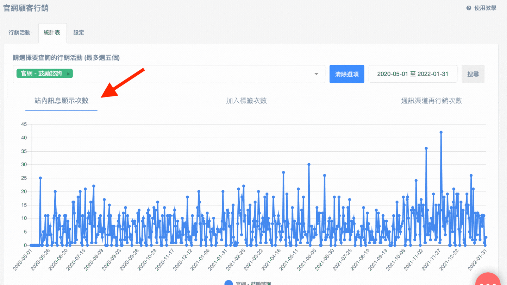

# 統計表

當行銷活動設定完並啟用後，可搭配統計表來查看每日成效：

* 一開始進到統計表頁面的時候，圖表會顯示全部官網顧客行銷活動，在過去兩個禮拜的總計

### 1. 選擇行銷活動

用戶可以手動輸入行銷活動的名稱，或是直接查看下拉選單，再點選想要查看成效的行銷活動，選擇後，輸入框會出現綠底白字的行銷活動名稱。

### 2. 選擇日期區間

選擇欲查看成效的日期區間，預設為近期的兩週內。

### 3. 按下「搜尋」

選擇行銷活動及日期後按下搜尋，即會出現每日的成效數據

用戶可以分別點選『網站訊息顯示次數』、『加入標籤次數』、『通訊渠道再行銷次數』，來查看不同觸發動作的成效

除了可以看每日成效，也可以查看下方統計表格，來得知指定日期區間的總觸發次數

### 4. 全部官網顧客行銷總計

* 一進到網頁預設會顯示：全部官網顧客行銷活動總計
* 搜尋各個官網顧客行銷活動之後，想再回到全部官網顧客行銷活動的總計
  1. 選擇想要查詢的日期區間
  2. 點選「清除選項」按鈕


統計表支援一次搜尋多組行銷活動的實施成效，一次可以選擇的組數上限為5組


