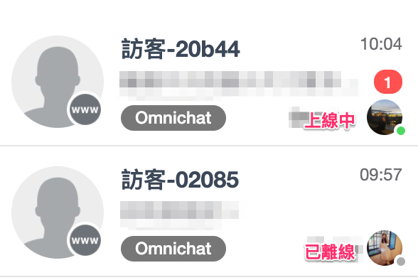

# 上線狀態

## 設定上線狀態

在後台左側選單，團隊成員可以更改自己的上線狀態


**注意：**

* 「上線狀態」是**手動設定**的，**不會**因為團隊成員沒有打開後台或手機APP而自動轉為已離線
* 「上線狀態」只會在後台及手機APP顯示，供團隊內部使用，客人不會看到團隊成員的上線狀態


## 上線狀態功用

### 上線狀態顯示

在後台對話頁裡，會有兩個地方顯示團隊成員的上線狀態

1. 「團隊跟進事件」的分頁中，會在團隊成員的大頭貼右下角顯示上線狀態

2\. 在「我的跟進事件」的分頁中，右側的「團隊成員」列表亦會在團隊成員的大頭貼右下角顯示上線狀態；在轉移事件前可以知道團隊成員是否在線上

### 暫停關鍵字自動指派

如果你有使用「關鍵字自動指派」，團隊成員休假或下班時，就可以透過設定自己的「上線狀態」為「已離線」去暫時停止自動指派；當休假結束後，設定自己的「上線狀態」為「上線中」就會恢復自動指派，而無需每次更改關鍵字自動指派的條件。
