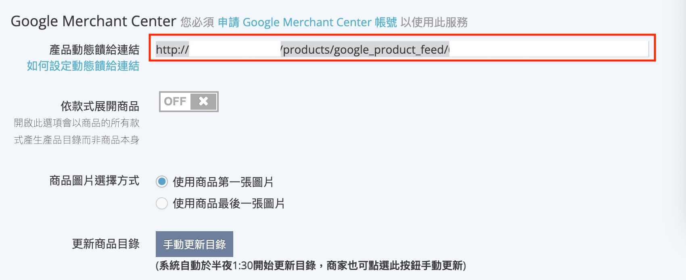

# 產品目錄 (Product Feed)

## 產品目錄是什麼？

產品目錄 (Product Feed) 通常一個 csv / xml 檔案，檔案中記錄了你的網路商店裡賣的所有商品的細節資訊，像是商品圖片 / 商品編號 / 標題 / 價錢... 等等。一般來說電商開店平台裡都會提供產生產品目錄檔案的功能，現在要做的就是把這個產品目錄檔案上傳到 Omnichat。

## 開始上傳產品目錄


左邊側欄 **設定 -> 產品目錄**，進入頁面後按下 **上傳產品目錄** 按鈕，彈出視窗中會看到兩個選項

1. [手動上傳檔案](shang-chuan-chan-pin-mu-lu-product-feed.md#shou-dong-shang-chuan-dang-an): 若您是自建網路商店或是使用其他開店平台，請選此選項
2. [產品目錄網址](shang-chuan-chan-pin-mu-lu-product-feed.md#chan-pin-mu-lu-wang-zhi): 若你使用的是 91App / WACA / SHOPLINE / Cyberbiz / meepShop / QDM 以上這些開店平台，請選此選項

### 手動上傳檔案

選擇手動上傳檔案，您需要將符合規定的 csv 產品目錄檔案拖曳至虛線灰色框裡。關於 csv 檔案裡的格式，可以參考我們的範例檔案 (下圖淺藍色說明匡裡有下載連結)，這個範例檔案是 Facebook 所提供的產品目錄格式。

若檔案內容格式正確，則下方會顯示出總共有多少項產品在此產品目錄檔案中，此時即可按下 **上傳** 按鈕，完成產品目錄的上傳。


若是直接使用範例檔案做修改，上傳前請記得先刪除 csv 檔第一列 (第一列僅做為說明欄位用，並不是產品目錄的一部分)



若是之前已經在 Omnichat 上傳過產品目錄，再次上傳產品目錄檔案會 **完全覆蓋** 舊的產品目錄，所以建議使用統一的產品目錄檔案進行編輯更新，以避免錯誤的更新產品目錄



### 產品目錄網址

若你是使用 **91App / WACA / SHOPLINE / Cyberbiz** / **Shopify / meepShop / QDM** 這幾家開店平台，你可以直接將開店平台的產品目錄網址複製到產品目錄網址這個輸入框，並在下拉選單選擇對應的開店平台，最後按下 **上傳**，就可以直接上傳產品目錄了。若是以此方法上傳產品目錄，Omnichat 會在 **每天凌晨 02:00** 到指定的網址去下載最新的產品目錄。


若你在按下上傳按鈕之後出現 **上傳失敗** 的彈出視窗，請檢查你的 **開店平台** 是否選擇正確，並請再次確認您的 **產品目錄網址** 輸入正確。\
要檢查產品目錄網址是否正確，你可以直接在瀏覽器開啟一個新的分頁，並在網址列貼上產品目錄網址，看看是否能正常下載產品目錄檔案


如何在開店平台後台取得你的產品目錄網址

* [如何取得 91App 產品目錄網址](shang-chuan-chan-pin-mu-lu-product-feed.md#91app-product-feed)
* [如何取得 WACA 產品目錄網址](shang-chuan-chan-pin-mu-lu-product-feed.md#waca-product-feed)
* [如何取得 SHOPLINE 產品目錄網址](shang-chuan-chan-pin-mu-lu-product-feed.md#shopline-product-feed)
* [如何取得 Cyberiz 產品目錄網址](shang-chuan-chan-pin-mu-lu-product-feed.md#cyberbiz-product-feed)
* [如何取得 Shopify 產品目錄網址](shang-chuan-chan-pin-mu-lu-product-feed.md#shopify-product-feed)
* [如何取得 meepShop 產品目網址](shang-chuan-chan-pin-mu-lu-product-feed.md#shopify-product-feed)
* [如何取得 QDM 產品目錄網址](shang-chuan-chan-pin-mu-lu-product-feed.md#shopline-product-feed-2)

.png>)

#### 如何取得 91App 產品目錄網址 <a href="#91app-product-feed" id="91app-product-feed"></a>

進入商店後台

OSM設定 --> 功能設定 --> 導流功能設定 --> 產品目錄查詢。

複製 **Facebook產品目錄網址** 即是您的產品目錄網址


#### 如何取得 WACA 產品目錄網址 <a href="#waca-product-feed" id="waca-product-feed"></a>

首先進入 WACA 商家後台，上方選擇 **行銷推廣** -->  **Facebook** 的頁面後。滑動到下方的 **其他 Facebook 行銷工具**，請查看**「Facebook 像素和 conversion api (轉換 api) 」**該選項旁邊的問號，**點選問號**後會出現彈出視窗，**複製紅框處的網址**即是您的產品目錄網址。

<figure><figcaption></figcaption></figure>

#### 如何取得 Shopline 產品目錄網址 <a href="#shopline-product-feed" id="shopline-product-feed"></a>

1. 先利用此 [Shopline 教學網址](https://support.shoplineapp.com/hc/zh-tw/articles/360042210731-Facebook-%E5%95%86%E6%A5%AD%E6%93%B4%E5%85%85%E5%8A%9F%E8%83%BD-%E5%95%86%E6%A5%AD%E6%93%B4%E5%85%85%E5%8A%9F%E8%83%BD)，將產品目錄同步至 Facebook。
2. 等待產品上傳至 Facebook 後，按你的產品 --> 在 Facebook 上查看你的產品，頁面會轉到 Facebook 後台


3\. 到了 Facebook 目錄管理工具後。左邊側欄選擇**資料來源**，右邊選擇 **SHOPLINE Products**

.png>)

 (2).png>)

4\. 右邊頁面選擇 設定，下方紅框處網址，即為您的 SHOPLINE **產品目錄網址**，將他複製下來，上傳至 Omnichat 後台。

 (1).png>)

 (1).png>)

#### 如何取得 Cyberbiz 產品目錄網址 <a href="#cyberbiz-product-feed" id="cyberbiz-product-feed"></a>


注意！Cyberbiz 用戶請使用 Google 的產品目錄(GMC) 連結進行上傳。如您使用 Facebook`產品目錄連結`，會造成 Facebook 產品目錄中的商品網址自帶 Facebook 的 UTM，導致 Omnichat 後台無法計算到`購物車再行銷的收益以及轉換率。`


依照下圖的指示至 Cyberbiz 後台把產品動態網址複製下來上傳到 Omnichat 後台，詳細請參考Cyberbiz Google 產品目錄教學：[https://www.cyberbiz.io/support/?p=230](https://www.cyberbiz.io/support/?p=230)

路徑：Cyberbiz 後台選單 --> 第三方整合 --> 谷歌 Google 設定 --> Google Merchant Center

<figure><figcaption><p>複製紅圈處網址回填 Omnichat 後台</p></figcaption></figure>


請務必將 Cyberbiz 產品目錄設定中的「依款式展開商品」的功能設定為 On 狀態。


#### 如何取得 meepShop 產品目錄網址 <a href="#shopify-product-feed" id="shopify-product-feed"></a>

依照下圖的指示至 meepShop 後台把產品動態網址複製下來上傳到 Omnichat 後台，詳細請參考 meepShop Facebook動態廣告(DPA)教學：[https://supportmeepshop.com/knowledgebase/facebook-facebook-%E5%8B%95%E6%85%8B%E5%BB%A3%E5%91%8A-dpa/](https://supportmeepshop.com/knowledgebase/facebook-facebook-%E5%8B%95%E6%85%8B%E5%BB%A3%E5%91%8A-dpa/)

路徑：meepShop 後台選單 --> 行銷 --> 廣告分析 --> 追蹤工具設定

點擊 **複製動態網址** 即是您的產品目錄網址

<figure><figcaption><p>複製紅圈處網址回填 Omnichat 後台</p></figcaption></figure>

#### 如何取得 QDM 產品目錄網址 <a href="#shopline-product-feed" id="shopline-product-feed"></a>

QDM 開店平台的產品目錄格式是固定的，只要在官網網址後綴加上：

```
/googlebase.xml
```

即是 QDM 開店平台的產品目錄網址，再將此網址貼回 Omnichat 後台就完成了。

範例：https://www.omnichat.ai/googlebase.xml

或是可以參照開店平台的教學手冊取得：[https://help.qdm.tw/support/solutions/articles/67000671826-fbe-%E7%9B%AE%E9%8C%84%E8%A8%AD%E5%AE%9A](https://help.qdm.tw/support/solutions/articles/67000671826-fbe-%E7%9B%AE%E9%8C%84%E8%A8%AD%E5%AE%9A)


#### 如何取得 Shopify 產品目錄網址 <a href="#shopify-product-feed" id="shopify-product-feed"></a>


請注意，若需要使用下列方式請先確認您的產品數量是否 < 5000 個，若超過 5000 個產品數量，請使用手動上傳的方式。

此外，該方法需要使用到 Facebook 粉絲專頁與 Ads 的管理員權限，請先留意是否有以上兩種資料的權限身份。


1. 請至 Shopify 後台安裝 [**Ako Retargeting Facebook Ads**](https://apps.shopify.com/ako-retargeting?locale=zh-CN)&#x20;
2. 依照步驟完成 Ako Retargeting 與 Facebook Business 的連結，請參考[教學步驟](https://help.akohub.com/en/articles/6012829-how-to-connect-your-facebook-ad-account-with-akohub)
3. 確認 Akohub 的狀態是否都有完成打勾，最後會看到 「You account are connected.」，表示已經完成連結（請參考下圖）

<figure><figcaption><p>確認狀態是否都是綠色打勾</p></figcaption></figure>

<figure><figcaption><p>完成連結畫面</p></figcaption></figure>

4\. 確認您的目錄資料在 Facebook 在企業管理平台的狀態為「啟用」狀態

<figure><figcaption></figcaption></figure>

5\. 請到 Facebook 企業管理平台的資料來源（Data Source）中，找到新增的產品目錄連結（Product Feed Link），並複製下來/選擇下載 csv.檔案，可參考下列說明：

* 選擇使用複製產品目錄連結：請在目錄資料中先篩選為「Ako Catalog XXX」後，再到 Data Source 中複製該連結

<figure><figcaption></figcaption></figure>

* 選擇使用上傳產品目錄 csv 檔案方式，請到 Data Source 當中後複製您的產品目錄連結到網址列，並下載該檔案

<figure><figcaption></figcaption></figure>

6\. 再到 Omnichat 系統後台中 >> 設定 >> 產品目錄，依照您在步驟五選擇的方式，貼上產品目錄連結 / 手動上傳產品目錄檔案，當產品目錄完成上傳並顯示成功，即完成所有步驟！

* 選擇貼上產品目錄連結，請選擇 **自建官網 CSV 格式**

<figure><figcaption></figcaption></figure>

* 或者您也可以將於步驟五下載的 csv 檔案，選擇手動上傳檔案

<figure><figcaption></figcaption></figure>

## 上傳成功畫面


後台上傳產品目錄檔案後，無法從 Omnichat 後台下載之前的檔案。



### 恭喜你成功將產品目錄上傳至 Omnichat 系統 ！！

### 下一步


[she-ding-gou-wu-che-zhui-zong-an-niu.md](../gou-wu-che-zai-hang-xiao-jia-gou-gong-neng/she-ding-gou-wu-che-zhui-zong-an-niu.md)

