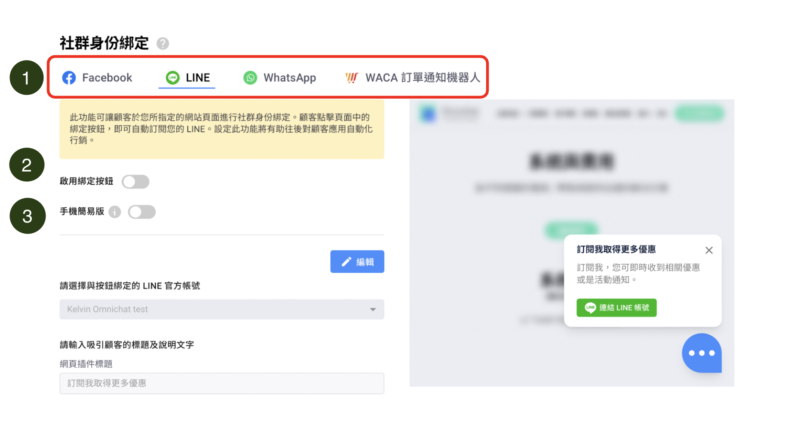
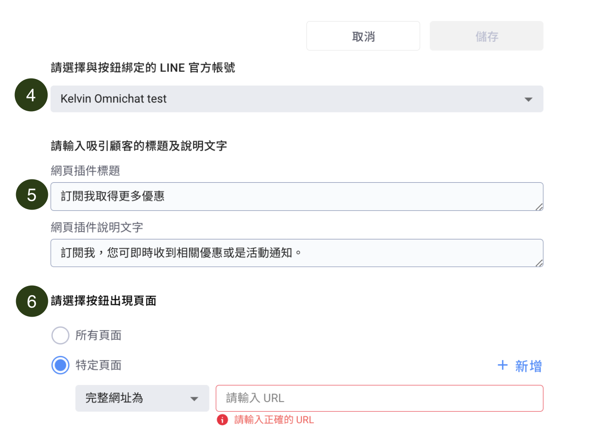

# 社群身份綁定


社群身份綁定定義： \
消費者的網站瀏覽身分（cookie）與社群身份（LINE/Facebook/WhatsApp）綁定在一起



社群訂閱插件教學影片


## 開啓社群身份綁定按鈕讓訪客隨時按訂閱完成綁定

<figure><figcaption></figcaption></figure>

### 不只是成為訂閱中的聯絡人

在官網按下「社群訂閱按鈕」的訪客，如果有完成後續的訂閱流程，會成為**「有綁定身份」**的聯絡人，您可以在後台『[聯絡人及推播訊息](broken-reference)』頁面，看到消費者的訂閱狀態、加入訂閱時間、是否綁定官網

### 如果消費者成為有綁定身份的聯絡人，後續可以應用的有：


為了有效使用 Omnichat 自動化行銷功能，就需要累積有綁定的聯絡人名單。\
\
有完成社群身份綁定的名單，後續才可以對這些聯絡人做到自動化行為\
例如：購物車再行銷、官網顧客行銷->顧客分眾標籤（使用者瀏覽行為自動貼標籤）、官網顧客行銷->通訊渠道再行銷推播等功能


1. 可以依據客人在官網上的瀏覽行徑，自動對客人貼標籤或是自動發送訊息到客人的 FB Messenger / LINE / WhatsApp。此兩項設定會運用到再行銷訊息功能，可詳閱此篇：[官網顧客行銷後台設定](../remarketing/hang-xiao-huo-dong-she-ding-shuo-ming.md)
2. 可以依據客人在官網上的瀏覽行徑，自動對客人進行社群渠道再行銷推播，可詳閱此篇：[官網顧客行銷後台設定](../remarketing/hang-xiao-huo-dong-she-ding-shuo-ming.md)
3. 在對話頁面，會顯示出客人的社群身份。詳情可詳閱：[綁定資料](https://docs.omnichat.ai/features/omnichannel-messenger#bang-ding-zi-liao)&#x20;
4. 有完成社群身份綁定的名單，才能收到購物車再行銷訊息。也就是購物車再行銷功能的送出訊息數量與有完成綁定的名單有直接的關係。詳請可詳閱：[購物車再行銷](../gou-wu-che-zai-hang-xiao-jia-gou-gong-neng/)

## 設定流程

1. **選擇社群渠道**
2. **打開綁定按鈕**
3.  **設定是否開啟『手機簡易版』**

    開啟的情況下：

    * 只會顯示**標題** 及 **訂閱按鈕**，不會顯示~~內容 (Content)~~
    * 標題 (Title) 限制十個中文字的寬度
    * 社群訂閱綁定插件的位置會從 Omnichat 網頁插件的上方，改到旁邊平行對齊

<figure><figcaption></figcaption></figure>

* 左圖：『手機簡易版』關閉
* 右圖：『手機簡易版』開啟

<figure><figcaption></figcaption></figure>


不管是否開啟『手機簡易版』，桌機上的顯示都不會有變動


4\. **選擇需要連接的 Facebook 粉專 / LINE 官方帳號/ WhatsApp 商業帳號**&#x20;

5\. **編輯網頁插件標題及內容（可加入Emoji）**

<figure><figcaption></figcaption></figure>

6\. **設定按鈕出現在所有頁面或特定頁面**

如選擇特定頁面：可以輸入完整網址或網址中的關鍵字&#x20;


您亦可以設定社群身份綁定按鈕顯示在不同頁面，讓消費者綁定不同的社群渠道

例如：設定 Facebook 社群身份綁定按鈕顯示在商品頁面，LINE 社群身份綁定按鈕顯示在官網首頁


#### 設定方法

* 同時打開 Facebook 與 LINE 社群身份綁定按鈕
* 選擇特定頁面的「完整網址為」並貼上特定網址（放上您要出現的頁面）

<figure><figcaption></figcaption></figure>


1. 若相同網址頁面同時設定在 Facebook 及 LINE，系統會以_**後建立的設定為優先。**_\
   同理，其他社群平台同時開啟也是一樣的。
2. 一但啟用綁定按鈕，即便關閉後開啟也無法調整建立設定優先次序


7\. **設定「綁定成功後通知顧客的訊息」**

* &#x20;您可以設定純文字，也可以設定使用機器人模組。當消費者完成綁定後，該訊息會顯示在綁定消費者的 Facebook、LINE 或 WhatsApp 上

8\. **設定『**社群身份綁定按鈕顯示**』**

* 設定社群身份綁定按鈕消失的計算方式，是從按鈕出現在螢幕畫面上開始。

<figure><figcaption></figcaption></figure>


如果選擇開啟，但沒有輸入秒數的話，將視為關閉

