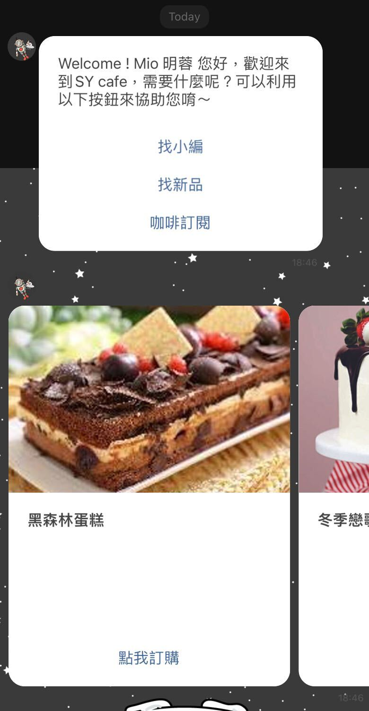

# 來源 / 媒介

### 一進到頁面

* 顯示「所有來源 / 媒介（All Sources / Medium）」的數據
* 預設表格排序是由最多到最少的轉換率％
* 數據的日期區間，如果沒有做調整的話，它是從今天開始算到過去 7 天（一週）

### 表格說明

.png>)

.png>)

1.  工作階段（All Sessions）

    1.1. 所有 來源 / 媒介 的工作階段總和
2.  轉換率（Conversion) = ( 交易／工作階段 ) \* 100

    2.1. 所有 來源 / 媒介 的平均轉換率％
3.  交易（Transaction / Purchase）

    3.1. 所有 來源 / 媒介 的交易總和
4.  收益（Revenue）

    4.1. 所有 來源 / 媒介 的收益總和

### 表格計算

.png>)

1. 搜尋來源 / 媒介（Sources / Medium）
2. 搜尋結果（任何來源 / 媒介有 "day" 關鍵字）的總和跟平均值
3. ％ 總計: 56.8% (44)
   * 25：**搜尋結果**的工作階段總和
   * 44：**所有來源 / 媒介**的工作階段總和
   * **％ 總計**的公式計算
   * ( **搜尋結果**的總和 / **所有來源**的總和 ) \* 100
     * ( 25 / 44 ) \* 100 = 56.8%
4. 資料檢視平均值: 36.4% (-56.0%)
   * 16.0%：**搜尋結果**的平均轉換率％
   * 36.4%：**所有來源 / 媒介**的平均轉換率％
   * **資料檢視平均值**的公式計算
   * \[( **搜尋結果**的平均 - **所有來源**的平均 ) / **所有來源**的平均] \* 100
   * \[( 16% - 36.4% ) / 36.4% ] \* 100 = (-56.0%)

## Omnichat UTM 查詢


1. 機器人卡片的內文若有連結則「**不會加 UTM**」。機器人訊息的 UTM 只會加在按鈕以及 Carousel (輪播卡片) 的圖片連結上
2. 透過自動化工具（如：Facebook 貼文回覆、關鍵字自動回覆、推播訊息）發出的機器人模組訊息，對應的 UTM 只會加在第一個發出的訊息，後續的機器人流程 UTM 會歸到「機器人訊息」
3. 關鍵字自動回覆如設定「**純文字**」，則文字訊息內放 URL **不會帶上 Omnichat UTM**
4. 官網顧客行銷中站內行銷訊息，「點擊圖片導頁網址」以及「內文連結」，有自帶 UTM 的話則不會代入 Omnichat 的 UTM
5. Omnichat UTM 目前支援追蹤到機器人模組，該模組中的機器人卡片 UTM 需自定義 UTM 進行追蹤
6. 推播訊息推播機器人卡片有點擊數跟點擊率可在「聯絡人及推播訊息」中的「報表」看到
7. 如要追蹤 LINE 圖文選單每個行動，請自行下 UTM 追蹤


#### 關於第二點，第一個發出的訊息如下示意圖

<figure><figcaption>
Omnichat 後台
</figcaption></figure>

 

<figure><figcaption>
LINE 畫面
</figcaption></figure>

| 訊息來源                                       | utm\_source | utm\_medium                                                                                                                | utm\_campaign                                                                                                                                                                                 | 補充說明                                                             |
| ------------------------------------------ | ----------- | -------------------------------------------------------------------------------------------------------------------------- | --------------------------------------------------------------------------------------------------------------------------------------------------------------------------------------------- | ---------------------------------------------------------------- |
| 歡迎訊息                                       | Omnichat    | <ol><li>welcome_message_webchat</li><li>welcome_message_facebook</li><li>welcome_message_line</li></ol>                    | <ol><li>welcome_message_webchat</li><li>welcome_message_facebook</li><li>welcome_message_line</li></ol>                                                                                       | webchat 為網站歡迎訊息                                                  |
| 離線訊息/即使回覆                                  | Omnichat    | <ol><li>instant_reply_webchat</li><li>instant_reply_facebook</li><li>instant_reply_line</li></ol>                          | <ol><li>instant_reply_webchat</li><li>instant_reply_facebook</li><li>instant_reply_line</li></ol>                                                                                             |                                                                  |
| 官網顧客行銷訊息                                   | Omnichat    | <ol><li>remarketing_webchat</li><li>remarketing_facebook</li><li>remarketing_line</li></ol>                                | <ol><li>remarketing_webchat_行銷活動名稱</li><li>remarketing_facebook_行銷活動名稱</li><li>remarketing_line_行銷活動名稱</li></ol>                                                                              |                                                                  |
| 機器人訊息                                      | Omnichat    | <ol><li>chatbot_webchat</li><li>chatbot_facebook</li><li>chatbot_line</li></ol>                                            | <ol><li>chatbot_webchat_機器人 id_機器人模組 id</li><li>chatbot_facebook_機器人 id_機器人模組 id</li><li>chatbot_line_機器人 id_機器人模組 id</li></ol>                                                               |                                                                  |
| 
機器人訊息

（排程回覆卡中片）
               | Omnichat    | <ol><li>chatbot_delayed_reply_facebook</li><li>chatbot_delayed_reply_line</li><li>chatbot_delayed_reply_WhatsApp</li></ol> | <ol><li>chatbot_delayed_reply_facebook_機器人 id_機器人模組 id</li></ol><ol start="2"><li>chatbot_delayed_reply_line_機器人 id_機器人模組 id</li><li>chatbot_delayed_reply_WhatsApp_機器人 id_機器人模組 id</li></ol> |                                                                  |
| 推播訊息                                       | Omnichat    | <ol><li>broadcast_facebook</li><li>broadcast_line</li></ol>                                                                | <ol><li>broadcast_facebook_推播訊息標題名稱</li><li>broadcast_line_推播訊息標題名稱</li></ol>                                                                                                                 |                                                                  |
| 推播訊息（加購）                                   | Omnichat    | openapi\_broadcast\_line                                                                                                   | openapi\_broadcast\_line\_推播訊息標題名稱                                                                                                                                                            | 額外加購 open api                                                    |
| 關鍵字自動回覆                                    | Omnichat    | <ol><li>keyword_webchat</li><li>keyword_facebook</li><li>keyword_line</li></ol>                                            | <ol><li>keyword_webchat</li><li>keyword_facebook</li><li>keyword_line</li></ol>                                                                                                               |                                                                  |
| 
訂單通知 （Waca用戶限定）
                  | Omnichat    | <ol><li>order_notification_facebook</li><li>order_notification_line</li></ol>                                              | <ol><li>order_notification_facebook</li><li>order_notification_line</li></ol>                                                                                                                 |                                                                  |
| 
Facebook 貼文回覆
                    | Omnichat    | fb\_cm\_reply                                                                                                              | fb\_cm\_reply\_活動名稱                                                                                                                                                                           |                                                                  |
| 
Instagram 貼文回覆
                   | Omnichat    | ig\_cm\_reply                                                                                                              | ig\_cm\_reply\_活動名稱                                                                                                                                                                           |                                                                  |
| 
Facebook  常設功能表
                  | Omnichat    | menu\_facebook                                                                                                             | menu\_facebook\_機器人名稱                                                                                                                                                                         |                                                                  |
| LINE 圖文選單                                  | Omnichat    | menu\_line                                                                                                                 | menu\_line\_圖文選單名稱                                                                                                                                                                            |                                                                  |
| 購物車再行銷訊息（Facebook）                         | Omnichat    | abandoned\_cart\_msg\_facebook                                                                                             | <ol><li>abandoned_cart_msg_facebook_0 </li><li>abandoned_cart_msg_facebook_1</li></ol>                                                                                                        | <ol><li>0 代表第一則購物車再行銷訊息</li><li>1 代表第二則購物車再行銷訊息</li></ol>        |
| 購物車再行銷訊息（LINE）                             | Omnichat    | abandoned\_cart\_msg\_line                                                                                                 | <ol><li>abandoned_cart_msg_line_0</li><li>abandoned_cart_msg_line_1</li></ol>                                                                                                                 | 

<ol><li>0 代表第一則購物車再行銷訊息</li><li>1 代表第二則購物車再行銷訊息</li></ol> |
| 商品導購連結                                     | Omnichat    | <ol><li>product_referral_facebook</li><li>product_referral_line</li><li>product_referral<em>_</em>webchat</li></ol>        | 

<ol><li>手動複製貼上連結： omnichat_transaction_link </li><li>用導購連結功能選擇商品： product_referral_{linkId}</li></ol>                                                                                  |                                                                  |
| 手動貼上網站連結                                   | Omnichat    | omnichat\_transaction\_link                                                                                                |                                                                                                                                                                                               |                                                                  |
| 離線 E-mail 通知                               | Omnichat    | email                                                                                                                      |                                                                                                                                                                                               |                                                                  |
| 
社群綁定成功訊息中使用機器人模組回覆訊息

（按鈕 URL）
 | Omnichat    | <ol><li>social_subscription_line</li><li>social_subscription_facebook</li></ol>                                            | <ol><li>social_subscription_line</li><li>social_subscription_facebook</li></ol>                                                                                                               |                                                                  |
| LINE 遊戲模組                                  | Omnichat    | game\_line\_遊戲活動名稱                                                                                                         | game\_line\_遊戲活動名稱                                                                                                                                                                            |                                                                  |
| 
Facebook  遊戲模組
                   | Omnichat    | game\_facebook\_遊戲活動名稱                                                                                                     | game\_facebook\_遊戲活動名稱                                                                                                                                                                        |                                                                  |
| 優惠券模組                                      | Omnichat    | coupon                                                                                                                     | coupon\_優惠卷名稱                                                                                                                                                                                 |                                                                  |
| OMO 綁定成功訊息/綁定成功附加訊息                        | Omnichat    | agent\_binding\_line                                                                                                       | agent\_binding\_line                                                                                                                                                                          | 

<ol><li>含分店自訂訊息</li><li>需使用機器人模組按鈕</li></ol>              |
| 
群發訊息  (OMO用戶限定)
                  | Omnichat    | mass\_message                                                                                                              | mass\_message\_{employeeCode}\_{employeeName}                                                                                                                                                 |                                                                  |

