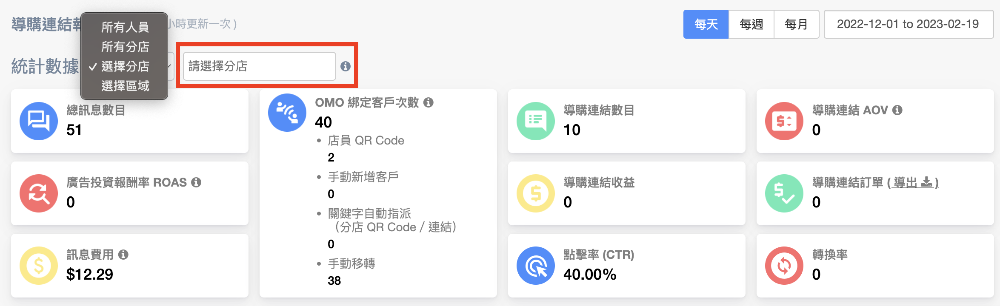
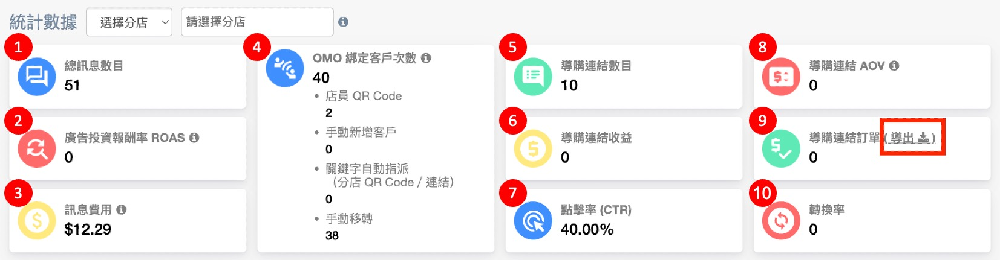

# 導購連結報表

## 不同權限看到的數據

<figure><figcaption></figcaption></figure>

* 紅色框起來的，都是只有 **管理員** 跟 **主管** 可以看到的

| 權限角色               | 總計 | 所有門市業績 | 所屬分店 | 團隊成員統計表格 |
| ------------------ | -- | ------ | ---- | -------- |
| 管理員 Admin          | ✔  | &#xD;✔ | ✔    | 全部成員     |
| 主管 Manager         | ✔  | ✔      | ✔    | 全部成員     |
| 銷售經理 Sales Manager |    |        | ✔    | 所屬分店成員   |
| 銷售人員 Salesperson   |    |        | ✔    | 只有自己     |

* 總計 = 非導購連結數據 + 導購連結數據
* 總體：所有網路＋門市，導購連結相關數據的總計
* 所有門市業績：所有門市導購連結相關數據的總計
* 所屬分店：該成員所屬分店導購連結相關數據

## 日期區間

.png>)

* 一進到網頁的預設日期，是從今天開始算到過去 14 天（兩週）
* 可以點選日期，去搜尋該日期區間的數據&#x20;
* 搜尋新日期之後，整個頁面的數據都會同時被更新
* 當日數據每小時更新一次

## 分店數據

<figure><figcaption></figcaption></figure>

* 管理員（Admin）＆ 主管（Manager）
  * 一進到導購連結頁面，會看到 **所有門市業績**（所有門市總計）
  * 右邊選單可以選擇其他門市數據
  * 在收益、AOV、訂單下方會看到 **總計**
    * `總計 = 非導購連結數據 + 導購連結數據`
* 銷售經理（Sales Manager）＆ 銷售人員（Salesperson）
  * 一進到導購連結頁面，會看到 **所屬分店數據**
  * 如果屬於多個分店門市，則會顯示列表第一間店的數據
  * 右邊選單可以選擇其他門市數據

## 上排數據總覽

<figure><figcaption></figcaption></figure>


OMO 綁定客戶次數：如同個客人取消綁定後再重新綁定，則綁定次數會再＋1。


1. 訊息數目 Message Count
   * 因為導購連結是透過訊息的方式，由團隊成員傳送給客戶，所以總訊息數目包含導購連結數目
   * 只計算 Omnichat 用戶從後台手動發出的訊息數量，如自動觸發的回覆或是機器人訊息不算在內
2. 廣告投資報酬率（ROAS）
   * ROAS = 導購連結收益 Revenue / 訊息費用 Message Cost
3. 訊息費用（Message Cost）
   * 有四個訊息渠道，但只有 LINE 跟 WhatsApp 會收費
   * LINE：每則以 `NTD 0.20` 計算
     * 因為 LINE 2.0 不同用量的方案（輕用量、中用量、高用量）有不同**免費訊息則數**跟**額外訊息費用**。Omnichat 統一用每則 NTD 0.20 計算，協助用戶抓出大概訊息成本費用，實際的費用請依照 LINE OA 後台計算為主
     * 相關費用產生與支出，可參考 LINE 2.0 收費計算機：[https://blog.omnichat.ai/2020/01/line-2-0-official-account-pricing/](https://blog.omnichat.ai/2020/01/line-2-0-official-account-pricing/)
   * WhatsApp
     * 以由哪一方開啟對話來進行收費，詳情可參考這篇說明：[https://blog.omnichat.ai/2022/01/whatsapp-business-2022-new-pricing-policy/](https://blog.omnichat.ai/2022/01/whatsapp-business-2022-new-pricing-policy/)
     * 若您對於實際費用有更多疑問，歡迎與 Omnichat 顧問洽詢
   * Facebook Messenger
   * Web：Omnichat 提供的網站對話插件
4. OMO 綁定客戶次數
   * 店員 QR Code：透過團隊成員在實體店面，在手機上產生的 QR Code，讓客戶掃描的綁定人數
   * 手動新增客戶（僅限 WhatsApp 使用）
   * 關鍵字自動指派（分店 QR Code／連結）
   * 手動移轉
5. 導購連結數目 Product Referral Links Sent
   * 團隊成員寄出去的導購連結數目
6. 導購連結收益 Product Referral Revenue
   * 透過導購連結進入網站後產生的收益
   * 總收益是指網站完成訂單的收益（包含導購連結收益）
   * 占比是指導購連結收益除以網站總收益\* 100
7. 點擊率 CTR\
   是依照消費者點擊次數 / 發送連結則數 \* 100
8. 導購連結 AOV（Average Order Value 平均訂單價值）
   * 導購連結 AOV = 導購連結收益 / 導購連結訂單
   * \[( 導購連結 AOV - 總 AOV ) / 總 AOV ] \* 100
9. 導購連結訂單 Order Count
   * 訂單的數據顯示 ＆ 計算方式跟收益一樣
   * 點擊「導出」可以導出訂單的 csv 資料，欄位如下圖

&#x20;10\. 轉換率 Conversion\
&#x20;      訂單數 / 點擊數＊100%

## 折線圖

* 折線圖上顯示 **導購連結收益** 跟 **導購連接訂單** 的數據
* 導購連結收益圖表中垂直 (數值) 軸的刻度，會自動轉換成
  *   K：thousands 千

      `1,000 = 1K`

      `10,000 = 10K`

      `100,000 = 100K`
  *   M：millions 百萬

      `1,000,000 = 1M`

### 每天

* 預設瀏覽是該日期區間每天的數據

.png>)

### 每週

.png>)

* 折線圖每週的計算，是以 **週日到週六** 為一個單位

### 每月

.png>)

## **團隊成員統計表格**

<figure><figcaption></figcaption></figure>

1. 點選團隊成員的名字，就會彈出一個視窗，顯示該成員細節數據
   * 如果 團隊成員 屬於一個以上門市（門市Ａ/ 門市 B）
   * 管理員或是主管：
     * 如果在網頁右上方選擇『所有門市業績』，門市會顯示團隊成員屬於幾個門市，點開名字彈出的視窗會列出各個門市名稱
     * 如果在網頁右上方選擇『門市Ａ』，表格跟彈出視窗只會顯示門市 A 的數據
   * 客服經理（門市 B）：
     * 只會看到其他門市 B 團隊成員的分店數據
2. 滑鼠移動到各個團隊成員的綁定數字上面（有底線的），就會出現綁定客戶方式的細節數據
3. 該團隊成員數據，在團隊所有導購連結數據的 **佔比**
   * `計算方式（以綁定客戶數為例）： (成員的綁定客戶數/全店總綁定客戶數)*100%`
4. 後台有串接 Whatsapp 才會出現的數據，會以品牌方開啟的收費對話來計算，詳情可參考這篇說明：[https://blog.omnichat.ai/2022/01/whatsapp-business-2022-new-pricing-policy/](https://blog.omnichat.ai/2022/01/whatsapp-business-2022-new-pricing-policy/)
5. 該團隊成員數據，跟團隊平均導購連結數據的 **比較**
   * `計算方式（以導購連結 AOV 為例）：[ (成員的AOV-全店平均AOV) / 全店平均AOV]*100%`
6. 點擊雙箭頭，會將數據依照最高排到最低
   * 再點選收益一次，排序則改成最低到最高
   * 也可以透過點選其他項目來排序（只有團隊成員不能排序）

## Q\&A

1. 導購連結有 30 天效期，效期是從客人點了客服發出的導購連結按鈕後，開始往後算 30 天。如果是上週發出但這週才買，這樣業績統計裡的訂單，會是記錄在這週買的那天對嗎？
   * 對，會算在訂單買的那一天。
2. 如果客人第一次點了導購連結之後，30 天內用了另一個裝置在開啟官網並完成下單，這時  UTM 是不是也不會被其他行銷活動的 UTM 蓋掉，一樣還是算導購連結的業績？
   * 導購連結業績是用發出導購連結的那個客服的 ID 去統計，即使有點到其他行銷活動的 UTM，Omnichat 的計算方式也會將該筆訂單算到那位客服的業績裡。
3. 有沒有辦法知道當天發出導購連結且當天有購買的人數？
   * 沒有辦法知道是那一天。因為是用客服去計算業績，而不是用 UTM 算業績。
   * 如果是想看整體導購連結績效，而不是每個客服獨立的績效，用戶們可以改到 GA 裡查看
4. **個別客服：**
   * 從 Omnichat 後台的業績統計查看即可，因為我們是以客服 ID 統計，不論有無點過導購連結以外的其他 UTM，只要 30 天內有帶來訂單，都會歸功給「導購連結功能」和「指定客服人員」
5. **整體成效：**
   * 可以從 GA 裡用 UTM 看，UTM 的數據會因為點擊了其他行銷活動的 UTM 而被取代，所以可以看導購連結的 UTM 跟其他行銷活動的 UTM 各自帶來的成效
   * **如果要知道多少人是有點擊過導購連結購而且也有點擊其他 UTM才購買的**，可以拿當天 Omnichat 後台導購連結業績統計的數字減去當天 GA 看導購連結 UTM 的數字，計算出來的就會是當天有點擊過其他行銷活動 UTM 後在官網上完成購買的數字
