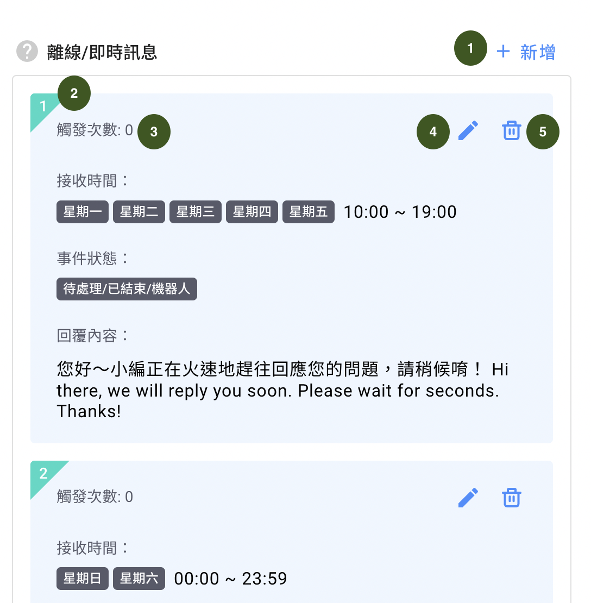

# 離線訊息 / 即時回覆


「**離線訊息**」或「**即時回覆**」只會傳送**一次**給「**待處理**」事件的客人。



對話被標記為「**已結束**」後，如果再次收到客人的訊息，「**離線訊息**」或「**即時回覆**」會再次觸發。


## 如何設定

  

1. 可以選擇是否要啟用「離線/即時訊息」
2. 設定收到訊息時的時間段：可以選擇任何時間或是特定時間。設定方式可以參考以下設定範例
3. 事件狀態：觸發該「離線/即時訊息」的對話事件狀態要在「處理中」的話請勾選
4. 設定內容可以使用文字或是機器人模組，設定完畢後請按下「新增」

### 設定完畢後

1. 新增：您可以選擇是否新增多個回覆訊息
2. 每個訊息左上方數字代表優先觸發順序
3. 觸發次數：該訊息被觸發幾次
4. 編輯：您可以隨時進去修改該訊息設定
5. 刪除

### 設定範例（一）：同時設定**「**離線訊息」及「即時回覆」

假設您的開店時間為 **星期一至五，早上 10 時整至晚上 7 時整**

首先，添加一個「**任何時間**」的即時回覆

然後，添加另一個即時回覆，在「**特定時間**」下，勾選 **星期一至星期五**，時間設為 **10:00 至 19:00**

### 設定範例（二）：只設定「離線訊息」

假設您的開店時間為 **星期一至五，早上 10 時整至晚上 7 時整**

首先，添加一個即時回覆，在「**特定時間**」，勾選 **星期一至星期五**，時間設為 **19:00 至 09:59**

然後，添加另一個即時回覆，在「**特定時間**」下，勾選 **星期六及星期日**，時間設為 **00:00 至 23:59**

### 設定範例（三）：只設定「即時回覆」

假設你的開店時間為 **星期一至五，早上 10 時整至晚上 7 時整**

添加一個即時回覆，在「**特定時間**」下，勾選 **星期一至星期五**，時間設為 **10:00 至 19:00**

