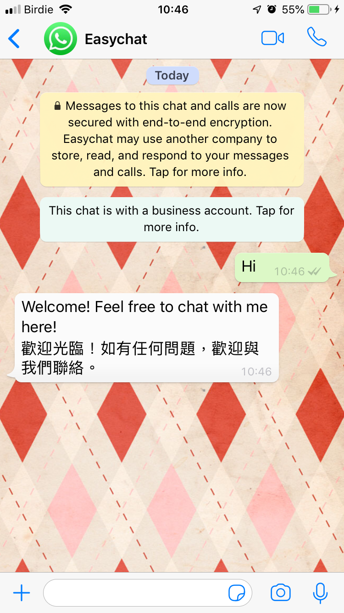

# 歡迎訊息

## 如何設定

在 Omnichat 後台，從左邊選單點選 「**通訊渠道**」 -> 「**社群常用訊息與設定**」->「**歡迎訊息**」-> 選擇哪一個社群平台

### 歡迎訊息

 

1. 如您有串接多個粉專或是官方帳號，可以從這邊點選想設定的帳號
2. 可選擇是否要開啟或關閉歡迎訊息
3. 點擊「鉛筆」圖示可更改歡迎訊息內容要是文字訊息還是機器人模組，確認後按下「儲存」


若是設定 Instagram ＆ WhatsApp 渠道上，只有文字可以設定。機器人模組需要到『[關鍵字自動回覆](../../marketing/keyword-autoreply.md)』設定觸發機器人模組。因為 Instagram & WhatsApp 沒有像 Facebook 有『開始使用』的按鈕可以進行觸發，皆需消費者傳送第一次訊息。


## 何時觸發

### Facebook Messenger

當客人點擊「**Get Started / 開始使用**」後，自動發送「**歡迎訊息**」

### LINE

當客人「**加入好友**」後，自動發送「**歡迎訊息**」

如果您想要確認歡迎訊息的樣子，可以先進行帳號封鎖後再開啟，即可以看到觸發後的情況。

.jpeg>)

### WhatsApp

當客人**第一次**傳送訊息到你的 WhatsApp Business API 帳號時，自動發送「**歡迎訊息**」

### 網站對話插件

當訪客第一次來到網站時我們預設給訪客的第一則對話訊息，您也可以設定由機器人模組回覆

＊訊息顯示判斷：**官網顧客行銷訊息 ＞ 歡迎訊息**


### 當網站 URL 觸發了官網顧客行銷訊息，歡迎**訊息**不會出現，而是出現官網顧客行銷訊息。

關於如何設定**官網顧客行銷訊息**，請查看[**官網顧客行銷訊息**](https://docs.omnichat.ai/features/remarketing)


 

#### 歡迎訊息是否彈出視窗



* 當訪客進入網站後，歡迎訊息會顯示於網站插件的上方
* 同時該歡迎訊息，會成為第一則對話

.png>)



* 訪客進入網站後，歡迎訊息不會像上圖一樣彈出視窗
* 但點開插件後，歡迎訊息依然會是第一則對話

.png>)



