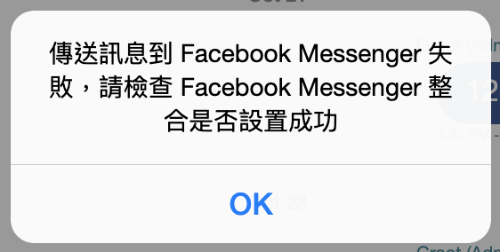
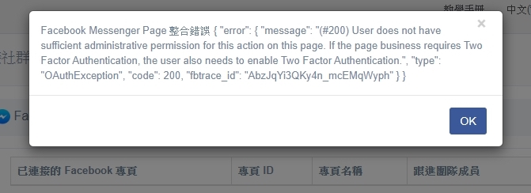

# Facebook Messenger | 整合到 Omnichat

## 如何整合 Facebook Messenger

### 前置條件

* 你的 Facebook 帳號需要擁有該 Facebook 專頁的**「管理員」權限**

### 串接步驟

1. 登入 [Omnichat 後台](https://app.omnichat.ai/)
2. 在左側選單選擇「**通訊渠道 >** [**串接社群通訊渠道**](https://app.omnichat.ai/integration.html)」
3. 點擊 **Facebook Messenger** 分頁部份 -> 點擊「**串接 Facebook 專頁**」

<figure><figcaption></figcaption></figure>

4\. 會另開網站分頁，請點擊「**以 O O O 的身份繼續**」


如您尚未登入 Facebook 帳號，請先進行登入


<figure><figcaption></figcaption></figure>

<figure><figcaption></figcaption></figure>

5\. 勾選你想要連接的 Facebook 專頁，然後按「**下一步**」


**注意：如果你之前已串接其他專頁到 Omnichat，請勿取消打勾**


<figure><figcaption></figcaption></figure>

6\. 檢視授權給 Omnichat 的權限，然後點擊「**完成**」


**注意：請勿把表列的權限取消，否則會影響 Omnichat 的功能**


<figure><figcaption></figcaption></figure>

7\. 授權完成，點擊「**確定**」

<figure><figcaption></figcaption></figure>

8\. 成功授權的 Facebook 專頁會在「**串接 Facebook 專頁**」部份列出，請勾選需要串接的 Facebook 粉專後點擊「**串接**」。

<figure><figcaption></figcaption></figure>

<figure><figcaption></figcaption></figure>

## 常見問題

### 回覆 Facebook 事件時，彈出錯誤「_傳送訊息到 Facebook Messenger 失敗，請檢查 Facebook Messenger 整合是否設置成功_」

如果回覆 Facebook 事件時，出現以下畫面，請先初步確認只有ㄧ個事件有出現，還是多個事件都有出現：

* **單一事件出現：**請完整截圖該事件的畫面，並從後台聯繫 Omnichat 線上客服
* **多個或所有事件出現：**屬於串接權限失效問題，請參考「[**如何排解權限失效狀態**](facebook-messenger.md#ru-he-pai-jie-quan-xian-shi-xiao-zhuang-tai)」步驟

### 出現整合錯誤

如果你看到上圖的錯誤提示，請先確認您的 Facebook 帳號是否已經擁有想要串接的 Facebook 專頁管理員權限

## 如何排解權限失效狀態

### 1. 重新授權

Facebook 的授權會因為以下原因而失效，授權失效後會影響 Omnichat 系統的功能：

* 負責授權的 Facebook 用戶帳號更改密碼
* 負責授權的 Facebook 用戶帳號開啟了雙重驗證
* Facebook 偵測到用戶有異常行為，基於安全原因把授權取消

你可以根據以下步驟重新授權：

1. 登入 [Omnichat 後台](https://app.omnichat.ai/)
2. 在左側選單選擇「**通訊渠道 >** [**串接社群通訊渠道**](https://app.omnichat.ai/integration.html)」
3. 打開 **Facebook Messenger 分頁**
4. 在**已串接的Facebook 專頁**，點擊「**解除串接**」把需要重新授權的 Facebook 專頁斷開連接

<figure><figcaption></figcaption></figure>

5\. 斷開連接後，點擊「**串接** **Facebook** 專頁」

<figure><figcaption></figcaption></figure>

6\. 點擊「**以** **OOO** **的身份繼續**」完成重新授權

<figure><figcaption></figcaption></figure>

7\. 成功重新授權後， Facebook 專頁會列出，請勾選需要串接的 Facebook 粉專後點擊「**串接**」。

<figure><figcaption></figcaption></figure>


如果想要串接的專頁沒有出現，請回到「第6步」點擊左邊「編輯**設定**」檢查是否有勾選想要串接的 Facebook 專頁及授權所有 Omnichat 要求的權限


.png>)


如果未跳出『編輯設定』可重新確認 Facebook 粉專設定，請查看是否點擊「**以** **OOO** **的身份繼續**」後可至『企業整合工具設定』調整。


### 2. 更改 Facebook 粉絲專頁的訊息主要接收者

若您為**「舊版粉絲專頁」**請參考此步驟，新版請往下繼續瀏覽。

1. 粉絲專頁設定 > 進階訊息&#x20;

<figure><figcaption></figcaption></figure>

2. 找到交接通訊協定，並點擊「Messenger reciever」旁的設定按鈕

<figure><figcaption></figcaption></figure>

將「主要接收者」設定成 Omnichat

<figure><figcaption></figcaption></figure>

若您為**「新版粉絲專頁」**請參照下列圖文步驟

1. 新版粉絲專頁管理頁面 > 列表中點擊「設定」

<figure><figcaption></figcaption></figure>

2. 列表中點擊「新版粉絲專頁體驗」&#x20;

<figure><figcaption></figcaption></figure>

3. 點擊「進階訊息」

<figure><figcaption></figcaption></figure>

3. 頁面找到 應用程式設定-交接通訊協定 > 在「Messenger 接收者」右側設定 > 選擇 「Omnichat」

<figure><figcaption></figcaption></figure>

<figure><figcaption></figcaption></figure>

### 若在 Facebook 原生系統後台回覆 FB 客人端訊息是否會進到 Omnichat 後台中？ 

若您有在 Facebook Messenger 收件夾當中回覆客人問題，該回覆的訊息會進到 Omnichat 的對話事件中，但由於 Meta 官方有機會產生系統 Bug 導致該訊息無法正常出現在 Omnichat 後台，因此建議您非必要時仍可以 Omnichat 系統端為主要回覆 Facebook 對話事件的平台。
