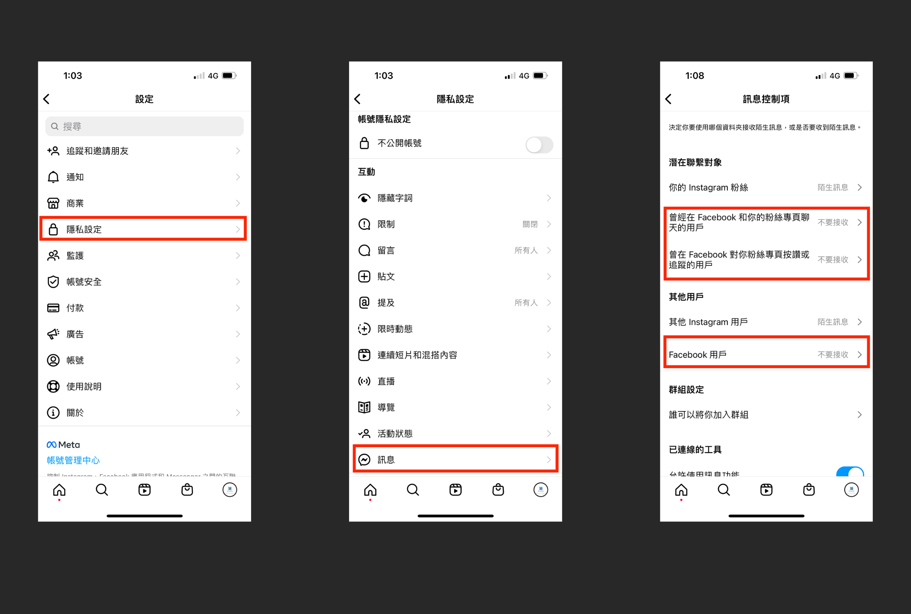
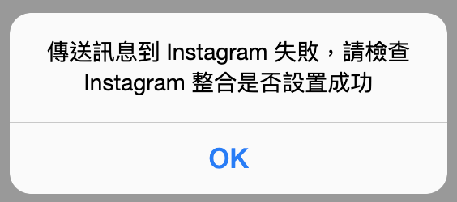
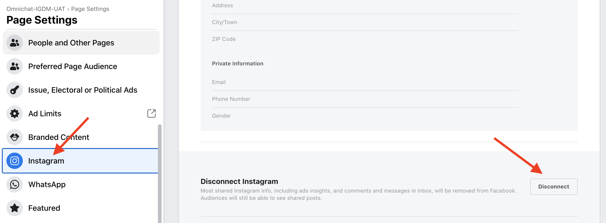
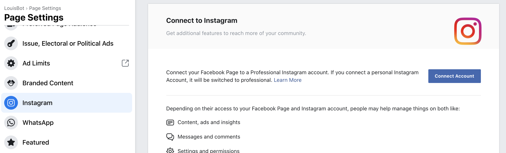
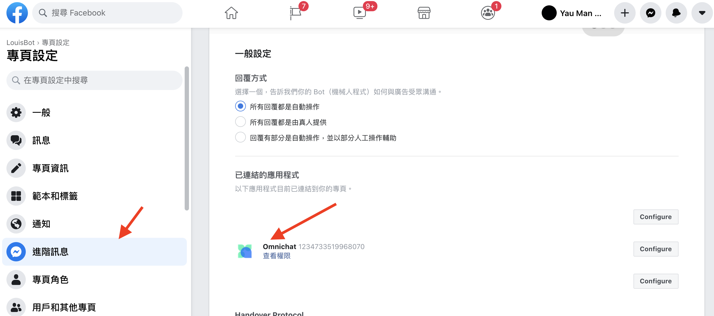
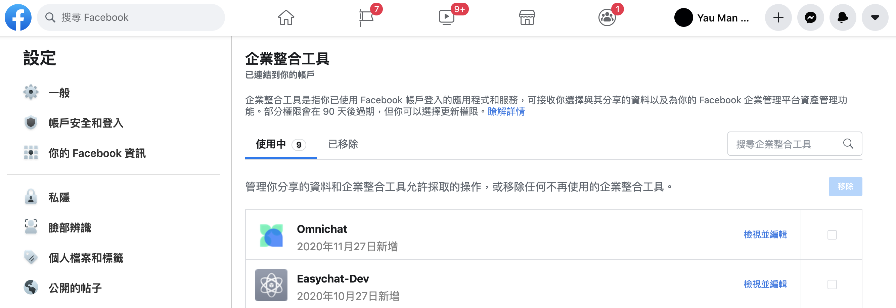

# Instagram Messenger | 整合到 Omnichat

## 如何整合 Instagram Messenger

### 前置條件

* 你的 Instagram 帳號必須是「**商業帳戶**」 （設定方法可參考：[https://help.instagram.com/502981923235522](https://help.instagram.com/502981923235522) ）
  * **注意：「創作者帳戶」會無法正常整合**
  * 可以到「Instagram App > 設定 > 帳號 > 切換帳號類型」確認目前類型。若帳號為「商業帳號」，切換時只會出現切換為個人帳號或創作者帳號。

<figure><figcaption>
中英文介面參考
</figcaption></figure>

* 請先將你需要整合的 Instagram 帳號連接到你的 Facebook 專頁（可參考： [https://www.facebook.com/business/help/connect-instgram-to-page](https://www.facebook.com/business/help/connect-instgram-to-page) ）
* 你的Facebook帳號需要擁有該 Facebook 專頁的**管理員 / 版主 / 編輯其中一個權限**
*   在 Instagram App 內，設定 > 隱私設定 > 訊息 (Settings > Privacy > Messages)：

    * 已連線工具的「允許使用訊息功能」打開 (Under "Connected Tools" section,  "Allow access to messages" toggle)
      * 將 「潛在聯繫對像 / Potential connections」 底下，「曾經透在 Facebook 和你的粉絲專頁聊天的用戶 / People who've chatted with your page on Facebook」、「曾在Facebook 對你的粉絲專頁按讚或追蹤用戶 / People who like or follow your Page on Facebook」這兩個設定改成 「不要接收 / Don't Receive」
    * 將 「其他用戶 / Other People 底下，「Facebook 用戶 / People on Facebook」這個設定改成 「不要接收 / Don't Receive」

<figure><figcaption>
中文設定介面
</figcaption></figure>

<figure><figcaption>
英文版介面
</figcaption></figure>

### 串接步驟

1. 登入 [Omnichat 後台](https://app.omnichat.ai/)
2. 在左側選單選擇「**通訊渠道 >** [**串接社群通訊渠道**](https://app.omnichat.ai/integration.html)」
3. 打開「已串接的 Instagram 帳號」部份 -> 點擊「**串接 Instagram 帳號**」


**如果你已經有串接 Facebook 粉專到 Omnichat，請使用負責串接 Facebook 粉專的同一個 Facebook 用戶串接 Instagram**


<figure><figcaption></figcaption></figure>

4\. 點擊「**串接 Instagram 帳號**」後會另開一個分頁，並出現以下 Facebook 視窗，請點擊「**以 O O O 的身份繼續**」


如您尚未登入 Facebook，請先登入


<figure><figcaption></figcaption></figure>

5\. 勾選您要串接的 Instagram 帳號，然後點擊「下一步」

<figure><figcaption></figcaption></figure>

6\. 勾選已經連接了 Instagram 帳號的 Facebook 專頁，然後按「**下一步**」


**注意：如果你有串接其他 Facebook 粉專到 Omnichat，請勿把本身已經勾選的 Facebook 粉專取消勾選，否則會使串接失效**


<figure><figcaption></figcaption></figure>

&#x20;7\. 檢視授權給 Omnichat 的權限，然後點擊「**完成**」


**注意：請勿把表列的權限取消，否則會影響 Omnichat 的功能**


<figure><figcaption></figcaption></figure>

8\. 授權完成，點擊「**確定**」

<figure><figcaption></figcaption></figure>

9\. 成功授權的 Instagram 帳號會在原本頁面彈出視窗，請勾選要串接的 Instagram 帳號後，點擊「**串接**」，即完成串接。

<figure><figcaption></figcaption></figure>


如果您看不到您想串接的 Instagram 帳號，請檢查：

* 是否擁有連接了 Instagram 帳號的 Facebook 專頁的管理員權限
* 在第 6 步是否有勾選連接了 Instagram 帳號的 Facebook 專頁


## 如何重新授權

Facebook 的授權會因為以下原因而失效，授權失效後會影響 Omnichat 系統的功能：

* 負責授權的 Facebook 用戶帳號更改密碼
* 負責授權的 Facebook 用戶帳號開啟了雙重驗證
* Facebook 偵測到用戶有異常行為，基於安全原因把授權取消

如果你在 Omnichat 後台 對話頁面看到以下錯誤，請重新授權 Instagram 帳號權限。

你可以根據以下步驟重新授權：

1. 登入 [Omnichat 後台](https://app.omnichat.ai/)
2. 在左側選單選擇「**通訊渠道 >** [**串接社群通訊渠道**](https://app.omnichat.ai/integration.html)」
3. 打開「**Instagram 帳號整合**」部份
4. 在「**已連接的 Instagram 帳號**」部份，點擊「**不連接**」把需要重新授權的 Instagram 帳號斷開連接

<figure><figcaption></figcaption></figure>

5\. 斷開連接後，點擊「**串接 Instagram 帳號**」

<figure><figcaption></figcaption></figure>

6\. 點擊「**以 OOO 的身份繼續**」完成重新授權

<figure><figcaption></figcaption></figure>

7\. 成功授權的 Instagram 帳號會在原本頁面彈出視窗，請勾選要串接的 Instagram 帳號後，點擊「**串接**」，即完成串接。

<figure><figcaption></figcaption></figure>


如果彈出的視窗沒有列出您想要整合的 Instagram 帳號，請在「第 6 步」點擊「**編輯設定**」，檢查是否有勾選整合的 Instagram 帳號及連接該 Instagram 帳號的 Facebook 粉專


<figure><figcaption></figcaption></figure>

## 串接後無法在 Omnichat 後台收到訊息解決方法


> Instagram 需為**『商業帳號』**才可完成整合串接，如果為**『創作者帳號』**請參考以下連結設定 Instagram 商業帳號：[https://help.instagram.com/50298192323552](https://help.instagram.com/502981923235522)&#x20;


1.在Facebook 專頁的設定內，斷開 Instagram 與 Facebook 專頁連接

2\. 重新連接 Instagram 到 Facebook 專頁

3\. 在 Facebook 專頁 > 設定 > 進階訊息，把 Omnichat 移除

4\. 移除後，請到 Omnichat 重新串接 Facebook 專頁及 Instagram
