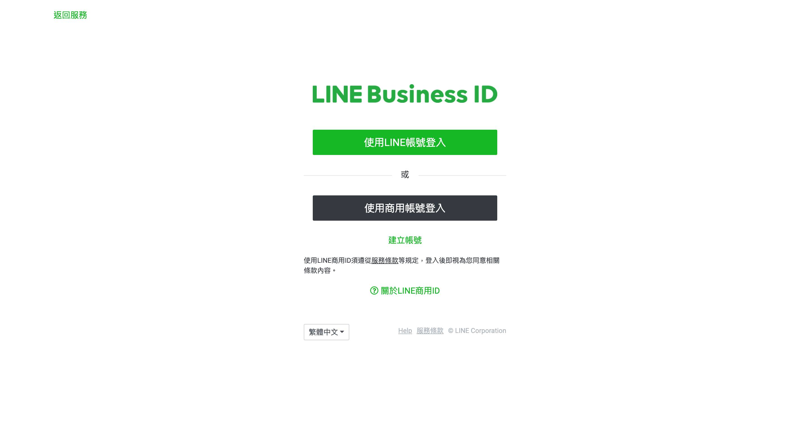
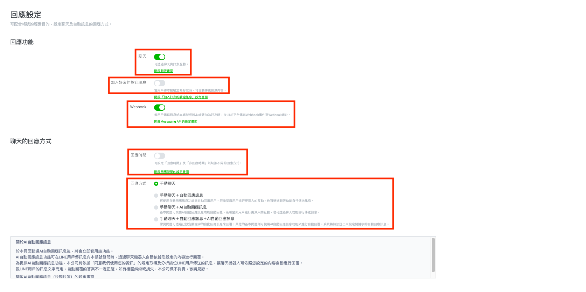
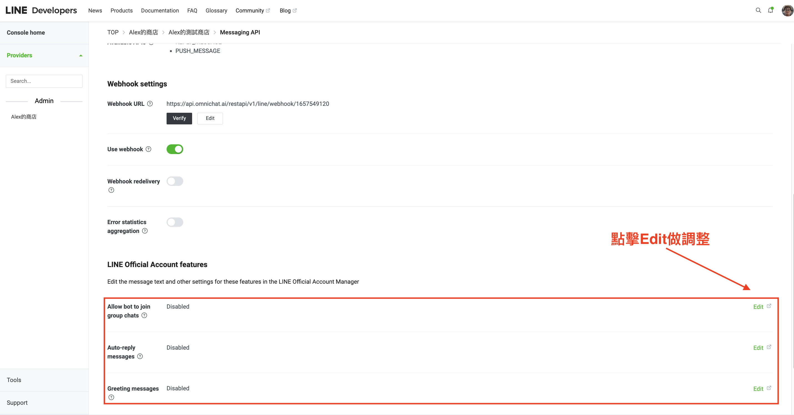
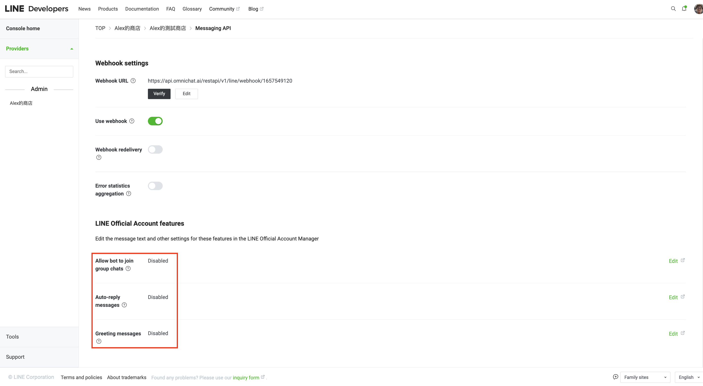

# LINE 官方帳號整合到 Omnichat

## 影片教學

如果已經有 LINE 官方帳號，你可以依照以下教學影片中的步驟，將 LINE 官方帳號 2.0 整合到 Omnichat

如果想看文字教學，請往下至「**二、**[**將 LINE 官方帳號與 Omnichat** ](https://docs.omnichat.ai/features/tong-xun-qu-dao/integrations/line-2.0/line-2.0-message-fee/line-guan-fang-zhang-hao-2.0-zheng-he-dao-omnichat-xin-ban-geng-xin-zhong#er-jiang-line-guan-fang-zhang-hao-yu-omnichat-zheng-he)**」**


LINE 官方帳號整合教學


## 概覽

此篇教學內容將會分成兩個部分，分別是：

[一、創建 LINE 官方帳號](https://docs.omnichat.ai/features/tong-xun-qu-dao/integrations/line-2.0/line-2.0-message-fee/line-guan-fang-zhang-hao-2.0-zheng-he-dao-omnichat-xin-ban-geng-xin-zhong#yi-chuang-jian-line-guan-fang-zhang-hao)

[二、將 LINE 官方帳號與 Omnichat 整合](https://docs.omnichat.ai/features/tong-xun-qu-dao/integrations/line-2.0/line-2.0-message-fee/line-guan-fang-zhang-hao-2.0-zheng-he-dao-omnichat-xin-ban-geng-xin-zhong#er-jiang-line-guan-fang-zhang-hao-yu-omnichat-zheng-he)


如果已經有 LINE 官方帳號，請跳過第一部分，從第二個部分 **「將 LINE 官方帳號與 Omnichat 整合」**開始查看與設定


## 一、創建 LINE 官方帳號

### 步驟一

進入 LINE Account Connect： [https://www.linebiz.com/tw/service/line-account-connect/](https://www.linebiz.com/tw/service/line-account-connect/)

點擊右上方「免費開設帳號」或是點擊下方的「免費開設帳號」都可以喔！

<figure><figcaption></figcaption></figure>

### 步驟二

選擇使用 LINE帳號 / 商用帳號 登入


若不確定要使用哪一項登入，可先詳閱LINE官網上的說明：[「使用LINE帳號登入」與「使用商用帳號登入」有何差別？」](https://help2.line.me/business\_id/web?lang=zh-TW)


### 步驟三

登入後，填上 LINE官方帳號的資料，查看「[LINE官方帳號服務條款](http://terms2.line.me/official\_account\_terms\_tw)」後按下「**確定**」

<figure><figcaption></figcaption></figure>

確認輸入內容無誤後，按下「**完成**」

<figure><figcaption></figcaption></figure>

查看到以下畫面，即表示 LINE 官方帳號申請成功

接著，請點擊「前往 LINE Official Account Manager 」進入 LINE OA 後台，繼續進行整合至 Omnichat 的設定

## 二、將 LINE 官方帳號與 Omnichat 整合

#### **首先，先進入** LINE Official Account Manager（LINE OA 後台）

**新創建 LINE 官方帳號者**：接續第一個部分，點擊「前往 LINE Official Account Manager 」後，請先點擊「同意」，即可進入 LINE OA 後台（如下圖）

### **已經有 LINE 官方帳號者**

點擊以下連結來登入 LINE Official Account Manager**：** [https://account.line.biz/login?redirectUri=https%3A%2F%2Fmanager.line.biz%2F](https://account.line.biz/login?redirectUri=https%3A%2F%2Fmanager.line.biz%2F)

登入 “LINE Official Account Manager” 後，先選擇要進行整合的 LINE 官方帳號：

### 步驟一

點擊「設定」

&#x20;在左側點選「**Messaging API**」，接著在 Messaging API 這頁，點擊「啟用 Messaging API」


1. Messaging API 每個官方帳號只有一個也無法重新建立。
2. 負責開啟的人員為該 Messaging API Channel 的永久管理員。建議由品牌創辦人或是主管的 LINE 帳號來創建，以免無法找回該 Messaging API Channel
3. 如果開啟後擔心只有一個人員帳號的話，可以再將權限利用 E-mail 方式來進行授權


### 步驟二

點擊「啟用 Messaging API」之後，首先需要**選擇已經建立的服務提供者，或是建立新的服務提供者（Provider）**


**請注意：「服務提供者名稱」應輸入貴公司的名稱，請不要輸入 「Omnichat」。**


選擇後請先詳閱「[LINE 官方帳號 API 服務條款](https://terms2.line.me/official\_account\_api\_terms\_tw)」，再按下同意

接著，填寫「隱私權政策及服務條款的網址（選填）**。**若無填寫亦可按下「確定」來進入下一個步驟

請確認「帳號名稱」和「服務提供者名稱」無誤後，按下「**確定**」即正式啟用Messaging API

按下「確定」之後就會出現以下畫面，並可看到狀態是「使用中」

接下來，您可以點擊**「LINE Developers 」**來取得更多整合需要用到的資料！

### 步驟三

為了整合 LINE 至 Omnichat 後台，會需要複製以下 5 樣資料

1. **App Name**
2. **Channel ID** &#x20;
3. **Channel secret**
4. **Channel access token (long lived)**
5. **LINE 官方帳號 ID**

請在 Messaging API 頁面，點擊進入 LINE Developers


Channel ID 和 Channel secret 會在 Messaging API 頁面顯示，亦可在此頁複製這兩項資訊&#x20;


### 步驟四

進入 LINE Developers 後， 先點擊右上方的頭像，選擇 LINE 帳號

從左側的 Admin 選擇 Provider（服務提供者）

接著點選 Channel（官方帳號），進入設定頁面


請留意，如果您從 LINE OA 後台中點擊進到 Developers 畫面時沒有看到 Messaging API Channel，請向公司同仁確認是否有其他人員帳號已經開立過 Messaging API。


### 步驟五

進入設定頁面後，分別在「Basic Settings」和「Messaging API 」兩個分頁裡，**取得串接需要的資料**

1. **App Name**
2. **Channel ID** &#x20;
3. **Channel secret**
4. **Channel access token (long lived)**

第一項～第三項可在「Basic Settings」裡取得

### 步驟六

切換到 **Messaging API** 分頁，往下滑找到  **Channel access token (long lived)**

請按 issue 獲得 **Channel access token (long lived)**

### 步驟七

#### 如何取得 LINE 官方帳號 ID

進入 LINE 官方帳號後台: [https://manager.line.biz](https://manager.line.biz/)\
複製下圖紅框處的文字即為 **LINE 官方帳號的 LINE ID (不包含 @)**

### 步驟八

登入 [Omnichat 管理](https://app.omnichat.ai/)，前往 通訊渠道 ->  [串接通訊渠道](https://app.easychat.co/integration.html)，並點選「**串接 LINE 官方帳號**」 **-> 新增 LINE 官方帳號**

<figure><figcaption></figcaption></figure>

點擊後會彈出視窗，再麻煩填入貼上剛剛取得的 5 個資料，點擊「**串接**」

<figure><figcaption></figcaption></figure>

### 步驟九

點擊「串接」後，會彈出「串接成功訊息」，請複製 Webhoook URL 來貼上 LINE OA 後台進行 Verify

或是您可以點擊剛串接 LINE 官方帳號三個點的地方，點擊『複製 Webhook 連結』來複製 Webhook 連結

<figure><figcaption></figcaption></figure>

<figure><figcaption></figcaption></figure>

### 步驟十

返回到 LINE Developers 的 **Message API 分頁**

找到 Webhook settings ，並在 Webhook URL 這裏按下 **"Edit"**&#x20;

貼上剛剛在 Omnichat 後台複製的 LINE Webhook 網址，接著按 **"Update"**

按 "**Verify**"，確保你看見 "Success"

### 步驟十一

**打開 Use Webhook 開關**

<figure><figcaption></figcaption></figure>


如果無法在 LINE Developers 開啟 Use Webhook，可以到 LINE OA 後台的「回應設定」裡調整，在 Webhook 的地方勾選「啟用」


**Plan A**

<figure><figcaption></figcaption></figure>


若您不會在LINE OA原生後台，只會在Omnichat後台回覆訊息，請在LINE OA後台做以下設定

* 關閉「聊天開關」；啟用 Webhook


**Plan B**

<figure><figcaption>
若要同時在 LINE OA 後台 &#x26; Omnichat後台回覆客人訊息，請參考此圖設定
</figcaption></figure>


若您有需要在 LINE OA 後台回覆客人訊息，請務必在 LINE OA「回應設定」做以下設定

* 開啟「聊天開關」；啟用Webhook
* 關閉「加入好友的歡迎訊息（避免同時觸發 LINE OA 與 Omnichat 兩邊的歡迎訊息功能）
* 關閉「回應時間」（避免同時觸發 LINE OA 與 Omnichat 兩邊的離線即時訊息功能）
* 「聊天的回應方式」請務必選擇「手動」（避免同時觸發 LINE OA 與 Omnichat 兩邊的機器人回應、關鍵字自動回覆、歡迎訊息）


### 步驟十二


**重新整理頁面並確認 Use Webhook 是 "開啟" 的狀態**


在瀏覽器重新整理該頁面，確認 Use Webhook 是否還是開啟的狀態。做這個檢查的原因是有時候 LINE 的設定後台會有 bug，會自動關閉  Use webhook，所以保險起見請再確認一次 Use webhook 是否開啟

<figure><figcaption></figcaption></figure>

### 步驟十三

把 **Allow bot to join group chats** 及 **Auto-reply messages** 設定為 "Disable"，請點擊右側的 "Edit"，進入 LINE OA 後台的回應設定裡調整

若有在 Omnichat 後台設定「歡迎訊息」，可以將 Greeting messages 設定為 "Disable"

<figure><figcaption></figcaption></figure>

調整後，畫面如下：

<figure><figcaption></figcaption></figure>

＊補充問題

如果已經在 LINE OA 後台的「回應設定」頁面調整，但是 LINE Developers 的 Messaging API 頁面仍沒有更新，是因為 LINE Developers 的顯示可能不會即時更新，不過隔一段時間就會更新，所以若已確認 LINE OA 後台已調整完畢就沒問題了

## **完成！你的 LINE 已經成功整合到 Omnichat**&#x20;

## **常見問題**

**1. 已經按照以上步驟將 LINE 整合到 Omnichat ，但是在 Omnichat 仍沒有收到 LINE 的訊息？**

&#x20;   如果遇到此情況，建議先查看這篇進行檢查： [LINE 整合疑難排查](https://docs.omnichat.ai/features/tong-xun-qu-dao/integrations/line-2.0/line-zheng-he-yi-nan-pai-cha)

&#x20;   若逐步檢查後仍有問題，歡迎從後台右下角的對話插件與 Omnichat 線上客服聯繫

**2. 出現以下圖中的彈出視窗，該怎麼處理？**

<figure><figcaption></figcaption></figure>

出現此提示，表示你的 LINE 官方帳號已經整合至其他團隊後台，請先回到另一個後台解除 LINE 官方帳號的整合，再回到現在的後台進行整合

**3. 如何取消 LINE 的整合**

請點擊右側的三個點的「**解除串接**」按鈕，接著按下彈出視窗中的「**解除**」即可


如果您之後是不再使用 Omnichat 服務，請先刪除 Omnichat 與 LINE 後台相關設定，再取消 LINE 的連結。如： LINE 圖文選單等。


<figure><figcaption></figcaption></figure>

<figure><figcaption></figcaption></figure>
