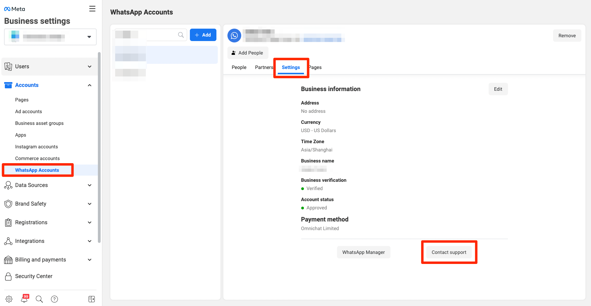
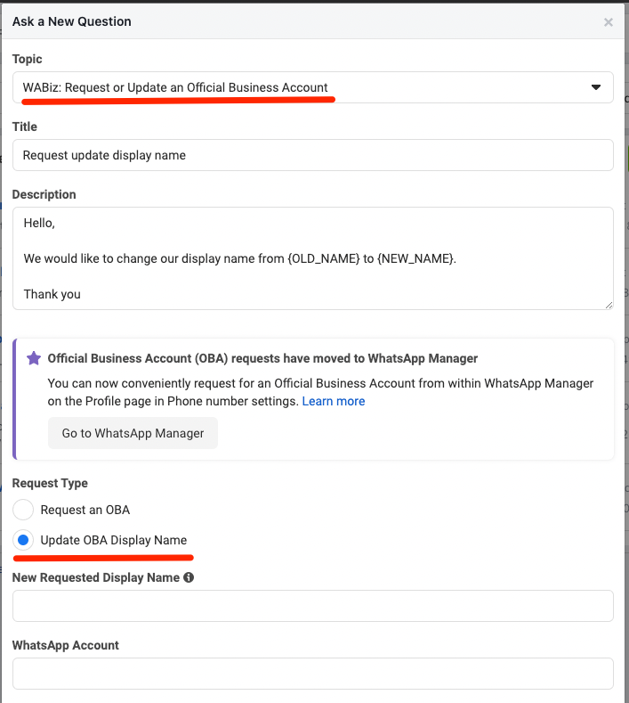

# 修改 WhatsApp Business API 商業帳號敘述


該步驟僅支援您的 WABA 帳號為 **官方 Green Tick** 時，可跟著下列步驟自行操作


### Step 1.  至 Meta 的企業管理平台 （Go to Meta Business Manager），點選帳號(Account) 當中的 WhatsApp 帳號

### Step 2. 在 WhatsApp 帳號當中選擇設定 (Setting) 的頁面，並點選聯絡支援團隊（Content Support） 

<figure><figcaption>
English version
</figcaption></figure>

 

<figure><figcaption>
中文介面
</figcaption></figure>

### Step 3. 點選問新的問題 (Ask a Question)，並點選主題 (Topic) 

主題 (Topic) 請選擇：**WABiz: Request or Update an Official Business Account**

類型 (Type) 請選擇： **Update OBA Display Name**

### Step 4. 請求授權類型 (Request type) 

請選擇 Update OBA Display Name ，並依照需修改的內容填入相關資訊，並點選提交後，待 WhatsApp 審查成功即完成！

<figure><figcaption>
English version
</figcaption></figure>

 

<figure><figcaption>
中文介面
</figcaption></figure>

