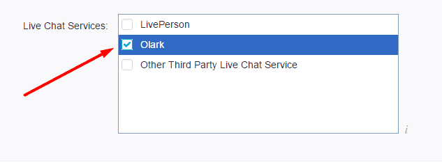

# Bigcommerce | 安裝 Omnichat

## 步驟 1

[登入](https://app.easychat.co/) 到 Omnichat 管理員頁面

## 步驟 2

前往  通訊渠道  >  網站對話插件  >  [安裝對話插件](https://app.easychat.co/install.html)  頁面

1. 輸入安裝 Omnichat 的網站地址
2. 選擇你的 Omnichat 網頁插件應用顏色
3. 選擇你的 Omnichat 網頁插件應用語言
4. 複製 Omnichat 安裝代碼

<figure><figcaption></figcaption></figure>

## 步驟 3

登錄到您的 [Bigcommerce 管理員頁面](https://login.bigcommerce.com/login)

## 步驟 4

按 **Advanced Settings** > **Live Chat**

## 步驟 **5**

在 Live Chat Service 按 Olark

## 步驟 **6**

在 Chat Code box, 貼上 Omnichat code

## **完成！ 立即在您的 Bigcommerce 網站上用** Omnichat **跟客戶即時聊天吧**

