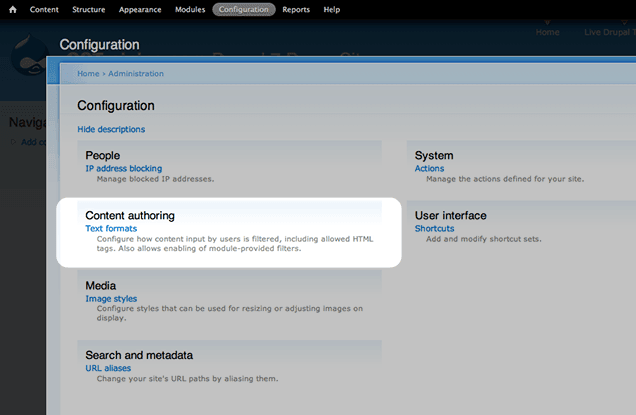
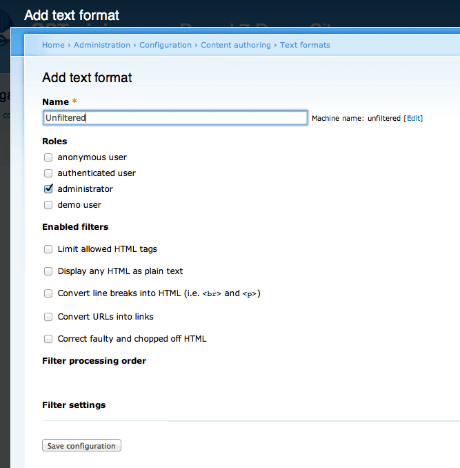
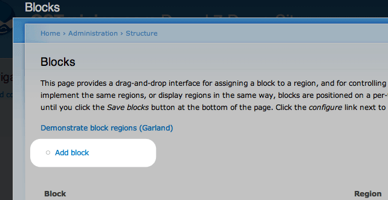
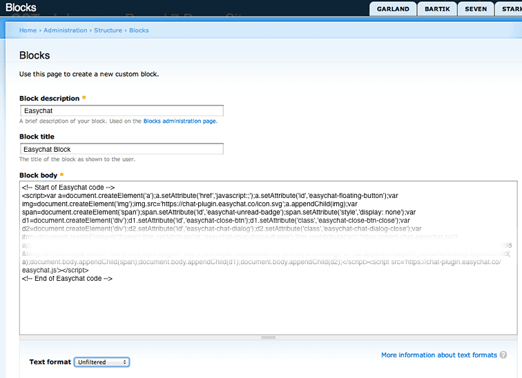
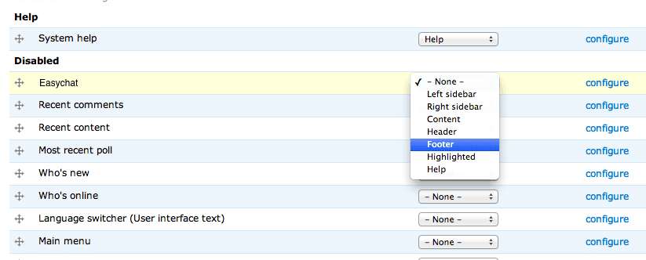

# Drupal | 安裝 Omnichat

## 步驟 1

[登入](https://app.easychat.co/) 到 Omnichat 管理員頁面

## 步驟 2

前往  通訊渠道  >  網站對話插件  >  [安裝對話插件](https://app.easychat.co/install.html)  頁面

1. 輸入安裝 Omnichat 的網站地址
2. 選擇你的 Omnichat 網頁插件應用顏色
3. 選擇你的 Omnichat 網頁插件應用語言
4. 複製 Omnichat 安裝代碼

<figure><figcaption></figcaption></figure>

## 步驟 3

登錄到您的 Drupal 管理員並前往 **Configuration > Content Authoring > Text Formats**

## 步驟 **4**

創建一個新的格式，並將其命名為“Unfiltered”。 **確保所有 filters 已經 disabled，然後保存。**

## 步驟 **5**

**前往 Structure** > **Block** 然後 **Add Block**

## 步驟 **6**

**創立 block ，稱之為“**Omnichat**”。將**Omnichat**代碼貼到 Block Body box 中**

## 步驟 **7**

**將 Text Format** 更改為您創建的新的 **Unfiltered** type，然後按**保存**

## **完成！ 立即在您的** Drupal **網站上用** Omnichat **跟客戶即時聊天吧**
