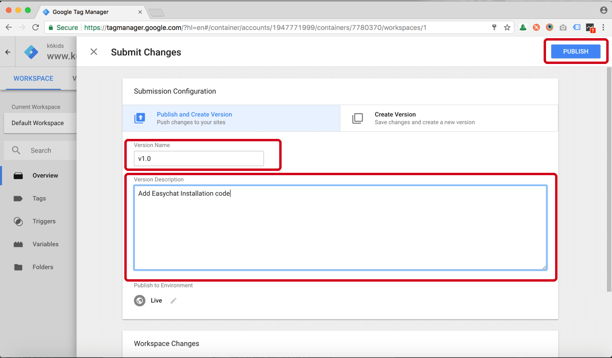

# Google Tag Manager | 安裝 Omnichat

## 步驟 1

[登入](https://app.easychat.co/) 到 Omnichat 管理員頁面

## 步驟 2

前往  通訊渠道  >  網站對話插件  >  [安裝對話插件](https://app.easychat.co/install.html)  頁面

1. 輸入安裝 Omnichat 的網站地址
2. 選擇你的 Omnichat 網頁插件應用顏色
3. 選擇你的 Omnichat 網頁插件應用語言
4. 複製 Omnichat 安裝代碼

<figure><figcaption></figcaption></figure>

## 步驟 3

登入您的 Google Tag Manager 帳戶 [https://tagmanager.google.com](https://tagmanager.google.com/)

## 步驟 4

添加新帳戶並設置 Account Name and Container name，並在 Where to Use Container 選擇 **Web**

## 步驟 5

按添加新標籤

.png>)

## 步驟 6

輸入標籤名稱(Tag name)，然後按右上角的編輯鉛筆(Edit Pencil)

## 步驟 7

選擇 Custom HTML

## 步驟 8

把 Omnichat Javascript 代碼 貼到 HTML Textbox

## 步驟 9

按 trigger 並選擇 "All Pages"

## 步驟 10

提交新版本並添加 "Version Name", "Version Description" 並按 "PUBLISH"

## **完成！**
