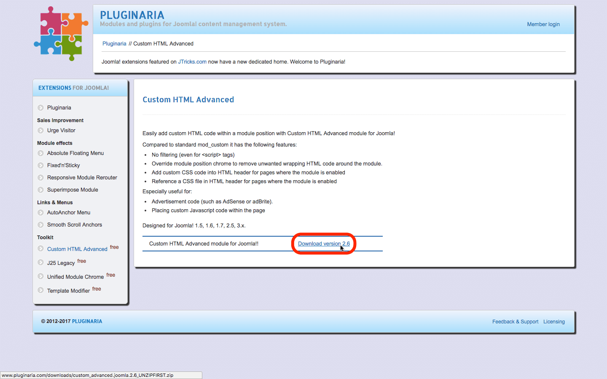
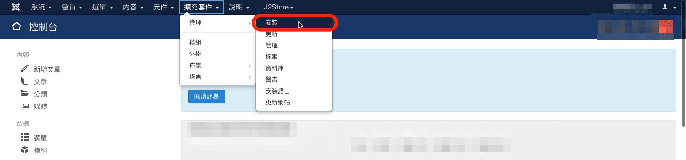
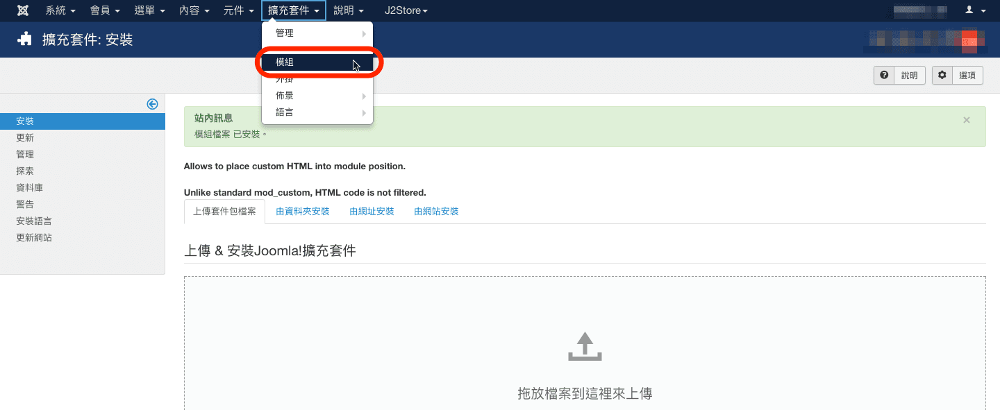
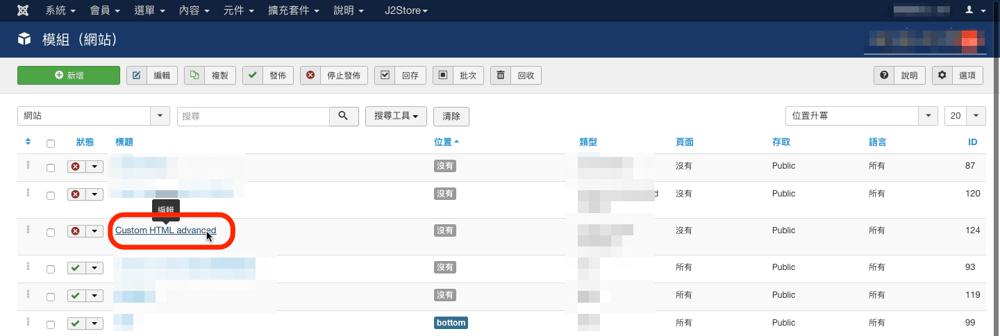
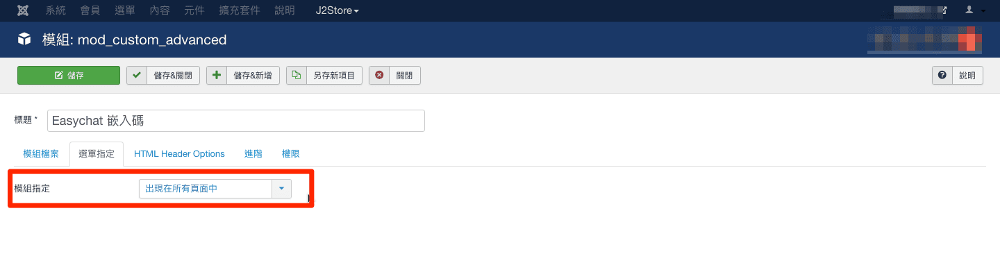

# Joomla | 安裝 Omnichat

## 步驟 1

[登入](https://app.easychat.co/) 到 Omnichat 管理員頁面

## 步驟 2

前往  通訊渠道  >  網站對話插件  >  [安裝對話插件](https://app.easychat.co/install.html)  頁面

1. 輸入安裝 Omnichat 的網站地址
2. 選擇你的 Omnichat 網頁插件應用顏色
3. 選擇你的 Omnichat 網頁插件應用語言
4. 複製 Omnichat 安裝代碼

<figure><figcaption></figcaption></figure>

## 步驟 3

打開瀏覽器輸入網址：[www.pluginaria.com/custom-html-advanced.html](http://www.pluginaria.com/custom-html-advanced.html)，點選如圖 所示連結下載「Custom HTML Advanced」模組，下載後請先解壓縮

## 步驟 4

在 Joomla! 網站管理區點選上方選單「擴充套件 – 管理 – 安裝」。

## 步驟 5

在「上傳套件包檔案」分頁上傳「mod\_custom\_advanced.zip」檔案安裝，接著點選管理區選單「擴充套件 – 模組」

## 步驟 6

找到「Custom HTML Advanced」項目，點選進入編輯。

## 步驟 7

在「Custom HTML」欄位處貼上 Omnichat 提供的嵌入碼，以下是其他欄位建議輸入/選擇值：

1. 標題：輸入：Omnichat
2. 顯示標題：選擇「隱藏」
3. 位置：選擇未使用佈景主題位置，如：debug。
4. 狀態：選擇「發佈的」。

.png>)

## 步驟 8

點選「選單指定」分頁，「模組指定」項目選擇「出現在所有頁面中」。完成以上步驟點選畫面上方「儲存&關閉」按鈕。

## **完成！ 立即在您的** Joomla **網站上用** Omnichat **跟客戶即時聊天吧**
