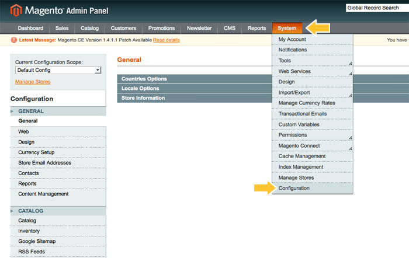
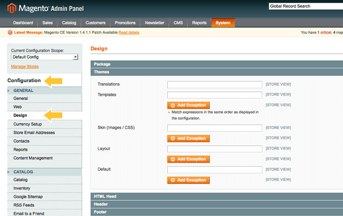
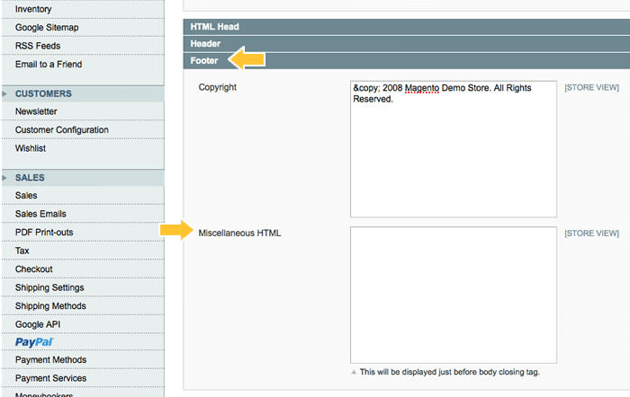
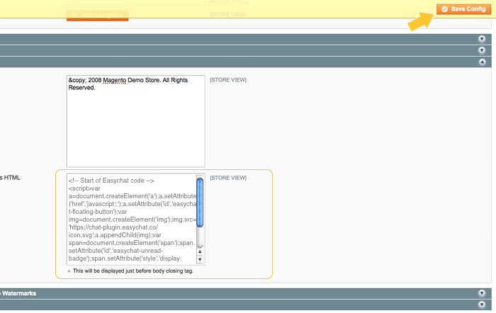

# Magento | 安裝 Omnichat

## 步驟 1

[登入](https://app.easychat.co/) 到 Omnichat 管理員頁面

## 步驟 2

前往  通訊渠道  >  網站對話插件  >  [安裝對話插件](https://app.easychat.co/install.html)   頁面

1. 輸入安裝 Omnichat 的網站地址
2. 選擇你的 Omnichat 網頁插件應用顏色
3. 選擇你的 Omnichat 網頁插件應用語言
4. 複製 Omnichat 安裝代碼

<figure><figcaption></figcaption></figure>

## 步驟 3

登錄到您的 Magento 管理頁面, 按 System > Configuation

## 步驟 4

在 Configuration 下, 在左邊 navigation 按 Design

## 步驟 5

在 Design Editor, 向下滾動到頁腳部分，找到 Miscellaneous HTML。複製 Omnichat 代碼並將其貼到方格中。

## 步驟 6

確保按下 Save Config, 然後到 Magento 店面檢查您的 Omnichat 插件

## **完成！ 立即在您的** Magento **網站上用** Omnichat **跟客戶即時聊天吧**
