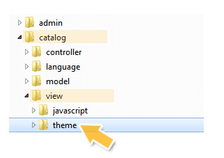
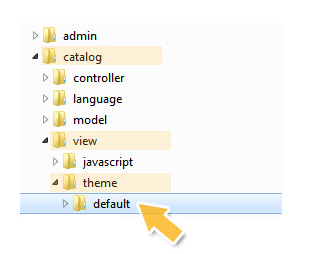
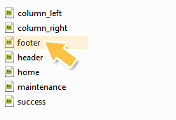
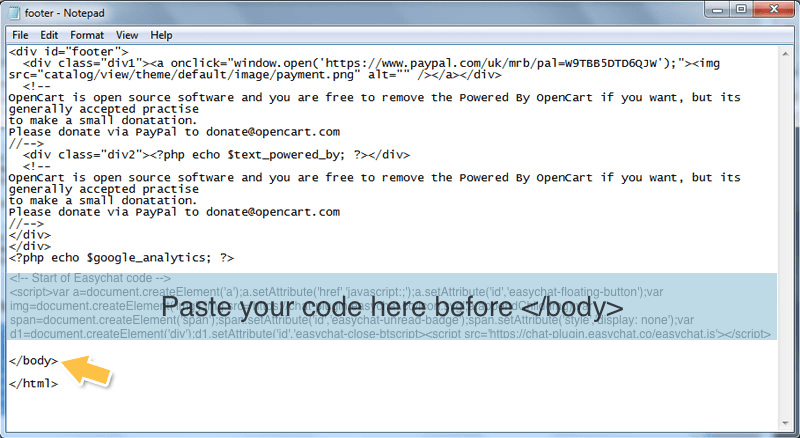

# Opencart | 安裝 Omnichat

## 步驟 1

[登入](https://app.easychat.co/) 到 Omnichat 管理員頁面

## 步驟 2

前往  通訊渠道  >  網站對話插件  >  [安裝對話插件](https://app.easychat.co/install.html)  頁面

1. 輸入安裝 Omnichat 的網站地址
2. 選擇你的 Omnichat 網頁插件應用顏色
3. 選擇你的 Omnichat 網頁插件應用語言
4. 複製 Omnichat 安裝代碼

<figure><figcaption></figcaption></figure>

## 步驟 3

使用**FTP客戶端**或**Cpanel File manager**登錄到您的 **OpenCart** 網站伺服器. (許多 Web hosting 公司也提供Cpanel內的File Manager)

## 步驟 4

前往 **OpenCart** 的 **ROOT directory** (通常是 "WWW" 或 "Public\_html")

## 步驟 5

前往 catalog > view > theme folder.

## 步驟 6

打開你正在使用的 theme folder。預設的 theme 為 **"default"**. (您可以在 OpenCart 管理區域內找到您的 theme, 在 **System > Settings > Store**)

## 步驟 7

前往 **template > common folder**.

## 步驟 8

打開 **footer.tpl / footer.twig** 文件並用如 Notepad 的編輯器編輯. 複製並貼上您的 Omnichat 代碼到 `</body>` tag 前。

## 步驟 9

按 **另存為** 並給file 命名 **footer.tpl / footer.twig** (一定要有**.tpl / .twig**)

## 步驟 10

將新編輯的 **footer.tpl  / footer.twig** 文件保存在PC上

## 步驟 11

用新的 **footer.tpl  / footer.twig** 文件替換伺服器上現有的 **footer.tpl  / footer.twig** 文件。

## 步驟 12


清除快取 Clear Cache&#x20;

[https://www.youtube.com/watch?v=mUMGV0WACHs](https://www.youtube.com/watch?v=mUMGV0WACHs) (Opencart Ver 3.x )


## **完成！ 立即在您的 OpenCart 網站上用** Omnichat **跟客戶即時聊天吧**
