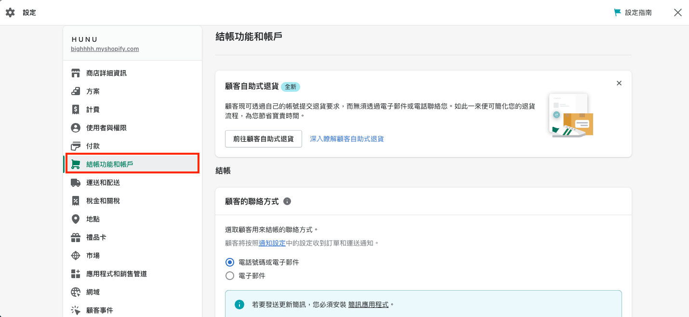

# Shopify | 安裝 Omnichat

## 步驟 1

[登入](https://app.easychat.co/) 到 Omnichat 管理員頁面

## 步驟 2

前往  通訊渠道  >  網站對話插件  >  [安裝對話插件](https://app.easychat.co/install.html)   頁面

1. 輸入安裝 Omnichat 的網站地址
2. 選擇你的 Omnichat 網頁插件應用顏色
3. 選擇你的 Omnichat 網頁插件應用語言
4. 複製 Omnichat 安裝代碼

<figure><figcaption>
Omnichat 網頁插件設定
</figcaption></figure>

複製 Omnichat Javascript 代碼

<figure><figcaption>
Omnichat 安裝代碼
</figcaption></figure>

## 步驟 3

登錄您的 Shopify 商店管理帳戶[http://www.shopify.com/login/](http://www.shopify.com/login/)

## 步驟 4

點擊左側功能列表中的「網路商店」

<figure><figcaption>
選擇「網路商店」
</figcaption></figure>

## 步驟 5

選擇「佈景主題」，並在頁面中點擊自訂旁的【・・・】，選擇「編輯程式碼」

<figure><figcaption>
「佈景主題」-「編輯程式碼」
</figcaption></figure>

## 步驟 6

點擊版面配置資料夾下的 **`theme.liquid`**

<figure><figcaption></figcaption></figure>

頁面中央編輯器面板瀏覽至最下方，找到``與`</body>`，在這之間按下 **Enter** 新增一列，

<figure><figcaption></figcaption></figure>

然後貼上 Omnichat Javascript 代碼到``與`</body>` tag 之間，按「儲存」。

<figure><figcaption></figcaption></figure>

## 步驟 7

點擊左側功能列表中的「設定」

<figure><figcaption>
選擇「設定」
</figcaption></figure>

## 步驟 8

選擇「結帳功能和帳戶」

<figure><figcaption>
結帳功能和帳戶
</figcaption></figure>

頁面下拉至「訂單狀態頁面」，然後貼上 Omnichat Javascript 代碼到其他指令碼欄位，按「儲存」。

<figure><figcaption>
「訂單狀態頁面」-「其他指令碼」
</figcaption></figure>

## **完成！ 立即在您的 Shopify 網站上用** Omnichat **跟客戶即時聊天吧**
