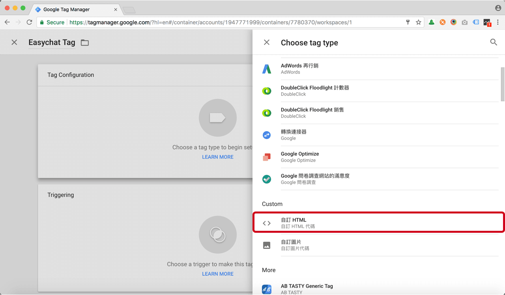
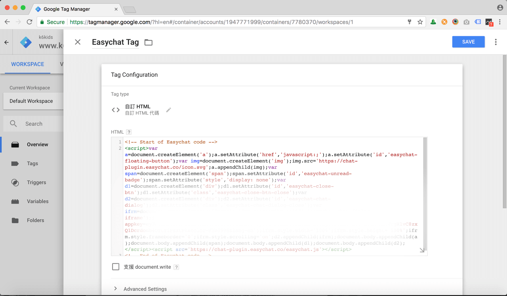

# SHOPLINE | 安裝 Omnichat

## 步驟 1

[登入](https://app.easychat.co/) 到 Omnichat 管理員頁面

## 步驟 2

前往  通訊渠道  >  網站對話插件  >  [安裝對話插件](https://app.easychat.co/install.html)  頁面

1. 輸入安裝 Omnichat 的網站地址
2. 選擇你的 Omnichat 網頁插件應用顏色
3. 選擇你的 Omnichat 網頁插件應用語言
4. 複製 Omnichat 安裝代碼

<figure><figcaption></figcaption></figure>

## 步驟 3

登錄您的 SHOPLINE 商店管理 [https://admin.shoplineapp.com/users/sign\_in](https://admin.shoplineapp.com/users/sign\_in)

## 步驟 4

前往 網店行銷與追蹤 > 追蹤設定

<figure><figcaption></figcaption></figure>

## 步驟 5

按 Google 代碼管理工具,  並在 "我的 Google 代碼管理工具編號" 欄位裡填入從 GTM 後台取得的 code

<figure><figcaption></figcaption></figure>

詳細步驟也可以參考 [SHOPLINE 官方文件說明](https://support.shoplineapp.com/hc/zh-tw/articles/205276289-Google-%E4%BB%A3%E7%A2%BC%E7%AE%A1%E7%90%86%E5%B7%A5%E5%85%B7-GTM-%E5%AE%89%E8%A3%9D%E6%96%B9%E5%BC%8F)

## 步驟 6

點擊「新增代碼」（ADD A NEW TAG）

.png>)

## 步驟 7

輸入 Tag name（代碼名稱），然後按右上角的鉛筆符號

## 步驟 8

選擇 Custom HTML（自訂 HTML）

## 步驟 9

把 Omnichat Javascript 代碼 貼到 HTML Textbox

## 步驟 10

按 trigger（觸發條件） 並選擇 "All Pages"

## 步驟 11

按下右上方的「Submit（提交）」按鈕，並添加「Version Name（版本名稱）」、「Version Description（版本說明）」，最後按下 「Publish（發布）」

## **完成！ 立即在您的 SHOPLINE 網站上用** Omnichat **跟客戶即時聊天吧**
