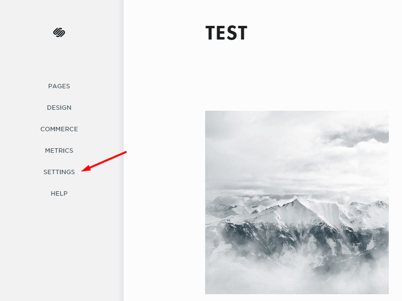
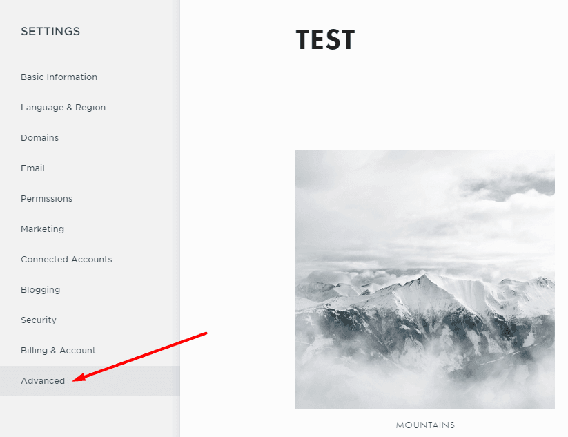
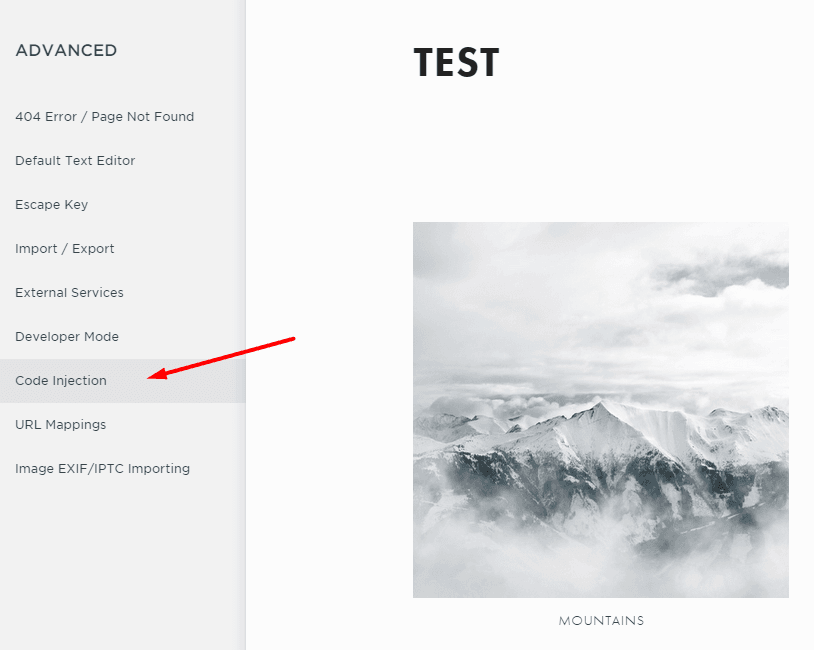
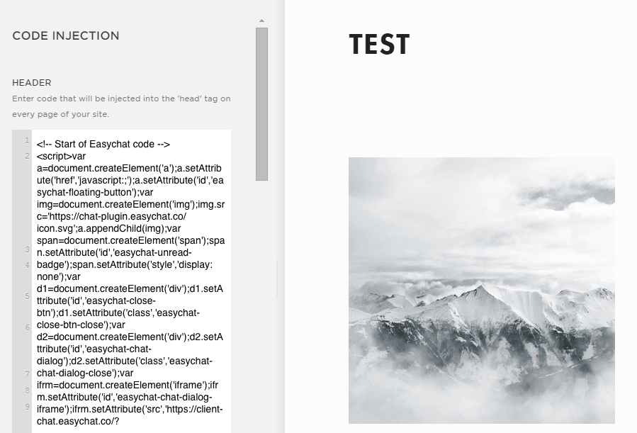

# Squarespace | 安裝 Omnichat

## 步驟 1

[登入](https://app.easychat.co/) 到 Omnichat 管理員頁面

## 步驟 2

前往  通訊渠道  >  網站對話插件  >  [安裝對話插件](https://app.easychat.co/install.html)  頁面

1. 輸入安裝 Omnichat 的網站地址
2. 選擇你的 Omnichat 網頁插件應用顏色
3. 選擇你的 Omnichat 網頁插件應用語言
4. 複製 Omnichat 安裝代碼

<figure><figcaption></figcaption></figure>

## 步驟 3

在左邊 Panel 按 **Settings**

## 步驟 **4**

再在左邊 Panel 按 **Advanced**

## 步驟 **5**

按 **Code Injection** (左邊 Panel column)

## 步驟 **6**

將 Omnichat 代碼貼到 header 部分，如果可以，最好貼到 **footer，**按 **Save Settings**.

## **完成！ 立即在您的** Squarespace **網站上用** Omnichat **跟客戶即時聊天吧**
