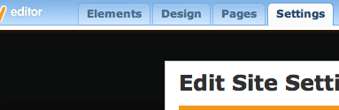
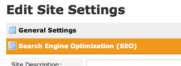
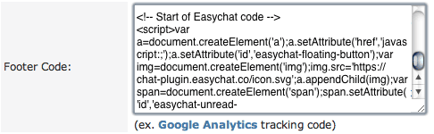
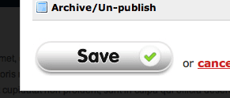
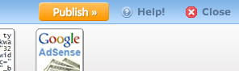

# Weebly | 安裝 Omnichat

## 步驟 1

[登入](https://app.easychat.co/) 到 Omnichat 管理員頁面

## 步驟 2

前往  通訊渠道  >  網站對話插件  >  [安裝對話插件](https://app.easychat.co/install.html)  頁面

1. 輸入安裝 Omnichat 的網站地址
2. 選擇你的 Omnichat 網頁插件應用顏色
3. 選擇你的 Omnichat 網頁插件應用語言
4. 複製 Omnichat 安裝代碼

<figure><figcaption></figcaption></figure>

## 步驟 3

登錄您的 Weebly 帳戶，然後點擊您要添加 Omnichat 的網站並按 **Edit Site**

## 步驟 **4**

在 main tab bar, 按 **Settings**.

## 步驟 **5**

按 **Search Engine Optimization (SEO).**

## 步驟 **6**

將 Omnichat 代碼貼到**頁腳代碼**。如果還有其他代碼，請在現有代碼之前或之後貼上 Omnichat 代碼。

## 步驟 **7**

按 **Save**.

## 步驟 **8**

在右上角按 **Publish**

## **完成！ 立即在您的 Weebly 網站上用** Omnichat **跟客戶即時聊天吧**
