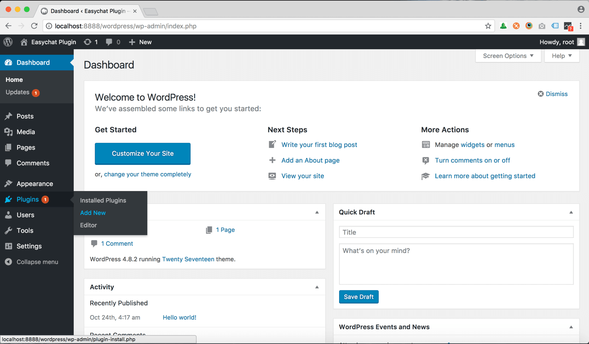
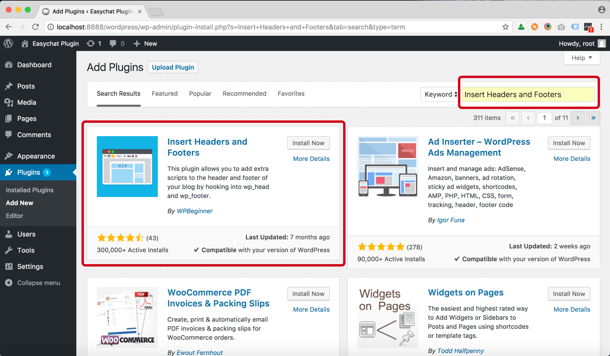
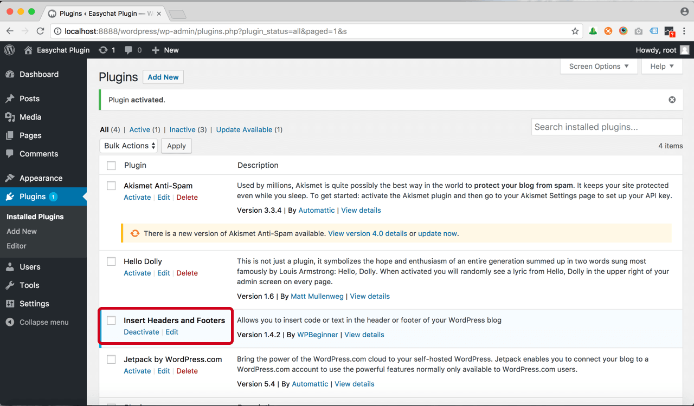
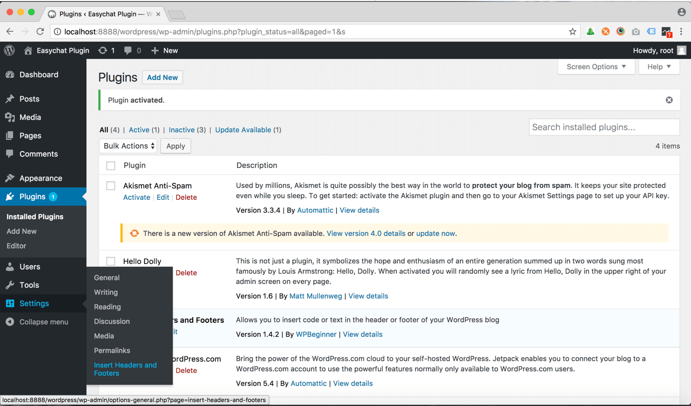
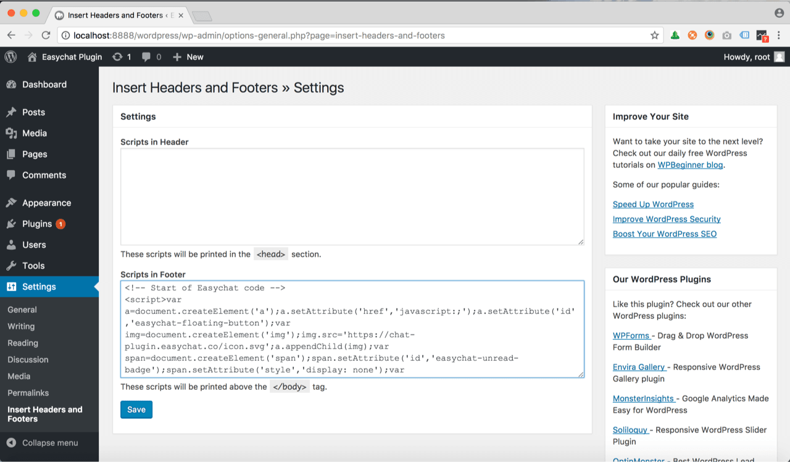

# Wordpress | 安裝 Omnichat

## 步驟 1

[登入](https://app.easychat.co/) 到 Omnichat 管理員頁面

## 步驟 2

前往  通訊渠道  >  網站對話插件  >  [安裝對話插件](https://app.easychat.co/install.html)  頁面

1. 輸入安裝 Omnichat 的網站地址
2. 選擇你的 Omnichat 網頁插件應用顏色
3. 選擇你的 Omnichat 網頁插件應用語言
4. 複製 Omnichat 安裝代碼

<figure><figcaption></figcaption></figure>

## 步驟 3

登錄到您的 Wordpress 管理頁面，按外掛(Plugins) > 添加 (Add New)

## 步驟 4

搜索 "Insert Headers and Footers", 按 "Install Now", After installed, 按 "Activate"

## 步驟 5

確保 "Insert Headers and Footers" 經已 Activated

## 步驟 6

前往 Setting > Insert Headers and Footers

## 步驟 7

貼上 Omnichat Code to 到 "Scripts in Footer" 方格並按 "Save"

## **完成！ 立即在您的 Wordpress 網站上用** Omnichat **跟客戶即時聊天吧**

