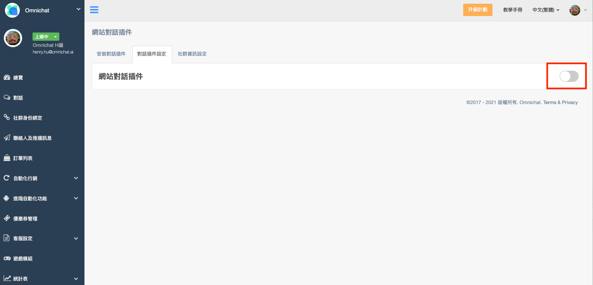
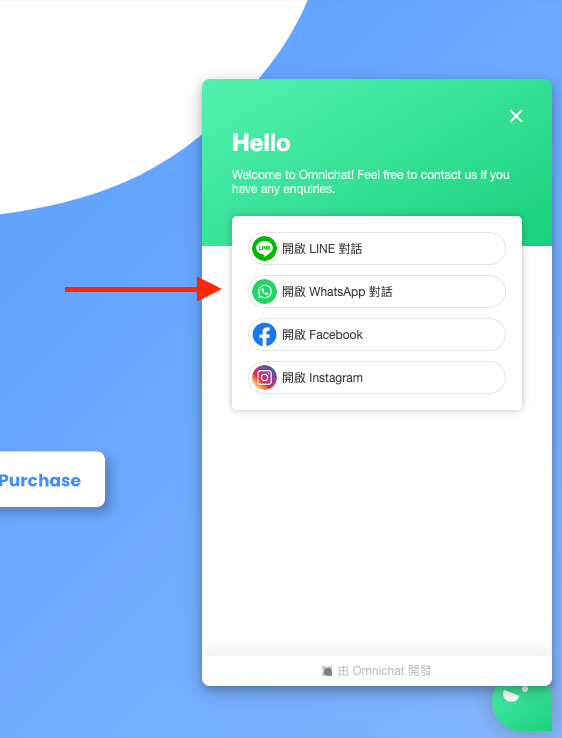
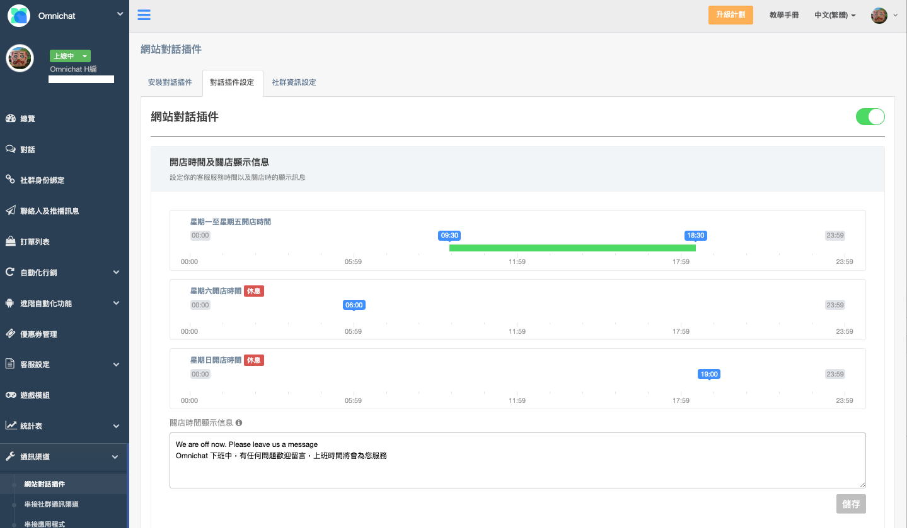

# 對話插件設定

## 網站對話插件 - 關閉

*

    

    <figure><figcaption>
後台「關閉」網站對話插件
</figcaption></figure>

     

    <figure><figcaption>
前台則「不顯示」- 網站對話視窗
</figcaption></figure>

    

* 網站對話插件顯示
* 彈出視窗顯示邏輯
  * 在網站對話插件關閉的情況下，『機器人』跟『歡迎訊息』都不會出現，也不會在網站插件上方彈出視窗
  * 唯一會彈出的視窗，只有『官網顧客行銷』

## 網站對話插件 - 開啟

<figure><figcaption>
後台「開啟」網站對話插件
</figcaption></figure>

<figure><figcaption>
前台則顯示-紅框處的顯示對話視窗
</figcaption></figure>

 

<figure><figcaption>
點擊進入網站對話頁面
</figcaption></figure>

### 開店時間＆關店顯示信息

.png>)

* 時間軸
  * 商戶可以透過拖曳時間，來設定網站插件開店及關店時間軸
* 關店時間顯示信息
  * 商戶可針對關店期間，設定相關提醒資訊
  * 只要訊息有做修改，『更改』按鈕就會變成可以點選的藍色，點選『更新』按鈕之後才會更新

＊**開店跟關店訊息**，只有在『網站真人客服』開啟的時候，才會顯示

<figure><figcaption></figcaption></figure>

### 團隊自動回覆

.png>)

* 在真人客服的狀態時，可設定團隊自動回覆，當消費者透過對話插件問問題時，自動回覆訊息給消費者

### 結束事件自動回覆

* 可以設定一段訊息，當後台成員按下結束事件時，由系統自動回覆一則訊息告知消費者此對話已經處理完成。

### 離線 Email 通知

* 設定開啟「離線電郵通知」功能後，當客戶在首次對話時，對話視窗會出現請客戶留下電郵的描述及填寫欄位

.png>)

* 小提醒1：如客戶未留 E-mail 在文字窗格中，僅已文字回覆，客服人員可複製客戶 E-mail 並編輯至右側『客戶資料』中的 E-mail 欄位。
* 小提醒2：離線 E-mail 通知功能的顯示語言，是依據 Omnichat 後台的「插件語言」顯示，非依照客戶使用的瀏覽器語言。

.png>)

* 如該客戶留下電郵，客服人員在往後回覆該客戶時，一旦客戶為「已離線」狀態，客服人員的回覆訊息同時會發送電郵通知該客戶

### 網站真人客服

.png>)



* 當網店客戶進入商戶網站後，網站插件的上方會顯示『回覆至』的視窗，清楚地讓網店客戶知道他可以在網站裡面直接跟客服對話

.png>)

* 網站插件的對話視窗最下方會出現
  * 傳送圖片功能
  * 文字輸入框
  * 輸入 emoji:blush:功能
  *

      <figure><figcaption>
訊息輸入窗可以發送文字、表情符號、差入圖片
</figcaption></figure>



* 這符合沒有真人客服，但善用機器人的團隊
* 網站真人客服開啟狀態會顯示的，在關閉的時候都不會顯示
* 但使用者還是可以透過設定好的機器人，點選按鈕來和商戶交流網站對話插件- 關閉
*

    <figure><figcaption>
訊息輸入窗被隱藏，無法發送訊息
</figcaption></figure>



### 關店時間自動關閉真人客服

若您不希望客人在下班時間直接透過網站對話插件來詢問問題，或是希望客人在下班時間用其他渠道聯繫你們，可以將此功能開啟。\
開啟此功能之後，對話插件將不會顯示對話列表，客戶就無法直接在網站對話插件對話。你可以設定 **關店顯示信息** 來引導客人透過其他渠道來詢問問題。


### 網站真人客服功能需有開啟，才能使用這項功能


&#x20;
