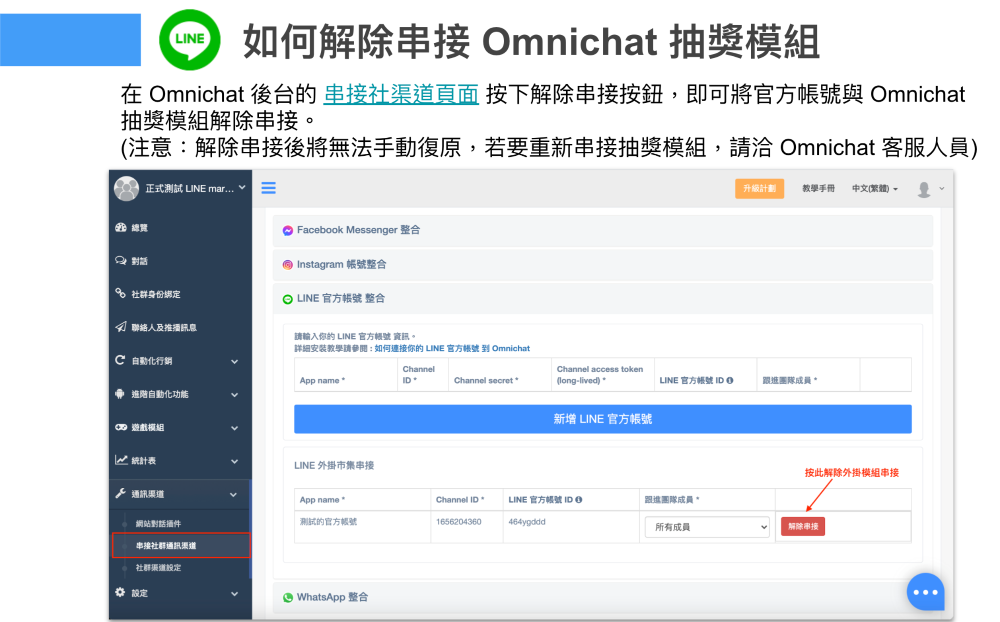

# 常見問題

#### Q：為什麼已經將 LIFF ID 放進『串接社群渠道』的欄位，且已按下『修改』，設定完遊戲模組後點擊開遊戲連結無法遊玩？

A：請先至 LINE Developer 後台確認 LOGIN channel 中是否已經連結 LINE 官方帳號，以及該 Channel 狀態是否已經從『Developing』至『Published』。

接著可以確認是否遊戲連結是在 LINE 的內建瀏覽器開啟。您可以在 LINE App 內的設定>>LINE Labs，確認是否有開啟『**使用預設瀏覽器開啟連結**』，如有，請先**關閉**才能開始玩遊戲喔

備註：如果您有遇到點擊遊戲後會出現「**請在有安裝 LINE 的裝置上開啟該此連結**」情況，同樣也請到 LINE Labs當中確認是否有開啟『**使用預設瀏覽器開啟連結**』，請將此功能**關閉**才能開始玩遊戲喔。

<figure><figcaption></figcaption></figure>


* 若客人用電腦版開啟 LINE 遊戲模組連結，會顯示 QR Code 讓客人用手機掃描（會依照瀏覽器預設語系顯示文字）
* 若客人用手機瀏覽器開啟 LINE 遊戲模組連結，系統會強制客人進入中繼轉換頁面，讓客人開啟 LINE


<figure><figcaption>
當客人瀏覽器預設語言為中文
</figcaption></figure>

<figure><figcaption>
當客人瀏覽器預設語言為英文
</figcaption></figure>

<figure><figcaption>
如果客人用外部瀏覽器開啟遊戲連結，系統會強制將客人進入中繼轉換頁面，並開啟 LINE
</figcaption></figure>

#### Q：如果發佈遊戲後暫停會怎麼樣呢？

A：該遊戲會無法打開遊戲。以及如果您按下暫停後再發佈，之前累積的遊戲資料也會全部歸零無法恢復

#### Q：為什麼使用刮刮樂沒有刮開，跳出畫面再進入，遊玩次數會減少一次（或是不能玩）？

A：『刮刮樂』這類型的遊戲有解鎖遊戲畫面的機制，所以若當下已按下「解鎖刮刮樂」按鈕，即便沒有刮開，也會計算有玩過一次遊戲

#### Q：我草稿階段點入遊戲連結，之後更改基本遊戲次數，我重新點入遊戲連結，我的次數會更改為更新後的基本遊戲次數嗎？

A：基本上系統是依照您點擊進入遊戲時作為計算，之後更改系統遊戲次數，只會影響尚未點擊進入的消費者唷

#### Q：如果我是透過 LINE 市集來測試遊戲模組，中間要如何取消擴充功能（連動）呢？

A：您可以到 Omnichat 後台 「社群渠道」中的『串接社群渠道』，按下『解除串接』按鈕。即可將 LINE 官方帳號與 Omnichat 抽獎遊戲模組解除串接


如您取消串接則無法手動復原，如要重新串接遊戲模組，則請洽 Omnichat 客服人員。


#### Q：如果我想要刪除遊戲模組列表上的遊戲，是可以的嗎？

A：遊戲列表上的遊戲在草稿階段時可以刪除，，但遊戲狀態如已在『暫停中』、『進行中』或『已結束』，則無法刪除該遊戲

#### Q：若排除掉不是新增遊戲，當遊戲內容經過重新編輯，遊戲原本的連結 Link 和 QR Code會變動嗎？

A：只要並未變更 LIFF ID 或是更換觸發的 LINE 官方帳號，就不會更改遊戲原本的 URL link 跟 QR code

#### Q：如果我想增加已發佈遊戲模組的其中獎項數量（加碼），是可以的嗎？

A：可以的。做獎項數量修改後，獎項狀態中的『剩餘獎項數量』會以修改後設定的獎項數量扣掉『已經送出的數量』當作獎項剩餘數量\
\
Ex：原本設定獎項四 為 10 個，經過抽獎後剩餘數量變為 5 。\
今天想要將獎項四 再加碼 10 個，使獎項四 送出總數量為 20。則在獎項四設定中的「數量」從 10 調整為 20 儲存，則在『獎項狀態』中的剩餘數量變為 15

#### Q：如果我獎項一設定中獎機率 100％，未中獎獎項設定 0%，那麼是不是未中獎訊息就可以不用設定，因為抽不中呢？

A：不是喔，未中獎訊息除了沒有抽中會發出外，如果獎項數量被抽完，即便是一樣抽中該獎項，也會彈出未中獎訊息唷

